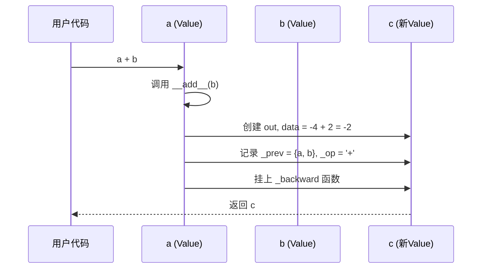
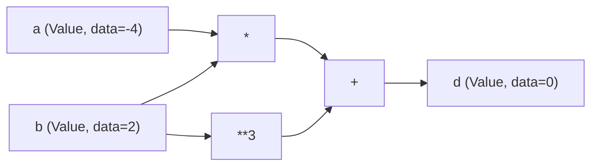

# Chapter 1: 标量值与自动微分 (Value)

欢迎来到 `micrograd` 的学习之旅！这是我们的第一章，我们将从整个项目最核心、最基础的概念开始：`Value`。

## 一、我们要解决什么问题？

想象一下，你正在玩一个数学游戏：

```
a = -4.0
b = 2.0
c = a + b
d = a * b + b ** 3
```

最后你算出了一个结果 `d`。现在我有一个有趣的问题想问你：

> **如果我把 `a` 稍微调大一点点，`d` 会变大还是变小？变化多少？**

这就是"导数"（或者叫"梯度"）要回答的问题。在神经网络的训练中，我们时时刻刻都需要回答这种问题——因为只有知道了"调整某个参数会让最终的损失变化多少"，我们才知道该往哪个方向调整这些参数。

但是，普通的 Python 数字（比如 `-4.0`、`2.0`）做完运算之后，**结果就只是一个孤零零的数字**，它不记得自己是怎么来的，也无法帮我们回答上面的问题。

`Value` 就是为解决这个问题而生的。

## 二、`Value` 是什么？一个"有记忆的数字"

你可以把 `Value` 想象成一个**带记忆的数字**：

- 它知道自己当前的值是多少（`data`）
- 它知道自己是由哪些"父节点"通过什么运算得到的（`_prev` 和 `_op`）
- 它有一个"梯度"槽位（`grad`），用来存放"我对最终结果的影响有多大"

打个比方：普通数字像一张匿名的现金，你只知道面额；而 `Value` 像一张银行流水记录——既有金额，也有"这笔钱是从谁转来的"完整记录。

## 三、最简单的上手例子

我们先来包装两个数字：

```python
from micrograd.engine import Value

a = Value(-4.0)
b = Value(2.0)
print(a)  # Value(data=-4.0, grad=0)
```

这里我们用 `Value(-4.0)` 把数字 `-4.0` 包装成了一个 `Value` 对象。打印它时会显示当前值（`data`）和梯度（`grad`，初始为 0）。

接下来，做一点运算：

```python
c = a + b      # 加法
d = a * b      # 乘法
e = b ** 3     # 幂运算
print(c)       # Value(data=-2.0, grad=0)
```

看！`a + b` 用起来就像普通数字一样自然。但秘密在于：**`c` 不是一个普通数字，它仍然是一个 `Value`**，并且它悄悄记住了"我是由 `a` 和 `b` 通过 `+` 得到的"。

这就是所谓的**运算符重载**——我们让 `+`、`*`、`**` 等符号在 `Value` 上表现出我们想要的行为。

## 四、为什么"记忆"如此重要？

让我们用一个简短的例子展示 `Value` 的真正威力：

```python
a = Value(-4.0)
b = Value(2.0)
d = a * b + b ** 3   # d = -8 + 8 = 0
d.backward()          # 关键一步：反向传播
print(a.grad)         # 2.0  （即 ∂d/∂a）
print(b.grad)         # 8.0  （即 ∂d/∂b）
```

最神奇的是 `d.backward()` 这一行：它会沿着 `d` 的"家族树"一路回溯，自动算出每个 `Value` 对 `d` 的影响有多大，并填入它们的 `grad` 字段。这就是**自动微分（autograd）**。

> 不用担心 `backward()` 的细节，我们会在 [反向传播与链式法则 (backward)](03_反向传播与链式法则__backward__.md) 中专门讲解它。本章我们只关注 `Value` 本身。

## 五、`Value` 内部到底有什么？

我们看一下 `Value` 最关键的 4 个属性：

```python
def __init__(self, data, _children=(), _op=''):
    self.data = data              # 当前数值
    self.grad = 0                  # 梯度，初始为 0
    self._backward = lambda: None  # 反向传播函数（占位）
    self._prev = set(_children)    # 父节点（产生我的那些 Value）
    self._op = _op                 # 产生我的运算（'+'、'*' 等）
```

逐项解释：

- **`data`**：当前的标量值，比如 `-4.0`。
- **`grad`**：梯度槽位，默认 0，等待 `backward()` 来填充。
- **`_prev`**：一个集合，存放"父节点"。比如 `c = a + b`，那么 `c._prev = {a, b}`。
- **`_op`**：一个字符串，记录运算类型（仅用于调试和可视化）。
- **`_backward`**：一个函数，定义了"梯度该如何从我流回父节点"。

## 六、一次运算背后发生了什么？

我们以 `c = a + b` 为例，看看运算符重载内部做了什么。

```python
def __add__(self, other):
    other = other if isinstance(other, Value) else Value(other)
    out = Value(self.data + other.data, (self, other), '+')

    def _backward():
        self.grad += out.grad
        other.grad += out.grad
    out._backward = _backward
    return out
```

逐行拆解：

1. **第 2 行**：如果 `other` 是普通数字（如 `c + 1`），自动把它包装成 `Value`。
2. **第 3 行**：创建一个新的 `Value`，它的 `data` 是两者相加，父节点是 `(self, other)`，运算是 `'+'`。
3. **第 5–7 行**：定义一个 `_backward` 函数，描述"加法的梯度规则"——加法会把梯度原样分给两个父节点。
4. **第 8 行**：把这个函数挂到 `out` 上，等以后 `backward()` 时调用。

下面这张时序图展示了 `c = a + b` 时的过程：



注意：**这一步只是"做了运算 + 记下了来龙去脉"，并没有真正去算梯度**。梯度要等到 `backward()` 时才计算。

## 七、其他运算长什么样？

`micrograd` 只支持几种最基础的运算，但它们已经足够搭建出整个神经网络。我们快速看一下乘法：

```python
def __mul__(self, other):
    other = other if isinstance(other, Value) else Value(other)
    out = Value(self.data * other.data, (self, other), '*')

    def _backward():
        self.grad += other.data * out.grad
        other.grad += self.data * out.grad
    out._backward = _backward
    return out
```

跟加法几乎是一个模子——只是 `_backward` 里的梯度规则不同（这是中学微积分里 `(xy)' = x'y + xy'` 的体现）。

再看 ReLU（一个常见的"非线性激活函数"，简单说：负数变 0，正数保持不变）：

```python
def relu(self):
    out = Value(0 if self.data < 0 else self.data, (self,), 'ReLU')

    def _backward():
        self.grad += (out.data > 0) * out.grad
    out._backward = _backward
    return out
```

同样的套路：算结果 → 记录父节点 → 挂上 `_backward`。

## 八、那些便利的辅助方法

你可能注意到 `Value` 里还有一堆短小的方法：

```python
def __neg__(self):       return self * -1     # -a
def __sub__(self, o):    return self + (-o)   # a - b
def __truediv__(self, o):return self * o**-1  # a / b
def __radd__(self, o):   return self + o      # 1 + a
```

这些都不是"新运算"，而是用已有的 `+`、`*`、`**` 来表达的"便利写法"。比如 `a / b` 内部其实就是 `a * b**(-1)`。这种设计保证了我们只需要为少数几个基础运算定义梯度规则，其他运算自然就有了梯度。

这就是为什么 README 中的复杂例子（`c += c + 1`、`10.0 / f` 等）都能丝滑工作。

## 九、用一张图总结 `Value` 之间的关系

当我们写 `d = a * b + b ** 3` 时，背后其实形成了这样一张"家族树"：



每个节点都是一个 `Value`，箭头记录着"谁是谁的父节点"。这张图被称为**动态计算图（DAG）**——它是 `backward()` 能够工作的根本前提。

## 十、本章小结

恭喜！你已经理解了 `micrograd` 中最核心的抽象：

- `Value` 是一个**带记忆的数字**：它不仅有 `data`，还知道自己是怎么算出来的。
- 通过**运算符重载**，`Value` 用起来就像普通数字一样自然。
- 每次运算都会创建一个新的 `Value`，并记录父节点 `_prev`、运算 `_op` 和未来要用的 `_backward` 函数。
- 这些"记忆"会自动形成一张计算图，为后续的反向传播奠定基础。

在下一章 [动态计算图 (DAG)](02_动态计算图__dag__.md) 中，我们将更深入地理解这些 `Value` 节点是如何串成一张图的，以及为什么它被称为"动态"的。准备好继续探索了吗？我们下章见！

---

Generated by [AI Codebase Knowledge Builder](https://github.com/The-Pocket/Tutorial-Codebase-Knowledge)