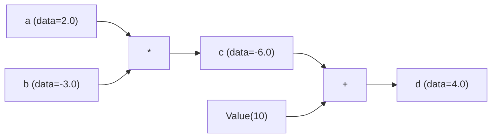
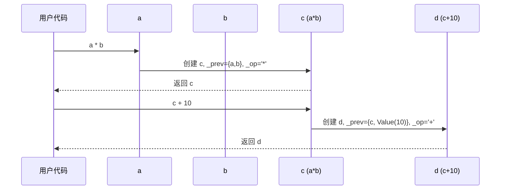

# Chapter 2: 动态计算图 (DAG)

在上一章 [标量值与自动微分 (Value)](01_标量值与自动微分__value__.md) 中，我们认识了 `Value` 这个"带记忆的数字"。我们已经知道：每次做运算时，`Value` 会偷偷记下自己的"父节点"和"运算类型"。

那么问题来了——**这些零散的"记忆"加在一起到底变成了什么？它们如何串起来发挥作用？**

这一章我们就来揭开谜底：所有这些记忆，自动拼成了一张叫做 **DAG（有向无环图）** 的东西。

## 一、我们要解决什么问题？

让我们先看一个具体的小例子，假设你写了这样几行代码：

```python
from micrograd.engine import Value

a = Value(2.0)
b = Value(-3.0)
c = a * b        # c = -6.0
d = c + 10       # d = 4.0
```

最后你拿到了 `d`，值是 `4.0`。但请你想一想：

> **如果有人只把 `d` 交给我，我能不能"顺藤摸瓜"找回 `c`、`a`、`b`？能不能知道它们之间是怎么连接的？**

这个能力非常重要！因为只有掌握了这种"顺藤摸瓜"的能力，才能让 `d.backward()` 沿着每一步运算反向计算梯度。

**DAG 就是这条"藤"**——它记录着每一个 `Value` 节点之间的依赖关系，让我们能从结果出发，一路回溯到所有源头。

## 二、什么是 DAG？

DAG 是 **Directed Acyclic Graph** 的缩写，翻译过来叫"有向无环图"。这个名字听起来很学术，但拆开看其实非常直观：

- **图（Graph）**：一些点（节点）和点之间的连线（边）。
- **有向（Directed）**：每条线有方向，就像箭头一样，从 A 指向 B。
- **无环（Acyclic）**：沿着箭头走，永远不会绕回起点（不会形成圈）。

打个比方：你的**家谱**就是一张 DAG。父母指向你，你指向孩子，但孩子绝不可能反过来"生出"自己的祖辈——这就是"无环"。

在 `micrograd` 里，DAG 就是 `Value` 们的"家谱"：
- 每个 `Value` 是一个**节点**。
- 每次运算产生的"我从谁来"的关系，是一条**有向边**。

## 三、用最简单的例子看 DAG 长什么样

回到我们一开始的例子：

```python
a = Value(2.0)
b = Value(-3.0)
c = a * b        # c 记得它的父亲是 a 和 b
d = c + 10       # d 记得它的父亲是 c 和那个被包装的 10
```

这几行代码"在背后"自动构建出了下面这张图：



注意几个关键点：

1. **边从父节点指向子节点**：`a` 和 `b` 是 `c` 的父亲，所以箭头从它们指向 `c`。
2. **每次运算自动生成新节点**：`10` 这个普通数字在加法时也被自动包装成了一个 `Value` 节点。
3. **整张图是"动态"生成的**：我们没有事先告诉 micrograd"我要算什么"，是它边运算边帮我们画图。

## 四、"动态"二字的含义

为什么强调"动态"？因为有些深度学习框架（早期的 TensorFlow 1.x）需要**先定义整张图，再喂数据进去运行**——这叫"静态图"。

而 `micrograd`（以及现代的 PyTorch）是**写一行代码，图就长一点**：

```python
x = Value(1.0)
y = x + 2          # 图：x -> + -> y
z = y * 3          # 图变长：x -> + -> y -> * -> z
```

打个生活化的比方：

- **静态图**像是**预先画好的菜谱**：你必须先把"先切菜、再翻炒、最后调味"画成流程图，再按图做饭。
- **动态图**像是**边做边记的厨房日记**：你切完一刀就在本子上记一笔，做到哪记到哪，菜做完了流程图也自然成形了。

动态图的好处是：你可以在中间用 `if`、`for` 等普通 Python 语法，图会自然跟着你的代码走，**无比灵活**。

## 五、回顾：每个 `Value` 是怎么"接上图"的？

我们在上一章已经见过这段代码，现在我们换个角度来看——只关注"图是怎么构建的"这件事：

```python
def __add__(self, other):
    other = other if isinstance(other, Value) else Value(other)
    out = Value(self.data + other.data, (self, other), '+')
    # ... 省略 _backward 设置 ...
    return out
```

注意第 3 行：创建新 `Value` 时，传入了 `(self, other)` 作为 `_children`。再回头看 `Value` 的构造函数：

```python
def __init__(self, data, _children=(), _op=''):
    self.data = data
    self._prev = set(_children)   # 父节点保存在 _prev 里
    self._op = _op                # 运算类型保存在 _op 里
```

所以每个 `Value` 都自带两条"信息":
- `_prev`：一个集合，存放它的父节点。
- `_op`：一个字符串，记录运算名（'+'、'*'、'ReLU' 等）。

**这两条信息合在一起，就是 DAG 的边和节点标签。** 整张图不需要任何额外的数据结构去维护——它隐藏在每个 `Value` 自己的属性里。

## 六、亲手"遍历"一下这张图

既然图就藏在 `_prev` 里，我们就能写几行代码"看见"它：

```python
a = Value(2.0)
b = Value(-3.0)
d = a * b + 10

print(d._prev)   # 它的父节点们
print(d._op)     # 它是怎么产生的
```

输出大致是这样的（顺序可能不同）：

```
{Value(data=-6.0, grad=0), Value(data=10, grad=0)}
+
```

看！`d` 知道它的父亲是 `c`（也就是 `a*b` 的结果，data=-6.0）和那个被自动包装的 `Value(10)`，并且它是通过 `+` 运算产生的。

我们还可以**递归**地往上爬：

```python
def walk(v, depth=0):
    print("  " * depth + f"{v._op or 'leaf'}: data={v.data}")
    for child in v._prev:
        walk(child, depth + 1)

walk(d)
```

这段小工具沿着 `_prev` 一路往上走，每个节点的运算和值都被打印出来。这其实就是 DAG 遍历的雏形——`backward()` 内部干的也是类似的事。

## 七、`backward()` 是怎么用这张图的？

说了这么多"图怎么搭起来"，那它有什么用呢？最关键的用途就是：**让反向传播按正确的顺序进行**。

来看 `backward()` 的核心片段（在 [反向传播与链式法则 (backward)](03_反向传播与链式法则__backward__.md) 中我们会更详细讲解）：

```python
def backward(self):
    topo = []
    visited = set()
    def build_topo(v):
        if v not in visited:
            visited.add(v)
            for child in v._prev:    # 顺着图往上爬
                build_topo(child)
            topo.append(v)
    build_topo(self)
    # ... 后面按 topo 倒序处理每个节点 ...
```

这段代码做了一件事：从 `self`（也就是终点 `d`）出发，沿着 `_prev` 把整张 DAG 走了一遍，并按"拓扑顺序"把所有节点收集起来。

**拓扑排序**是 DAG 上的经典操作，简单说就是：保证"父节点排在子节点前面"。这样从尾巴往前处理时，每处理一个节点，它的"下游"梯度都已经准备好了，链式法则才能正确地传下去。

## 八、用时序图看一次完整的图构建

下面这张时序图，展示了 `d = a * b + 10` 这一行代码背后整张 DAG 是如何"长"出来的：



注意每一步：
1. **运算时图就长大**：每做一次运算，就有一个新节点诞生并自动连上父节点。
2. **节点不会消失**：即使你没用变量接住中间结果（比如 `Value(10)` 是匿名的），它仍然被新节点的 `_prev` 引用着。
3. **整张图是"懒"的**：构建图时**完全不算梯度**——梯度等到 `backward()` 才计算。

## 九、几个常见疑问

**Q1：如果我多次用同一个 `Value`，图会不会出问题？**

```python
a = Value(3.0)
b = a + a          # a 被用了两次
```

完全不会！`b._prev` 是个**集合**（`set`），里面会有一份 `a` 的引用。后续 `backward()` 的梯度规则也会正确地把"两份贡献"累加给 `a`（这就是为什么所有 `_backward` 里都用 `+=` 而不是 `=`）。

**Q2：DAG 真的不会有环吗？**

不会。因为每次运算都**创建新的** `Value`，新节点指向旧节点，旧节点对新节点一无所知——所以箭头永远是单向的，绝不可能"绕回去"。

**Q3：图占内存吗？要不要手动清理？**

会占一些内存（每个中间 `Value` 都要保留）。在小项目里完全不用管；在更大的框架里（如 PyTorch），通常一次 `backward()` 之后图就可以被回收了。

## 十、本章小结

我们这一章揭开了 `Value` 们背后那张"看不见的图"：

- **DAG = 有向无环图**：节点是 `Value`，边是"父子依赖"，方向从父指向子。
- **图存在哪？**：完全藏在每个 `Value` 自己的 `_prev` 和 `_op` 里——不需要任何额外结构。
- **为什么叫"动态"？**：图是边写代码边构建出来的，写一行长一点，灵活到可以配合任意 Python 控制流。
- **图有什么用？**：它是 `backward()` 进行**拓扑排序、链式法则反向传播**的基础设施。

简单回顾一下我们走过的路：第 1 章我们认识了"带记忆的数字" `Value`；这一章我们发现这些"记忆"其实在悄悄拼出一张图。下一步自然就是：**这张图究竟是怎么把梯度一步步算出来的？**

让我们在 [反向传播与链式法则 (backward)](03_反向传播与链式法则__backward__.md) 中一探究竟！

---

Generated by [AI Codebase Knowledge Builder](https://github.com/The-Pocket/Tutorial-Codebase-Knowledge)