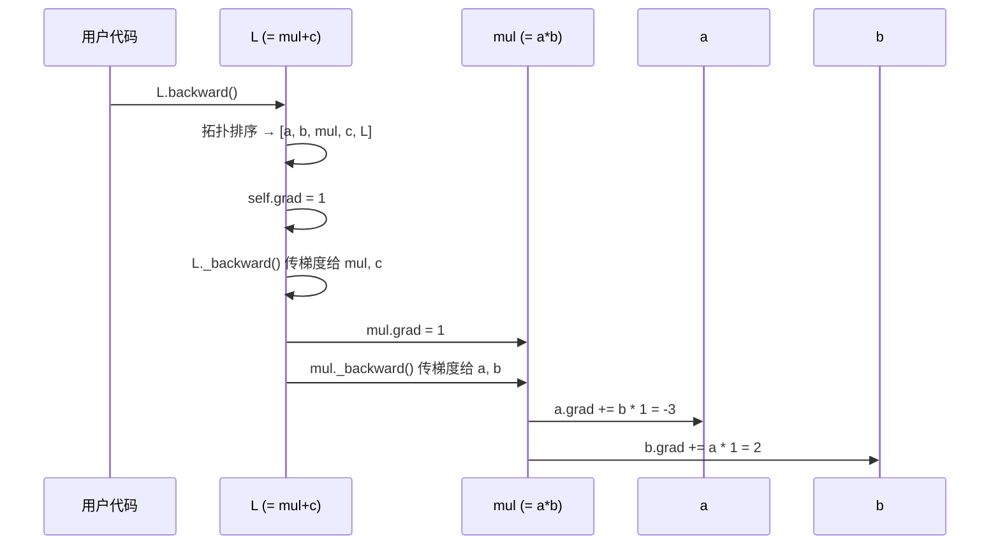
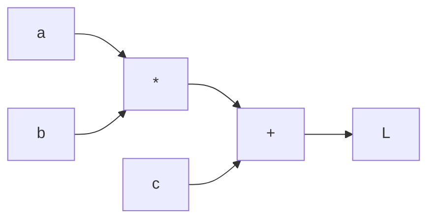

# Chapter 3: 反向传播与链式法则 (backward)

在上一章 [动态计算图 (DAG)](02_动态计算图__dag__.md) 中，我们看到一连串的运算如何在背后悄悄拼出一张"家谱图"。我们也提到：这张图最重要的用途之一，就是为反向传播服务。

那么，**反向传播到底是什么？它如何沿着这张图把梯度算出来？** 这一章我们就来彻底揭开这层神秘面纱。

## 一、我们要解决什么问题？

让我们回到第 1 章那个有趣的问题。假设我写了几行代码：

```python
from micrograd.engine import Value

a = Value(2.0)
b = Value(-3.0)
L = a * b      # L = -6.0
```

现在我想问：

> **如果我把 `a` 调大一点点（比如从 2.0 变成 2.001），最后的 `L` 会怎么变？**

凭中学微积分的知识我们知道：`∂L/∂a = b = -3.0`。也就是说 `a` 增加 0.001，`L` 大约会减少 0.003。

但如果计算更复杂，比如 `L = ((a*b + b**3) * 2 - a).relu()` 呢？人工算偏导会让人头疼。

**`backward()` 就是来帮我们自动完成这件事的。** 你只要调用一次 `L.backward()`，每个 `Value` 的 `.grad` 字段就会自动填上"我对 `L` 的影响有多大"。

这一章我们的目标，就是搞清楚这个"魔法"背后到底发生了什么。

## 二、先准备一点基础：链式法则

在动手之前，我们要先理解一个数学小道具——**链式法则**。别担心，它非常直观。

想象一座工厂的"责任传递"：

- 经理 `L` 决定了今年的总产值。
- 经理依赖工人 `y` 的零件输出。
- 工人 `y` 又依赖原材料 `x` 的供应。

如果有人问："原材料 `x` 涨了 1 单位，总产值 `L` 会变多少？" 那答案就是：

$$
\frac{\partial L}{\partial x} = \frac{\partial L}{\partial y} \times \frac{\partial y}{\partial x}
$$

翻译成大白话：**"`x` 对 `L` 的影响" = "`x` 对 `y` 的影响" × "`y` 对 `L` 的影响"**。

如果链条更长（`x → y → z → L`），就乘更多项，一路接力下去。这就是链式法则。

> 形象一点：链式法则就像**汇率换算**。一杯咖啡卖 5 美元，1 美元换 7 块钱人民币——那么 1 杯咖啡 = 5 × 7 = 35 元。中间的"换算"层层相乘。

## 三、`backward()` 的三步走

`micrograd` 的 `backward()` 做的事情可以总结成三步：

1. **拓扑排序**：把整张计算图的节点排好序，保证"先算完的"排在前面。
2. **种下起点的梯度**：把输出节点（也就是我们调用 `backward()` 的那个节点）的 `grad` 设为 1。
3. **逆序调用每个节点的 `_backward`**：从输出节点一路往回走，把梯度传给父节点。

打个比方：这就像是"溯源问责"——

- 公司年终算了总利润 `L`，先给它打满分（梯度 = 1，意为"它对自己负 100% 的责")。
- 然后按部门贡献，一层层往下分摊到每个员工头上。
- 每个员工只需要知道"自己上游的总分配比例"，加上"自己这一步的贡献规则"，就能算出自己应得多少。

## 四、最小例子：手动验证一遍

我们先用一个超级简单的例子，**用手算的方式**验证 `backward()` 的结果，让你看到这不是黑魔法。

```python
from micrograd.engine import Value

a = Value(2.0)
b = Value(-3.0)
L = a * b           # L = -6.0
L.backward()
print(a.grad)       # 期望: ∂L/∂a = b = -3.0
print(b.grad)       # 期望: ∂L/∂b = a =  2.0
```

数学上 `L = a * b`，所以 `∂L/∂a = b`，`∂L/∂b = a`。运行后你会看到 `a.grad` 是 `-3.0`、`b.grad` 是 `2.0`——完美对上！

**这就是反向传播：你只写"前向算式"，框架自动帮你算梯度。**

## 五、稍微长一点的链子

我们让链子再长一点：

```python
a = Value(2.0)
b = Value(-3.0)
c = a * b           # c = -6.0
L = c + 10          # L = 4.0
L.backward()
print(a.grad)       # ∂L/∂a = ?
```

让我们手算：
- `∂L/∂c = 1`（加法对自己的偏导是 1）。
- `∂c/∂a = b = -3.0`。
- 链式法则：`∂L/∂a = ∂L/∂c × ∂c/∂a = 1 × (-3.0) = -3.0`。

运行后 `a.grad` 果然是 `-3.0`。看，链条变长了，但每一段都按"局部规则"走，最后乘起来就是答案。

## 六、`backward()` 内部到底做了什么？

我们打开 `micrograd/engine.py`，看看 `backward()` 的全貌：

```python
def backward(self):
    # 第一步：拓扑排序
    topo = []
    visited = set()
    def build_topo(v):
        if v not in visited:
            visited.add(v)
            for child in v._prev:
                build_topo(child)
            topo.append(v)
    build_topo(self)
```

这一段做了什么？从 `self`（也就是终点）出发，递归往上爬遍整张图，把所有节点按"父亲先于儿子"的顺序收集到 `topo` 列表里。这叫**拓扑排序**。

继续看后半段：

```python
    # 第二步：种下起点的梯度
    self.grad = 1
    # 第三步：按逆序调用每个节点的 _backward
    for v in reversed(topo):
        v._backward()
```

简单清晰：
- `self.grad = 1`：终点的梯度设为 1（"我对自己的导数当然是 1"）。
- 然后**倒着遍历** `topo`（从终点开始，往源头走），依次调用每个节点的 `_backward()`。

## 七、`_backward` 闭包：每种运算的"局部规则"

每个 `Value` 都有一个挂在它身上的 `_backward` 函数。这个函数干的事就是："**把我的梯度按链式法则传给我的父节点。**"

我们看加法的例子（来自 `micrograd/engine.py`）：

```python
def __add__(self, other):
    other = other if isinstance(other, Value) else Value(other)
    out = Value(self.data + other.data, (self, other), '+')

    def _backward():
        self.grad  += out.grad   # 加法：直接把梯度传下去
        other.grad += out.grad
    out._backward = _backward
    return out
```

数学上 `out = self + other`，所以 `∂out/∂self = 1`，`∂out/∂other = 1`。链式法则告诉我们：

- `self.grad += 1 × out.grad`
- `other.grad += 1 × out.grad`

这正是 `_backward` 里写的。一句话：**加法把"上游来的梯度"原封不动分给两个父亲**。

再看乘法：

```python
def _backward():
    self.grad  += other.data * out.grad
    other.grad += self.data  * out.grad
```

数学上 `out = self * other`，所以 `∂out/∂self = other`，`∂out/∂other = self`。乘以 `out.grad`（上游来的梯度）就是链式法则的体现。一句话：**乘法把梯度按"对方的数值"加权后传给自己**。

幂运算：

```python
def _backward():
    # 公式: d(x^n)/dx = n * x^(n-1)
    self.grad += (other * self.data**(other-1)) * out.grad
```

ReLU：

```python
def _backward():
    # 正数照传，负数截断为 0
    self.grad += (out.data > 0) * out.grad
```

**每种运算只关心自己那一步的局部偏导**——这就是 `micrograd` 的精妙之处：复杂的全局梯度，被拆成了一堆简单的局部规则。

## 八、为什么是 `+=` 而不是 `=`？

你可能注意到所有 `_backward` 里都是 `self.grad += ...`，而不是 `self.grad = ...`。这是为什么？

因为同一个 `Value` 可能在多个地方被用到：

```python
a = Value(3.0)
y = a * a       # a 用了两次！
```

`y` 对 `a` 的贡献来自两条路径——`a` 既是左乘数也是右乘数。两条路径的梯度**必须累加**，否则后一次会覆盖前一次。

`+=` 就是为了这个累加需求服务的。这也呼应了上一章我们提到的"DAG 中节点可以被多次引用"的设计。

> ⚠️ **小提示**：如果你想再次调用 `backward()`（比如在训练循环中），需要先手动把所有节点的 `.grad` 清零，否则旧梯度会和新梯度叠加！

## 九、用时序图看一次完整的反向传播

我们以 `L = a * b + c`（其中 `a=2, b=-3, c=10`）为例，看整个 `backward()` 的全过程：



关键观察：
1. 从 `L` 出发，梯度像"水"一样**沿着箭头反向流动**。
2. 每经过一个节点，都用该节点的"局部规则"决定怎么分配。
3. **拓扑排序保证了流动顺序正确**——一个节点的 `_backward` 被调用时，它的 `out.grad` 已经被所有"下游"贡献者填好了。

## 十、亲自体验一次完整流程

让我们把第 1 章那个例子完整跑一遍：

```python
from micrograd.engine import Value

a = Value(-4.0)
b = Value(2.0)
d = a * b + b ** 3      # d = -8 + 8 = 0
d.backward()
print(a.grad)            # 2.0
print(b.grad)            # 8.0
```

我们来手算验证一下 `b.grad`：

- `d` 由两条路径依赖 `b`：通过 `a*b`（贡献 `a = -4`）和通过 `b**3`（贡献 `3*b**2 = 12`）。
- 两条路径相加：`-4 + 12 = 8`。✅

是不是非常神奇？你只写了一行前向公式，所有偏导自动算好。

## 十一、为什么必须先拓扑排序？

你可能想：**为什么不能直接随便顺序调用所有 `_backward`？**

考虑这种情况：



如果你**先**调用 `mul._backward()`，但此时 `mul.grad` 还是 0（`add._backward()` 还没把梯度传下来），那 `mul._backward()` 就只能把 0 传给 `a` 和 `b`——结果就错了！

所以必须保证：**调用一个节点的 `_backward` 之前，所有依赖它的下游节点都已经处理完**。拓扑排序的逆序遍历恰恰保证了这一点。

## 十二、一些常见疑问

**Q1：调用两次 `backward()` 结果对吗？**

不对！因为 `_backward` 用的是 `+=`，第二次调用会把新梯度叠加到旧梯度上。在训练循环中，你需要手动把 `.grad` 清零（通常会写一个 `zero_grad()` 方法，我们将在 [模块基类 (Module)](04_模块基类__module__.md) 中看到）。

**Q2：起点为什么要把 `grad` 设成 1？**

因为我们要算的是 `∂L/∂(各个变量)`。"`L` 对自己的导数"就是 1。这个 `1` 是"梯度之水"流出来的源头。

**Q3：为什么这种方法叫"反向模式"自动微分？**

因为我们是从输出节点开始，**逆着箭头方向**传播梯度。它的对偶——"正向模式"——是从输入往输出推。在神经网络这种"输出少、输入多"的场景，反向模式效率高得多。

## 十三、本章小结

我们终于把"自动微分"的全部秘密揭开了：

- **链式法则** 是一切的数学基础：复合函数的偏导 = 各段局部偏导的乘积。
- **`backward()` 三步走**：拓扑排序 → 起点梯度设为 1 → 逆序调用每个 `_backward`。
- **每种运算定义自己的 `_backward`**：只负责一段局部偏导，整体由链式法则串起来。
- **`+=` 而不是 `=`**：保证同一节点被多次引用时梯度能正确累加。
- **拓扑排序保证顺序正确**：先处理下游，再处理上游，梯度才能正确接力。

让我们用一句话回顾全章：**`backward()` 沿着第 2 章构建的那张 DAG 倒着走，每一步按链式法则把梯度从儿子传给父亲，直到所有 `Value` 都知道"自己对最终结果的影响有多大"。**

现在我们已经掌握了 `micrograd` 引擎的全部核心机制。从下一章开始，我们要爬上一个新台阶——**用 `Value` 搭建神经网络**。第一步是认识所有神经网络组件的共同祖先：[模块基类 (Module)](04_模块基类__module__.md)。我们下章见！

---

Generated by [AI Codebase Knowledge Builder](https://github.com/The-Pocket/Tutorial-Codebase-Knowledge)