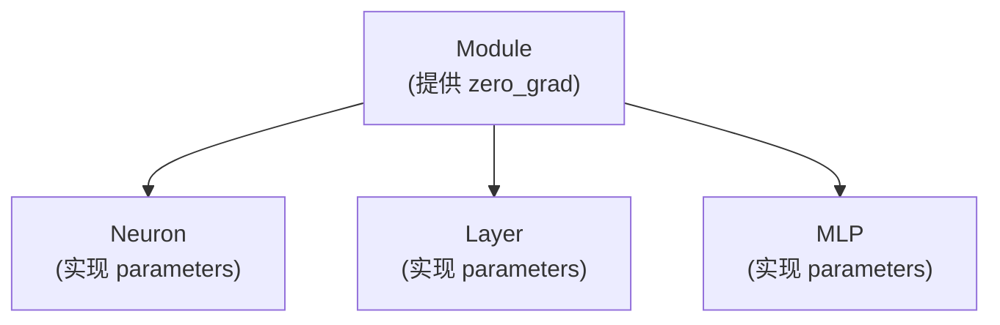
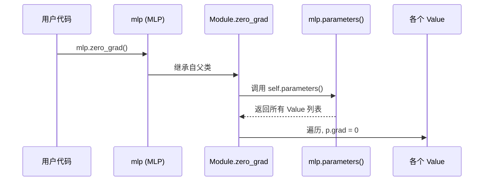
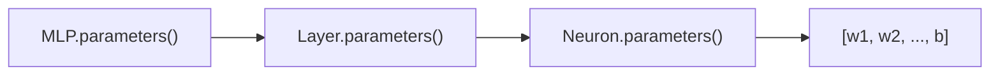

# Chapter 4: 模块基类 (Module)

在上一章 [反向传播与链式法则 (backward)](03_反向传播与链式法则__backward__.md) 中，我们已经掌握了 `micrograd` 引擎的全部核心机制：`Value` 会自动构建计算图，`backward()` 会沿着图把梯度算出来。

从这一章开始，我们要爬上一个新台阶——**用 `Value` 搭建真正的神经网络**。但在动手写"神经元""层""整个网络"之前，我们要先认识它们的"共同祖先"：`Module`。

## 一、我们要解决什么问题？

让我们想象一个场景。假设你已经搭好了一个神经网络（细节先不管），它的结构大致是：

```
输入 → 一层有 4 个神经元 → 一层有 4 个神经元 → 一层有 1 个神经元 → 输出
```

每个神经元内部有一堆 `Value` 类型的"参数"（权重 `w` 和偏置 `b`）。整个网络加起来，可能有几十甚至上百个 `Value`。

现在到了训练时刻，你想做两件事：

1. **训练前**：拿到**所有可训练的参数**，准备给优化器去更新它们。
2. **每轮训练后**：把**所有参数的 `.grad` 清零**（还记得上一章吗？如果不清零，新旧梯度会叠加在一起，结果就错了）。

如果让你**手动**写代码去做这两件事——挨个翻箱倒柜找出每一层、每个神经元、每个权重——简直是噩梦：

```python
# 手动清零，要写多少行？😱
for neuron in layer1.neurons:
    for w in neuron.w:
        w.grad = 0
    neuron.b.grad = 0
for neuron in layer2.neurons:
    # ... 重复一遍 ...
```

> **能不能让每个组件（神经元、层、整个网络）都"自带"两个标准动作：`parameters()` 拿出所有参数，`zero_grad()` 一键清零？**

**`Module` 就是来解决这个问题的。** 它是一份"通用契约"——任何神经网络组件只要继承它，就自动获得这两项基础能力。

## 二、`Module` 到底是什么？

你可以把 `Module` 想象成一份**"组件入会协议"**：

> "想加入'神经网络组件'俱乐部？只要继承我，并告诉我你的 `parameters()` 是什么，剩下的事我帮你处理。"

打个生活化的比方：

- 想象一家连锁餐厅，每家店都必须遵守"总部规章"。规章里规定：每家店都要有"列出所有员工"的能力和"统一停业整顿"的能力。
- 至于具体有哪些员工，每家店自己上报；但"统一停业整顿"这个动作，总部已经写好了通用流程——它会调用你上报的员工名单，然后挨个让他们停业。

`Module` 就是这份"总部规章"：

- **你必须告诉我**：你的参数有哪些（实现 `parameters()`）。
- **我送你一个免费赠品**：`zero_grad()`——一键给所有参数清零，不用你写。

## 三、看一眼 `Module` 的真身

`Module` 的代码非常短小，可以说是"micrograd 里最简单的类"：

```python
class Module:

    def zero_grad(self):
        for p in self.parameters():
            p.grad = 0

    def parameters(self):
        return []
```

总共只有两个方法，我们一个一个看。

### 方法 1：`parameters()`——返回空列表？

```python
def parameters(self):
    return []
```

奇怪了——它返回的居然是个**空列表**？这不是没用吗？

这其实是一个**默认实现**（也叫"占位实现"）。意思是：

> "如果你继承 `Module` 但忘了重写 `parameters()`，那就当你没有任何参数（空列表）。"

真正有意义的实现，会由它的子类（比如 `Neuron`、`Layer`、`MLP`）来覆盖。我们一会儿就会看到。

### 方法 2：`zero_grad()`——通用的清零工具

```python
def zero_grad(self):
    for p in self.parameters():
        p.grad = 0
```

这段代码做的事简单到不能再简单：

1. 调用 `self.parameters()` 拿到所有参数（一个 `Value` 列表）。
2. 遍历它们，把每个 `.grad` 设为 0。

**关键点**：`zero_grad()` 自己不关心"参数到底有多少、藏在哪里"——它**只信任 `parameters()` 给它的列表**。这种设计让 `zero_grad()` 一行代码都不用改，就能服务于神经元、层、整个网络等所有继承者。

## 四、`Module` 这种设计叫什么？

这种"父类定义通用骨架、子类填具体内容"的设计模式，在面向对象编程里叫**模板方法模式**。

更通俗一点：

- `Module` 像是**乐高积木的标准底板**——所有积木只要插得上这块底板，就能拼到一起。
- `parameters()` 是底板上的**插槽**——每块积木都要插上自己的参数清单。
- `zero_grad()` 是底板自带的**功能按钮**——只要插好了清单，按一下就能把所有参数清零。

> 顺便一提：这种设计直接借鉴自著名深度学习框架 **PyTorch 的 `nn.Module`**。如果你以后学 PyTorch，会发现一模一样的套路——`Module` 是所有网络组件的基类，子类只要实现自己的部分，公共能力都从父类继承。

## 五、子类如何"继承"它？看一个最小例子

`Module` 自己单独看挺枯燥的，让我们瞄一眼它的"第一个孩子"——`Neuron`，看看子类是怎么使用 `Module` 的：

```python
class Neuron(Module):                    # 继承 Module
    def __init__(self, nin):
        self.w = [Value(0.1), Value(0.2)]  # 两个权重
        self.b = Value(0)                   # 一个偏置

    def parameters(self):                   # 重写父类方法
        return self.w + [self.b]
```

逐行看：

1. **`class Neuron(Module):`**：声明 `Neuron` 是 `Module` 的子类——这一步它就自动拥有了 `zero_grad()`。
2. **`__init__`**：神经元内部有两个权重和一个偏置（都是 `Value`）。
3. **`parameters()`**：把这些参数装进列表返回。

注意——**`Neuron` 完全没写 `zero_grad()` 方法**。但你仍然可以这样用：

```python
n = Neuron(2)
n.zero_grad()       # 居然能用！
```

为什么？因为 `Neuron` 继承了 `Module`，`zero_grad()` 在父类里已经写好了。当我们调用 `n.zero_grad()` 时，Python 找不到 `Neuron` 自己的 `zero_grad`，就**自动到父类 `Module`** 里去找，找到了就用。

## 六、用一张图理解继承关系

整个神经网络体系的"家族树"是这样的：



三个核心组件——`Neuron`（神经元）、`Layer`（层）、`MLP`（多层感知机）——都是 `Module` 的"子孙"。它们各自实现了**自己的** `parameters()`，但都共享父类的 `zero_grad()`。

## 七、一次 `zero_grad()` 的完整流程

让我们用一个时序图，看看当你在一个完整的网络上调用 `mlp.zero_grad()` 时，到底发生了什么：



关键步骤：

1. 用户调用 `mlp.zero_grad()`。
2. `MLP` 自己没有 `zero_grad`，Python 自动去父类 `Module` 里找。
3. `Module.zero_grad` 调用 `self.parameters()`——这里 `self` 是 `mlp`，所以实际执行的是 `MLP.parameters()`（多态！）。
4. 拿到所有 `Value` 后，挨个把 `grad` 设成 0。

> ✨ **精妙之处**：父类调用 `self.parameters()` 时，Python 会**根据 `self` 的真实类型**去查找方法——这就是面向对象里所谓的"多态"。父类不需要知道具体是哪个子类在用它，只要子类实现了 `parameters()`，就能无缝工作。

## 八、实际用一下试试

让我们模拟一次"训练循环"中典型的使用场景：

```python
from micrograd.nn import MLP

model = MLP(3, [4, 4, 1])         # 一个小网络
print(len(model.parameters()))    # 共有多少参数
```

第一次调用 `model.parameters()`——它会返回这个网络里**所有**的权重和偏置。你会看到一个不小的数字（大概几十个 `Value`）。

接下来模拟训练里的一步：

```python
# 1. 前向计算 + 反向传播（细节先不管）
loss = model([1.0, 2.0, 3.0])
loss.backward()

# 2. 训练循环里一定要做的事：清零
model.zero_grad()
```

`model.zero_grad()` 这**一行**，就把网络里几十个参数的梯度全部清零了。如果没有 `Module` 这个设计，你得手写好几层嵌套循环——简直是噩梦。

## 九、`parameters()` 是如何"递归收集"的？

你可能好奇：一个 `MLP` 里有很多 `Layer`，每个 `Layer` 里又有很多 `Neuron`，每个 `Neuron` 里又有自己的参数。`MLP.parameters()` 怎么把它们都收集起来的？

我们看 `MLP` 的实现（来自 `micrograd/nn.py`）：

```python
class MLP(Module):
    def parameters(self):
        return [p for layer in self.layers
                  for p in layer.parameters()]
```

这是一个"嵌套列表推导式"，翻译成大白话就是：

> "遍历我的每一层 `layer`，再遍历那一层的每一个参数 `p`，把它们收集到一个大列表里返回。"

`Layer` 的 `parameters()` 也是同样的套路——它会去问每个 `Neuron` 要参数：

```python
class Layer(Module):
    def parameters(self):
        return [p for n in self.neurons
                  for p in n.parameters()]
```

而 `Neuron` 是最底层，直接返回自己的权重和偏置：

```python
class Neuron(Module):
    def parameters(self):
        return self.w + [self.b]
```

整个收集过程像**俄罗斯套娃**一样层层展开：



每一层只管"问下一层要"，最终所有底层参数都被汇总到一个扁平列表里。这种**层层委托**的设计极其优雅——每个类只需关心"自己直接拥有什么"，不需要操心"孙辈、曾孙辈"。

## 十、为什么这种设计这么有用？

让我们对比一下"有 `Module`"和"没有 `Module`"的区别。

**没有 `Module`**（假想场景）：

```python
# 每个组件都要自己写一遍 zero_grad
class Neuron:
    def zero_grad(self):
        for w in self.w: w.grad = 0
        self.b.grad = 0
class Layer:
    def zero_grad(self):
        for n in self.neurons: n.zero_grad()
# ... MLP 还要再写一遍 ...
```

代码重复，每加一个新组件都要复制粘贴。

**有了 `Module`**：

```python
# 只在 Module 里写一次
class Module:
    def zero_grad(self):
        for p in self.parameters():
            p.grad = 0
```

所有子类自动共享，**零重复**。新增组件只需实现自己的 `parameters()` 即可。

这就是"**通过继承复用代码**"的威力——也是面向对象编程在大型项目里大放异彩的原因。

## 十一、常见疑问

**Q1：`Module` 自己能直接用吗？**

技术上可以（`m = Module()`），但意义不大——它的 `parameters()` 默认返回空列表，没有任何参数可以管。`Module` 是为继承而生的"抽象骨架"。

**Q2：为什么 `parameters()` 的默认实现是返回空列表，而不是直接报错？**

这是一种"宽容"的设计。返回空列表意味着：即使子类忘了重写，`zero_grad()` 也不会崩溃——它会安静地遍历一个空列表，啥都不做。这种设计减少了出错的可能。

**Q3：可以在 `Module` 里加更多方法吗？**

完全可以！比如 PyTorch 的 `nn.Module` 就有几十个方法（保存模型、加载参数、切换训练/评估模式等）。`micrograd` 只保留了最核心的两个，因为它的目标是"用最少的代码讲清原理"。

**Q4：`parameters()` 返回的是 `Value` 列表还是普通数字列表？**

返回的是 **`Value`** 列表！这非常重要——只有 `Value` 才有 `.grad` 字段可以清零，也只有 `Value` 才能参与反向传播。如果返回普通数字，整个梯度系统就崩了。

## 十二、本章小结

我们这一章认识了 `micrograd` 神经网络层的"开国元勋"——`Module`：

- **`Module` 是所有神经网络组件的共同父类**，是一份"组件契约模板"。
- **它提供两个核心能力**：
  - `parameters()`：收集所有可训练参数（子类必须自己实现）。
  - `zero_grad()`：一键清零所有梯度（父类已写好，子类直接用）。
- **设计的精髓在于"模板方法"**：父类定义骨架，子类填充细节；同一份 `zero_grad()` 代码服务所有继承者。
- **参数收集是层层递归的**：`MLP` 问 `Layer`，`Layer` 问 `Neuron`，最终汇成一个扁平列表。
- **灵感来自 PyTorch 的 `nn.Module`**：理解了它，未来学 PyTorch 会非常顺畅。

简单回顾一下我们走过的路：第 1–3 章我们把 `micrograd` 的引擎（`Value` + 自动微分）彻底搞懂；这一章我们认识了神经网络组件的"契约模板"。**接下来三章，我们将沿着 `Module` 的家族树，逐个认识它的三个孩子。**

第一个孩子是网络的最小单元——一个会"加权求和 + 激活"的小家伙。让我们在 [神经元 (Neuron)](05_神经元__neuron__.md) 中正式认识它！

---

Generated by [AI Codebase Knowledge Builder](https://github.com/The-Pocket/Tutorial-Codebase-Knowledge)