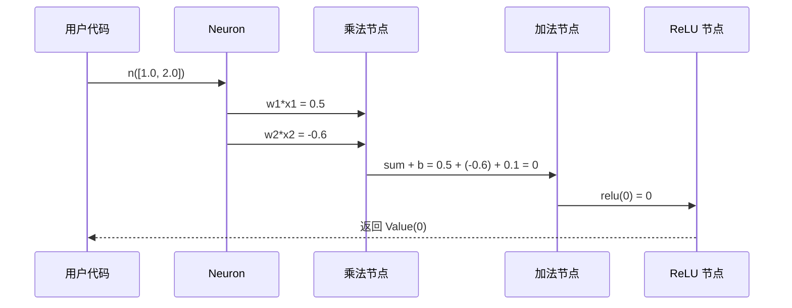
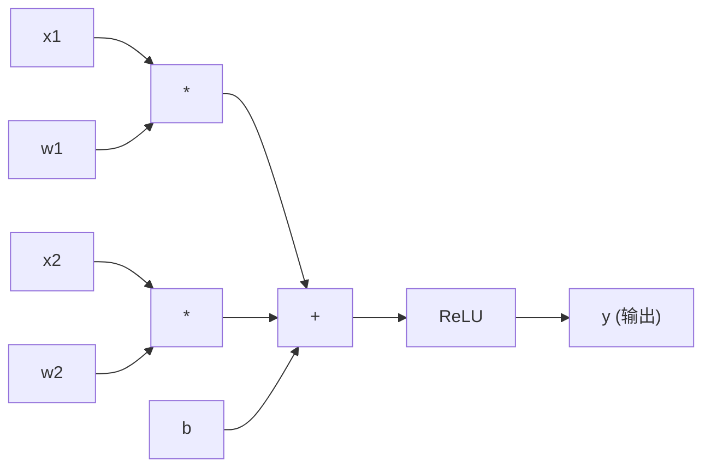

# Chapter 5: 神经元 (Neuron)

在上一章 [模块基类 (Module)](04_模块基类__module__.md) 中，我们认识了所有神经网络组件的"共同祖先"——`Module`。它为我们提供了 `parameters()` 和 `zero_grad()` 这两个通用能力。

从这一章开始，我们要正式见到 `Module` 的第一个孩子，也是整个神经网络中**最小、最基础的计算单元**——`Neuron`（神经元）。

## 一、我们要解决什么问题？

让我们想象一个最直观的小场景。假设你是一家小公司的招聘经理，面前摆着一份候选人的简历，上面有三个指标：

- 学历分数：`x1 = 0.8`
- 工作经验：`x2 = 0.5`
- 面试表现：`x3 = 0.9`

你心里有一杆秤——觉得"工作经验最重要、学历其次、面试表现最次"，于是分别给它们打上权重 `w1 = 0.3, w2 = 0.7, w3 = 0.1`。再加上一个"基础印象分" `b = 0.2`。最后你计算：

```
总分 = w1*x1 + w2*x2 + w3*x3 + b
     = 0.3*0.8 + 0.7*0.5 + 0.1*0.9 + 0.2
     = 0.79
```

如果总分 > 0，就给候选人通过；否则刷掉。

> **恭喜你！你刚刚手动模拟了一个"神经元"的工作流程。**

`Neuron` 就是把这个"加权打分 + 决策是否激活"的过程，**自动化、可学习地**封装起来。我们这一章的目标就是搞清楚：

- `Neuron` 内部到底有什么？
- 它怎么把输入"算"成一个输出？
- 它和我们前面学的 `Value`、`Module` 怎么串到一起？

## 二、`Neuron` 是什么？一个"小型投票器"

你可以把 `Neuron` 想象成一个**小型投票器**：

- 它有几根"输入线"——接收外界传来的信号 `x1, x2, ..., xn`。
- 每根线上都挂着一个"权重旋钮" `w1, w2, ..., wn`——表示"我对这条线的重视程度"。
- 还有一个"偏置" `b`——一个固定的"基础态度"。
- 它把所有输入按权重加起来，再加上偏置，得到一个总分。
- 最后**可选**地过一个"激活函数"（比如 ReLU），决定是不是真的"激活"输出。

用数学公式表达就是：

$$
y = \text{ReLU}(w_1 x_1 + w_2 x_2 + \cdots + w_n x_n + b)
$$

或者用紧凑的向量形式：

$$
y = \text{ReLU}(\mathbf{w} \cdot \mathbf{x} + b)
$$

打个生活化的比方：

- **权重 `w`** 就像每位评委心中的"打分倾向"——有的偏爱才艺，有的偏爱外貌。
- **偏置 `b`** 就像评委的"基础情绪"——心情好时整体多给两分，心情差时少给两分。
- **ReLU 激活** 就像一个"门槛"——总分大于 0 才会兴奋地举牌"通过"，否则就保持沉默（输出 0）。

## 三、看一眼 `Neuron` 的真身

让我们打开 `micrograd/nn.py`，看看 `Neuron` 长什么样。它的 `__init__` 部分非常短：

```python
class Neuron(Module):
    def __init__(self, nin, nonlin=True):
        self.w = [Value(random.uniform(-1,1)) for _ in range(nin)]
        self.b = Value(0)
        self.nonlin = nonlin
```

逐行解读：

1. **`class Neuron(Module):`**：`Neuron` 继承自 `Module`，所以它自动拥有 `zero_grad()` 等通用能力。
2. **`self.w = [...]`**：创建 `nin` 个权重。每个权重是一个 `Value`，初始值是 `-1` 到 `1` 之间的随机数。
3. **`self.b = Value(0)`**：偏置初始化为 0。它也是一个 `Value`，意味着它可以参与反向传播。
4. **`self.nonlin`**：一个开关——决定要不要在末尾过 ReLU 激活。

> 💡 **为什么权重要随机初始化？** 如果所有权重都设成 0，每个神经元的行为就一模一样，训练时也会朝同一方向更新——网络就退化成了"一个神经元"。随机初始化打破对称性，让每个神经元有自己的"个性"。

## 四、`Neuron` 如何"工作"——`__call__` 方法

`Neuron` 的核心计算逻辑藏在 `__call__` 方法里：

```python
def __call__(self, x):
    act = sum((wi*xi for wi,xi in zip(self.w, x)), self.b)
    return act.relu() if self.nonlin else act
```

逐行拆解：

1. **`zip(self.w, x)`**：把权重和输入一一配对，得到 `[(w1,x1), (w2,x2), ...]`。
2. **`sum((wi*xi for ...), self.b)`**：把所有 `wi*xi` 加起来，**起点是 `self.b`**（这是 Python `sum` 函数的第二个参数）。所以结果就是 `b + w1*x1 + w2*x2 + ...`。
3. **`act.relu() if self.nonlin else act`**：如果需要非线性激活，就调用 ReLU；否则直接返回。

> ✨ **关键观察**：`wi`、`xi`、`self.b` 都是 `Value`，所以 `wi*xi`、`+` 这些运算都被自动重载——背后会**自动构建计算图**！这意味着 `__call__` 跑完之后，我们就得到了一棵以输出为根的 DAG，可以直接 `backward()` 了。

那么 Python 中的 `__call__` 是什么？它让一个对象**像函数一样被调用**：

```python
n = Neuron(3)
y = n([1.0, 2.0, 3.0])   # 看! 像函数一样调用
```

这种用法非常优雅——让神经元用起来跟普通的数学函数一样自然。

## 五、亲手用一下 `Neuron`

让我们从最简单的例子开始，看看 `Neuron` 在实际中是怎么用的。

### 例子 1：创建一个 2 输入的神经元

```python
from micrograd.nn import Neuron

n = Neuron(2)        # 2 个输入
print(n)             # ReLUNeuron(2)
```

我们创建了一个有 2 个输入的神经元。打印它时会看到 `ReLUNeuron(2)`——表示这是一个带 ReLU 激活的、接收 2 个输入的神经元。

### 例子 2：喂给它一些输入

```python
y = n([1.0, -2.0])   # 喂两个数字进去
print(y)             # Value(data=..., grad=0)
```

注意 `y` 不是普通的数字——它是一个 `Value`！这意味着它带着完整的计算图，可以直接做 `y.backward()`。

### 例子 3：查看它的参数

```python
print(len(n.parameters()))   # 3 个参数: 2个权重 + 1个偏置
```

输出是 `3`——正是 2 个权重 `w` 加上 1 个偏置 `b`。这个 `parameters()` 方法是 `Neuron` 自己实现的（不是从 `Module` 继承的默认空列表）：

```python
def parameters(self):
    return self.w + [self.b]
```

简单到不能再简单——直接把权重列表和偏置拼起来返回。

## 六、`nonlin` 开关有什么用？

你可能好奇：为什么需要一个 `nonlin` 开关？什么时候要关掉 ReLU 激活？

让我们对比一下两种神经元：

```python
n1 = Neuron(3, nonlin=True)    # 带 ReLU (默认)
n2 = Neuron(3, nonlin=False)   # 不带 ReLU (线性)
```

- **`nonlin=True`**：经过 ReLU，负数变 0。适合**网络中间层**——非线性是神经网络能拟合复杂函数的关键。
- **`nonlin=False`**：纯粹的线性输出 `w·x + b`。适合**网络最后一层**——比如做回归任务时，输出可能是任意实数（包括负数），不能被 ReLU 截断。

打个比方：

- 中间层的神经元像**严格的中转站**——负面信号一律压制为 0（"我不传递负能量"）。
- 最后一层的神经元像**忠实的传声筒**——什么数都原样输出，不掺杂个人态度。

我们将在 [多层感知机 (MLP)](07_多层感知机__mlp__.md) 中看到这个开关是怎么被巧妙运用的。

## 七、内部到底发生了什么？一次完整的前向过程

让我们用一个具体的例子，看看 `n([1.0, 2.0])` 这一行代码背后究竟发生了什么。

假设我们有一个 2 输入的神经元，权重 `w = [0.5, -0.3]`，偏置 `b = 0.1`。当我们调用 `n([1.0, 2.0])` 时：



关键观察：

1. **每一步运算都创建一个新 `Value` 节点**——`wi*xi`、累加、ReLU 都是。
2. **整个过程构建了一棵小型 DAG**——以输出为根，叶子是所有的 `w`、`x`、`b`。
3. **没有任何梯度计算**——前向只是"算值 + 记录图"，梯度等 `backward()` 时才算。

## 八、用一张图看 `Neuron` 内部的计算图

我们以一个有 2 个输入的 `Neuron` 为例，看看 `y = ReLU(w1*x1 + w2*x2 + b)` 在计算图里长什么样：



注意一些重要细节：

- **每个权重、每个输入、偏置都是单独的 `Value` 节点**——micrograd 是标量级别的自动微分，所以"乘法"不是一次完成的矩阵运算，而是被拆成一个个独立的标量乘法。
- **节点数量随输入数量线性增长**——5 个输入的神经元就有 5 次乘法 + 4 次加法 + 1 次激活 ≈ 10 个节点。这就是为什么 README 里说 micrograd"虽然慢，但很直观"。
- **整个图自动连接起来**——我们不需要手动构建任何图结构，所有连接都是 `Value` 在做加法和乘法时自动记录下来的（回顾 [动态计算图 (DAG)](02_动态计算图__dag__.md)）。

## 九、为什么说 `Neuron` 是"可学习"的？

这是 `Neuron` 最神奇的地方——它的权重和偏置都是 `Value`，所以它们可以**被训练**！

让我们看一个迷你训练步骤：

```python
n = Neuron(2)
y = n([1.0, 2.0])    # 前向计算
y.backward()         # 反向传播
print(n.w[0].grad)   # 第一个权重的梯度!
```

调用 `y.backward()` 后，每个权重和偏置的 `.grad` 都被自动填上了"它对输出 `y` 的影响有多大"。接下来训练时只需要：

```python
for p in n.parameters():
    p.data -= 0.01 * p.grad   # 朝梯度反方向走一小步
```

这就是**梯度下降**——通过不断调整参数，让神经元的行为逐渐接近我们想要的目标。

> 🎯 整个流程是不是很美？前向构建图 → 反向算梯度 → 调整参数 → 重新前向……循环往复，神经元就"学会"了。

## 十、单个神经元能做什么？

一个孤零零的神经元能力有限，但它仍然能解决一些简单问题：

- **线性分类**：比如判断一个点是在直线的哪一侧。
- **简单的逻辑函数**：比如 AND、OR（但**不能**实现 XOR——这就是为什么单个神经元不够用）。

要解决更复杂的问题，我们就需要把多个神经元**横向并排**组成一层，再把多层**纵向堆叠**起来——这就是接下来两章的主题。

## 十一、常见疑问

**Q1：为什么权重是 `-1` 到 `1` 的随机数？**

这是一种简单的初始化策略。在工业级框架里有更精细的方案（如 Xavier、He 初始化），但 micrograd 为了简单只用 `random.uniform(-1, 1)`，效果在小网络上已经够用。

**Q2：为什么偏置初始化为 0，而权重要随机？**

偏置是"全局偏移"，初始为 0 不会破坏对称性（因为对所有输入都一视同仁）；而权重负责"区分输入"，必须随机才能让神经元有不同的"个性"。

**Q3：`Neuron` 的 `__call__` 用了 `sum(..., self.b)`，这是什么写法？**

Python 的 `sum` 函数有第二个可选参数叫"起点"。`sum(iter, start)` 表示"从 `start` 开始累加 `iter` 中的元素"。所以 `sum((wi*xi for ...), self.b)` 等价于 `self.b + w1*x1 + w2*x2 + ...`。

**Q4：为什么用生成器表达式 `(wi*xi for ...)` 而不是列表 `[wi*xi for ...]`？**

生成器是"懒"的，不需要把所有乘积一次性存在内存里——更节省空间。在这里两者效果一样，只是写法更优雅。

**Q5：如果输入 `x` 里包含的是普通数字而不是 `Value`，能用吗？**

完全可以！`Value.__mul__` 会自动把普通数字包装成 `Value`（回顾 [标量值与自动微分 (Value)](01_标量值与自动微分__value__.md) 里的运算符重载）。这就是为什么 `n([1.0, 2.0])` 写起来这么自然。

## 十二、本章小结

我们这一章正式认识了神经网络的最小单元——`Neuron`：

- **`Neuron` 是一个"小型投票器"**：给每个输入分配权重，加上偏置，再可选地过 ReLU 激活。
- **数学公式很简洁**：`y = ReLU(w·x + b)`，但 micrograd 是**标量级**实现，每次运算都拆成独立的 `Value` 节点。
- **`Neuron` 继承自 `Module`**：自动拥有 `zero_grad()` 等通用能力，自己只需实现 `parameters()`。
- **权重和偏置都是 `Value`**：意味着它们可以参与自动微分，所以神经元是"可学习"的。
- **`__call__` 让神经元像函数一样使用**：`n([1.0, 2.0])` 自动构建计算图，结果可以直接 `backward()`。
- **`nonlin` 开关**控制是否过 ReLU——中间层一般打开（增加非线性），输出层一般关闭（保留任意实数输出）。

简单回顾一下我们走过的路：前 4 章我们打好了引擎（`Value` + 自动微分）和组件契约（`Module`）的地基；这一章我们用它们搭出了第一个"砖块"——单个神经元。**接下来我们要把多个神经元横向排成一行，形成神经网络中的"一层"。**

让我们在 [神经网络层 (Layer)](06_神经网络层__layer__.md) 中继续探索吧！

---

Generated by [AI Codebase Knowledge Builder](https://github.com/The-Pocket/Tutorial-Codebase-Knowledge)