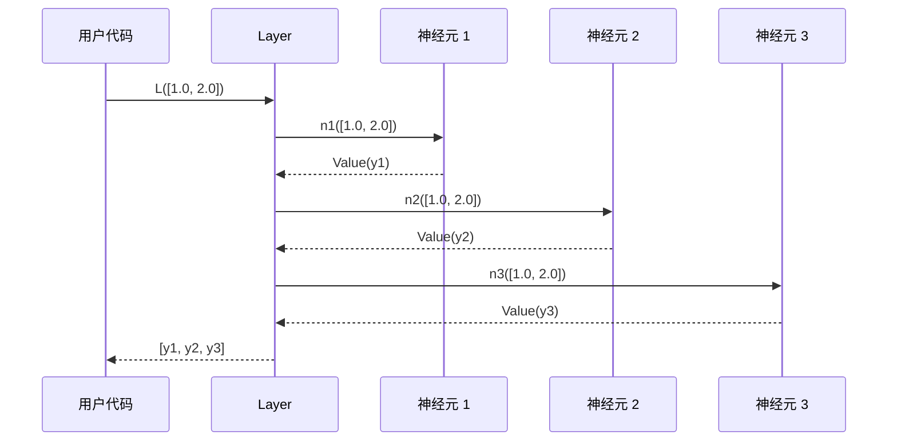
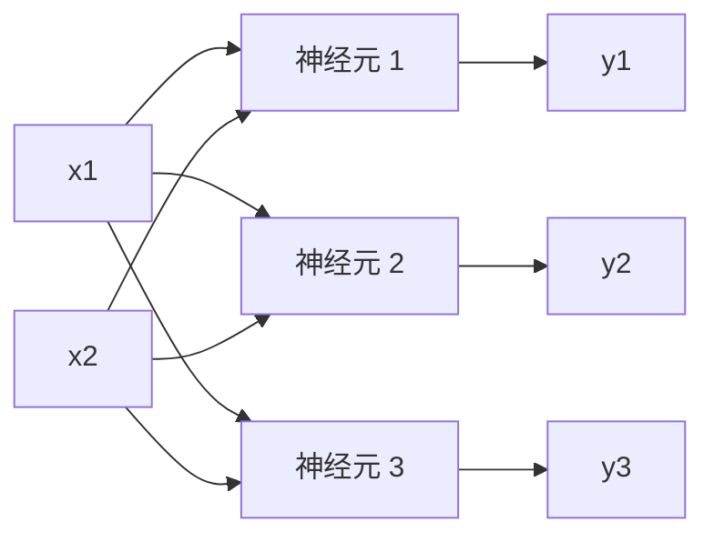

# Chapter 6: 神经网络层 (Layer)

在上一章 [神经元 (Neuron)](05_神经元__neuron__.md) 中，我们认识了神经网络的最小单元——一个会"加权打分 + 激活决策"的小投票器。我们已经知道一个孤零零的神经元可以做简单的线性分类。

但真实世界的问题远比"判断点在直线哪一侧"复杂。想要让网络解决更难的问题，我们需要把神经元**横向并排**组合起来——这就是这一章要登场的 `Layer`（神经网络层）。

## 一、我们要解决什么问题？

让我们回到上一章那个招聘的例子。假设你不再是一个孤独的招聘经理，而是一家公司的**招聘委员会主席**。委员会里有 4 位评委，每位评委都会独立地看同一份简历（同样的 `x1, x2, x3`），但每个人心里的"权重"完全不同：

- 评委 A 偏爱学历高的人。
- 评委 B 偏爱工作经验丰富的人。
- 评委 C 偏爱面试表现好的人。
- 评委 D 综合考虑一切。

每位评委独立打一个分，最终你拿到 4 个分数：`[0.79, 0.62, 0.85, 0.71]`。这 4 个分数会一起送给"下一轮的决策者"。

> **恭喜你！你刚刚手动模拟了一个"神经网络层"的工作流程。**

`Layer` 就是把这种"一排并排的神经元，各自独立处理同一份输入"的模式自动化封装起来。我们这一章的目标就是搞清楚：

- `Layer` 内部到底有什么？
- 它怎么把一份输入"广播"给所有神经元？
- 它和我们前面学的 `Neuron`、`Module` 怎么串到一起？

## 二、`Layer` 是什么？一排并排的投票器

你可以把 `Layer` 想象成一排**并排站立的投票器**：

- 每个投票器（神经元）看到的是**同一份输入** `x`。
- 但每个投票器内部有自己**独特**的权重和偏置——所以会给出不同的判断。
- 它们的输出**并列摆放**，形成一个向量，作为下一层的输入。

打个生活化的比方：

- 想象一支**乐队**面对同一段旋律。每位乐手用不同的乐器（不同的权重）演奏，最终合成出丰富的和声（一组输出）。
- 又像**多角度摄影**——同一个物体从前、后、左、右各拍一张照片，每张照片捕捉到的细节不一样，合在一起才能完整地呈现物体。

数学上，如果一个 `Layer` 有 `nout` 个神经元，每个神经元接收 `nin` 个输入：

$$
\mathbf{y} = \big[ \text{Neuron}_1(\mathbf{x}),\ \text{Neuron}_2(\mathbf{x}),\ \ldots,\ \text{Neuron}_{nout}(\mathbf{x}) \big]
$$

注意——**所有神经元都看同一个 `x`，但每个神经元内部有自己的 `w` 和 `b`**。

## 三、看一眼 `Layer` 的真身

让我们打开 `micrograd/nn.py`，看看 `Layer` 长什么样。它的 `__init__` 非常简洁：

```python
class Layer(Module):
    def __init__(self, nin, nout, **kwargs):
        self.neurons = [Neuron(nin, **kwargs) for _ in range(nout)]
```

逐行解读：

1. **`class Layer(Module):`**：`Layer` 继承自 `Module`，所以它自动拥有 `zero_grad()` 等通用能力。
2. **`nin`**：每个神经元接收多少个输入。
3. **`nout`**：这一层要有多少个神经元（也就是输出的维度）。
4. **`self.neurons = [...]`**：用列表推导式创建 `nout` 个 `Neuron`，每个都接收 `nin` 个输入。
5. **`**kwargs`**：把额外的参数（比如 `nonlin=False`）**透传**给每个 `Neuron`——这样我们可以一次性配置整层的"激活开关"。

> 💡 **关键观察**：`Layer` 自己**完全不存储**任何权重——它只是一个"神经元的容器"。所有真正的参数都藏在 `self.neurons` 里的每个 `Neuron` 中。

## 四、`Layer` 如何"工作"——`__call__` 方法

`Layer` 的核心计算逻辑藏在 `__call__` 方法里：

```python
def __call__(self, x):
    out = [n(x) for n in self.neurons]
    return out[0] if len(out) == 1 else out
```

逐行拆解：

1. **`[n(x) for n in self.neurons]`**：对每个神经元，把**同一份** `x` 喂进去，收集所有输出到一个列表。
2. **`out[0] if len(out) == 1 else out`**：一个小贴心——如果这一层只有 1 个神经元，直接返回那个标量；否则返回整个列表。

> ✨ **为什么有这个 "if 只有 1 个就直接返回" 的特殊处理？** 因为神经网络的**最后一层**经常只有 1 个输出（比如回归任务预测一个房价、二分类任务预测一个概率）。返回单独的 `Value` 比返回 `[Value]` 用起来更自然——可以直接 `loss.backward()`，不用先 `loss[0].backward()`。

## 五、亲手用一下 `Layer`

让我们从最简单的例子开始，看看 `Layer` 在实际中是怎么用的。

### 例子 1：创建一个"3 输入、4 输出"的层

```python
from micrograd.nn import Layer

L = Layer(3, 4)        # 3 个输入, 4 个神经元
print(L)               # Layer of [ReLUNeuron(3), ...]
```

我们创建了一个层，它接收 3 个输入、产出 4 个输出。打印它会看到 4 个 `ReLUNeuron(3)` 排在一起——正是这一层的 4 个神经元。

### 例子 2：喂给它一份输入

```python
y = L([1.0, 2.0, 3.0])    # 喂入一个 3 维输入
print(len(y))             # 4 (4 个输出)
print(y[0])               # Value(data=..., grad=0)
```

注意 `y` 是一个**列表**，长度是 4——正好对应 4 个神经元的输出。每个元素都是一个 `Value`，带着完整的计算图。

### 例子 3：查看这层的参数

```python
print(len(L.parameters()))   # 3*4 + 4 = 16
```

每个神经元有 `3 个权重 + 1 个偏置 = 4 个参数`，4 个神经元加起来就是 `4 × 4 = 16` 个参数。`Layer.parameters()` 把所有这些参数收集起来一并返回：

```python
def parameters(self):
    return [p for n in self.neurons for p in n.parameters()]
```

简单到只有一行——遍历每个神经元，把它们的参数全部"摊平"成一个大列表。这就是我们在 [模块基类 (Module)](04_模块基类__module__.md) 里讲过的**层层委托**：`Layer` 自己不直接管理参数，而是去问每个 `Neuron` 要。

### 例子 4：一键清零所有参数的梯度

```python
L.zero_grad()    # 16 个参数的 grad 全部清零
```

我们**没有**给 `Layer` 写 `zero_grad()` 方法——它直接继承自 `Module`，因为 `Module.zero_grad()` 会自动调用 `self.parameters()`，所以一切都"刚刚好"地串起来了。

## 六、`**kwargs` 透传是怎么回事？

让我们看一个稍微进阶的用法——创建一个"纯线性"的层（不带 ReLU）：

```python
L_linear = Layer(3, 4, nonlin=False)   # 4 个线性神经元
```

`Layer` 的 `__init__` 收到 `nonlin=False` 后，会通过 `**kwargs` 把它**透传**给每个 `Neuron`：

```python
self.neurons = [Neuron(nin, **kwargs) for _ in range(nout)]
# 等价于: Neuron(3, nonlin=False)
```

打个比方：`Layer` 像一个**贴心的快递员**——你交给它一个包裹（额外参数），它不打开看，而是原封不动地分发给每个神经元。这种设计让 `Layer` 不需要事先知道 `Neuron` 有什么配置选项——未来 `Neuron` 加新参数，`Layer` 也无需改动。

## 七、内部到底发生了什么？一次完整的前向过程

让我们用一个时序图，看看 `L([1.0, 2.0])` 这一行代码（假设 `L = Layer(2, 3)`）背后究竟发生了什么：



关键观察：

1. **同一份 `x` 被喂给所有神经元**——每个神经元都看到 `[1.0, 2.0]`。
2. **每个神经元独立计算**——它们之间没有任何信息交换，谁也不知道谁在想什么。
3. **输出按顺序收集成列表**——最后整齐地返回给用户。

## 八、用一张图看 `Layer` 内部的计算图

我们以一个 `Layer(2, 3)` 为例（2 个输入、3 个神经元），看看它构建出的计算图：



注意几个重要细节：

- **输入是共享的**：`x1` 和 `x2` 同时连接到 3 个神经元——但每个神经元用它们的方式完全独立。
- **3 条独立路径**：从输入到 3 个输出，是 3 条互不相干的"小图"。
- **整张图自动连接**——我们没有手动建任何图结构，所有连接都是 `Value` 在做加法和乘法时自动记录下来的（回顾 [动态计算图 (DAG)](02_动态计算图__dag__.md)）。

> 🎨 **形象化理解**：`Layer` 就像一个**"扇出 + 扇入"** 的结构——输入信号**扇出**复制给每个神经元，每个神经元**独立处理**后，输出再**并列摆放**。这种结构在数学上等价于一次"矩阵乘向量"运算（`y = W·x + b`），只不过 micrograd 把它拆成了一个个独立的标量运算。

## 九、为什么需要"层"这个抽象？

你可能会问：既然 `Layer` 只是把一堆 `Neuron` 装在一起，那为什么不直接用一个 `Neuron` 列表呢？

```python
# 没有 Layer 的写法
neurons = [Neuron(3) for _ in range(4)]
outputs = [n(x) for n in neurons]
# 收集参数也要自己写
all_params = []
for n in neurons:
    all_params.extend(n.parameters())
```

而有了 `Layer`：

```python
# 有 Layer 的写法
L = Layer(3, 4)
outputs = L(x)               # 一行搞定前向
all_params = L.parameters()  # 一行搞定参数收集
L.zero_grad()                # 一行搞定清零
```

差别一目了然——`Layer` 把这些零碎操作**封装成了一个统一的接口**。这种封装的好处有三个：

1. **代码更简洁**：少写 N 行循环。
2. **抽象层级清晰**：`Layer` 是一个"整体"，可以像积木一样和其他 `Layer` 拼接起来（这就是下一章 `MLP` 要做的事）。
3. **一致的 `Module` 接口**：`Layer` 也是 `Module`，所以它和 `Neuron`、`MLP` 共享同一套 API——`__call__`、`parameters`、`zero_grad`。

## 十、用 `Layer` 解决我们的"招聘委员会"问题

让我们回到本章开头的例子，用 `Layer` 把"4 位评委独立打分"的场景写出来：

```python
from micrograd.nn import Layer

committee = Layer(3, 4)            # 3 个指标, 4 位评委
candidate = [0.8, 0.5, 0.9]        # 简历指标
scores = committee(candidate)      # 4 位评委的打分
print(len(scores))                 # 4
```

这 4 个分数（`scores`）现在可以作为输入，喂给"下一轮的决策者"——而那个决策者本身又是另一个 `Layer`。把多层这样首尾相连，就组成了真正的神经网络。

## 十一、常见疑问

**Q1：`Layer` 里的神经元为什么不互相通信？**

这是神经网络层的**核心设计**——同一层的神经元是**并列**关系，不互通信号。它们的"协作"通过**下一层**来实现：下一层的神经元会同时看到这一层所有神经元的输出。这种"并联 + 串联"的组合让网络可以表达极其复杂的函数。

**Q2：`nout` 怎么选？是越多越好吗？**

不是。`nout` 太小可能学不到足够的特征（"欠拟合"），太大可能让网络过分记住训练数据的噪声（"过拟合"），还会增加计算量。实际中通常根据问题复杂度试出来——小问题用几个就够，复杂问题可能要几百上千。

**Q3：`Layer` 输出的列表能直接拿去做 `backward()` 吗？**

不能！`backward()` 必须从**单个** `Value` 出发（一个标量损失）。如果输出是列表，需要先把它合并成一个标量（比如求和、求平均、或算损失函数）。看下一章 [多层感知机 (MLP)](07_多层感知机__mlp__.md) 时你会看到完整的流程。

**Q4：为什么 `out[0] if len(out) == 1 else out` 这种特殊处理只对长度 1 做？长度 2、3 怎么不简化？**

长度 1 是个"语义特例"——它本质上就是一个标量，包装成列表反而别扭。而长度 ≥ 2 的列表本来就是"向量"，保持列表形式更自然。这个小细节体现了 micrograd 对"易用性"的细心考量。

**Q5：`Layer` 里每个神经元的权重初始化都不一样吗？**

是的！回顾 [神经元 (Neuron)](05_神经元__neuron__.md) 我们知道每个 `Neuron` 创建时权重都是 `random.uniform(-1,1)` 随机生成的。所以同一层的不同神经元，**初始时就有不同的"个性"**——这是它们能学到不同特征的根本前提。如果初始权重一样，训练时它们会朝完全相同的方向更新，整层就退化成"一个神经元"了。

## 十二、本章小结

我们这一章正式认识了神经网络的"中间层级"——`Layer`：

- **`Layer` 是一排并排的神经元**：每个神经元独立看同一份输入，输出共同组成一个向量。
- **`Layer` 继承自 `Module`**：自动拥有 `zero_grad()`，自己只需实现 `parameters()`。
- **`Layer` 自己不存参数**：所有参数都在内部的 `Neuron` 列表里，通过"层层委托"收集起来。
- **`__call__` 让 `Layer` 像函数一样使用**：`L(x)` 会把 `x` 广播给所有神经元，并收集它们的输出。
- **`**kwargs` 透传**让我们可以一次性配置整层的"激活开关"——为下一章 `MLP` 的"最后一层用线性"埋下伏笔。
- **单输出特殊处理**：当一层只有 1 个神经元时，直接返回标量而不是单元素列表——这让"回归 / 二分类"等场景的用法更自然。

简单回顾一下我们走过的路：第 5 章我们造出了"一块砖"（`Neuron`）；这一章我们把砖**横向**码成了"一排"（`Layer`）。**下一步自然就是把多排砖**纵向**堆叠起来，搭出整面墙——也就是真正可用的神经网络。**

让我们在 [多层感知机 (MLP)](07_多层感知机__mlp__.md) 中见证这最后一步！

---

Generated by [AI Codebase Knowledge Builder](https://github.com/The-Pocket/Tutorial-Codebase-Knowledge)