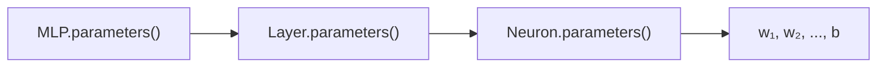
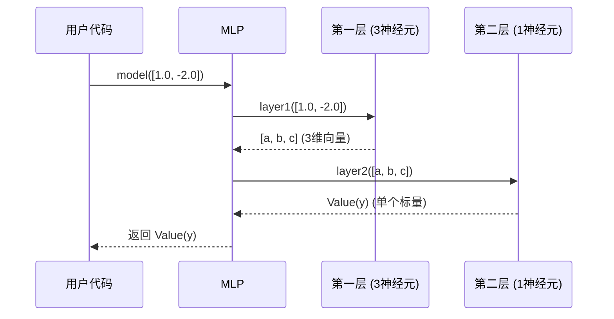
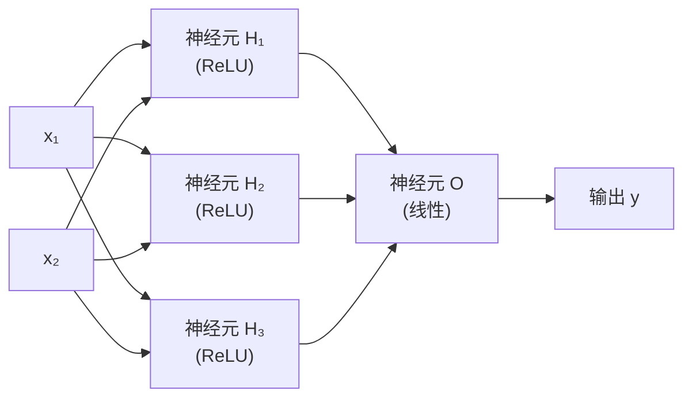
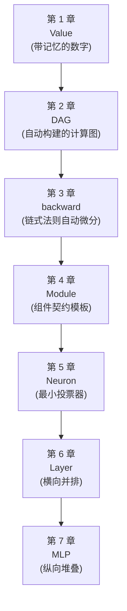

# Chapter 7: 多层感知机 (MLP)

在上一章 [神经网络层 (Layer)](06_神经网络层__layer__.md) 中，我们把一堆神经元横向排成了一列，组成了一个"招聘委员会"——多位评委独立看同一份输入，给出一组打分。

但只有"一排评委"还不够——真实的决策往往要经过**多轮筛选**：初筛、复试、终面……每一轮的结果会作为下一轮的输入。这一章登场的 `MLP`（多层感知机）就是把多个 `Layer` **纵向堆叠**起来，组成一条完整的"决策流水线"——这也是我们 micrograd 之旅的**最后一站**！

## 一、我们要解决什么问题？

让我们想象一个具体的场景。你想训练一个神经网络，输入是某个点的 2D 坐标 `(x, y)`，输出是这个点属于"红色类"还是"蓝色类"的概率（这就是 `README` 提到的"月亮形数据集"二分类任务）。

只用一个神经元，你只能画一条直线把平面分成两半——但月亮形的边界**根本不是直线**，怎么办？

> **答案：把多层神经元串起来！** 每层学到一些"中间特征"，下一层在中间特征的基础上再学更高级的特征——层数一多，模型就能拟合**任意复杂的边界**。

`MLP` 就是来自动化这个"串联多层"的过程。我们这一章的目标就是搞清楚：

- `MLP` 内部到底有什么？
- 它怎么把数据从第一层"传"到最后一层？
- 它和我们前面学的 `Layer`、`Module` 怎么串到一起？

## 二、`MLP` 是什么？一条信息加工流水线

你可以把 `MLP` 想象成一条**信息加工流水线**：

- 原料（输入数据）从流水线一端进入。
- 经过**第一道工序**（第一层），变成一组"半成品 A"。
- "半成品 A"进入**第二道工序**（第二层），变成"半成品 B"。
- ……
- 最终从流水线另一端出来一个"成品"（预测结果）。

每一道工序里的"工人们"（神经元）只关心眼前的输入，按自己的规则加工，把结果送给下一道工序。这种**前一层输出 = 后一层输入**的串联结构，就叫"**前馈神经网络**"（Feedforward Neural Network）。

打个生活化的比方：

- **图像识别** 像逐级抽象——第一层认识"边缘"，第二层组合边缘认识"眼睛、鼻子"，第三层把五官拼成"脸"。
- **多轮面试** 像逐级筛选——初筛看简历关键词，复试评估专业能力，终面综合判断。每一轮都是基于上一轮结果的**进一步加工**。

数学上，如果我们有 3 层，输入为 `x`：

$$
\mathbf{y} = \text{Layer}_3\big( \text{Layer}_2( \text{Layer}_1(\mathbf{x}) ) \big)
$$

层层嵌套调用，前一层的输出作为后一层的输入。

## 三、看一眼 `MLP` 的真身

让我们打开 `micrograd/nn.py`，看看 `MLP` 长什么样。它的 `__init__` 部分非常巧妙：

```python
class MLP(Module):
    def __init__(self, nin, nouts):
        sz = [nin] + nouts
        self.layers = [Layer(sz[i], sz[i+1], nonlin=i!=len(nouts)-1)
                       for i in range(len(nouts))]
```

逐行解读：

1. **`nin`**：输入维度（比如 2D 坐标就是 `2`）。
2. **`nouts`**：一个列表，描述**每一层的输出维度**。比如 `[16, 16, 1]` 表示"第一层 16 个神经元，第二层 16 个，最后一层 1 个"。
3. **`sz = [nin] + nouts`**：把输入维度拼到最前面，凑成一个"维度序列"。比如 `nin=2, nouts=[16, 16, 1]` 拼出来就是 `[2, 16, 16, 1]`。
4. **构建各层**：遍历这个序列，相邻两个数字就是一层的 `(nin, nout)`。

让我们具体看一下 `sz = [2, 16, 16, 1]` 会拼出哪些层：

- `i=0`：`Layer(2, 16)`——2 维输入 → 16 维输出
- `i=1`：`Layer(16, 16)`——16 维输入 → 16 维输出
- `i=2`：`Layer(16, 1)`——16 维输入 → 1 维输出

每一层的输入维度，正好是上一层的输出维度——**接口自动对齐**！

## 四、关键细节：`nonlin=i!=len(nouts)-1` 是什么意思？

让我们仔细看 `Layer(sz[i], sz[i+1], nonlin=i!=len(nouts)-1)` 这一行里的 `nonlin` 参数。

`i!=len(nouts)-1` 翻译成大白话是："只要 `i` 不是最后一层的索引，就为 `True`（即 `nonlin=True`）"。所以：

- **中间层** → `nonlin=True` → 神经元末尾过 ReLU 激活。
- **最后一层** → `nonlin=False` → 神经元末尾不过 ReLU，直接输出线性结果。

> 💡 **为什么最后一层要关掉 ReLU？** 因为 ReLU 会把负数变成 0，而最后一层的输出可能需要是任意实数（比如做回归预测房价，或者二分类预测一个 logit 值，可以是负的）。如果最后一层也过 ReLU，模型就**永远输不出负数**，表达能力被强行截断了一半。

回顾 [神经元 (Neuron)](05_神经元__neuron__.md) 中我们提过的：**中间层像中转站（压制负信号），最后一层像传声筒（原样输出）**——`MLP` 通过这个聪明的 `nonlin` 开关把这种设计自动化了。

## 五、`MLP` 如何"工作"——`__call__` 方法

`MLP` 最迷人的地方在于它的**前向传播**写起来极其简洁：

```python
def __call__(self, x):
    for layer in self.layers:
        x = layer(x)
    return x
```

总共 3 行有效代码。逐行解读：

1. **`for layer in self.layers`**：依次取出每一层。
2. **`x = layer(x)`**：把当前的 `x` 喂给这一层，**用结果覆盖 `x`**——下一轮循环时，`x` 就变成了"加工过一道"的数据。
3. **`return x`**：循环结束时，`x` 已经经过了所有层的加工，就是最终输出。

这正是"前一层的输出作为后一层的输入"的最干净表达——一个简单的 `for` 循环！

## 六、亲手用一下 `MLP`

让我们从最简单的例子开始。

### 例子 1：创建一个两层隐藏层的 MLP

```python
from micrograd.nn import MLP

model = MLP(2, [16, 16, 1])
print(model)
```

我们创建了一个网络：2 维输入 → 16 → 16 → 1 维输出。这正是 README 里二分类 demo 用的结构！打印它会看到三个 `Layer`——前两个是 `ReLULayer`，最后一个是 `LinearLayer`。

### 例子 2：喂给它一个输入

```python
x = [1.0, -2.0]
y = model(x)
print(y)    # Value(data=..., grad=0)
```

注意 `y` 不是列表，而是单个 `Value`！为什么？因为最后一层只有 1 个神经元——回顾 [神经网络层 (Layer)](06_神经网络层__layer__.md)，单输出时 `Layer` 会自动返回标量而不是单元素列表。

### 例子 3：看看有多少参数

```python
print(len(model.parameters()))
```

让我们手算一下：
- 第 1 层：`16 * (2+1) = 48`
- 第 2 层：`16 * (16+1) = 272`
- 第 3 层：`1 * (16+1) = 17`
- 总计：`337` 个参数

`MLP.parameters()` 会把这 337 个 `Value` 全部收集起来，方便统一管理。

### 例子 4：完整的"训练一步"

```python
y = model([1.0, -2.0])
loss = (y - 1.0) ** 2    # 假设目标是 1.0
model.zero_grad()        # 清零所有梯度
loss.backward()          # 反向传播
```

这 4 行就是一次完整的**前向+反向**过程！`model.zero_grad()` 直接从 [模块基类 (Module)](04_模块基类__module__.md) 继承——一行调用就清零了所有 337 个参数的梯度。

最后一步：根据梯度更新参数：

```python
for p in model.parameters():
    p.data -= 0.01 * p.grad
```

把上面 5 行代码循环跑 1000 次，模型就**学会**了！这就是神经网络训练的全部秘密。

## 七、`parameters()` 的"层层委托"

我们看 `MLP.parameters()`：

```python
def parameters(self):
    return [p for layer in self.layers for p in layer.parameters()]
```

依然是熟悉的"层层委托"模式（回顾 [模块基类 (Module)](04_模块基类__module__.md)）：

- `MLP` 不直接管参数，去问每个 `Layer` 要。
- `Layer` 也不直接管，去问每个 `Neuron` 要。
- `Neuron` 才是真正"持有"参数的人。

整条链路像**俄罗斯套娃**层层展开：



这种设计让每一层只需关心"自己的直接组成部分"——加新组件、改旧组件，都不会牵一发动全身。

## 八、一次完整前向传播的全过程

让我们用一个时序图，看看 `model([1.0, -2.0])` 这一行代码（`model = MLP(2, [3, 1])`）背后究竟发生了什么：



关键观察：

1. **数据"流"过每一层**：维度依次为 `2 → 3 → 1`——精准对齐。
2. **每一层独立工作**：内部细节我们一点都不用管。
3. **最后一层只有 1 个神经元**：所以 `Layer` 自动返回单个 `Value` 而不是列表，用户拿到的就是直接可用的结果。

## 九、用一张图看 MLP 的完整计算图

我们以 `MLP(2, [3, 1])` 为例（2 维输入、一个隐藏层 3 个神经元、输出层 1 个神经元），看看整个网络的连接方式：



注意几个重要细节：

- **左半边**：3 个隐藏层神经元各自看到完整的输入 `(x₁, x₂)`——这是 `Layer` 的"广播"行为。
- **右半边**：输出神经元 `O` 看到的输入是 3 个隐藏神经元的输出 `(H₁, H₂, H₃)`——这是"层与层之间的串联"。
- **中间层带 ReLU，最后一层是线性**——`MLP.__init__` 里的 `nonlin=i!=len(nouts)-1` 把这个规则自动应用了。
- **整张图自动连接**——我们一行图构建代码都没写，全是 `Value` 在加法/乘法时自动记录下来的（回顾 [动态计算图 (DAG)](02_动态计算图__dag__.md)）。

> 🎯 **整张图的威力**：当我们调用 `y.backward()` 时，梯度会从输出 `y` 一路"流"回所有 337 个参数（在两层 16 神经元的真实 demo 里），每个参数都知道"我对损失的影响有多大"——然后我们就可以朝梯度反方向调整它们，让损失越来越小。这就是**深度学习训练**的核心。

## 十、为什么"多层"如此强大？

让我们直觉理解一下：**为什么一层不够，多层就能拟合复杂函数？**

- **一层（线性模型）**：本质上是 `y = Wx + b`，只能画**直线（或超平面）**作为决策边界。月亮形数据集？画不出来。
- **多层 + 非线性激活**：每一层做完线性变换后过 ReLU，相当于在数据空间里**"折叠"**了一次。多层折叠之后，原本弯弯曲曲的决策边界在最后一层看来就变成了"直线可分"——所以最后一层只需要做线性输出。

打个比方：

- 单层网络像**单次裁剪**——只能用直剪刀剪一刀。
- 多层网络像**多次精细折叠+裁剪**（玩过剪纸窗花吗？）——通过反复折叠，简单的直剪刀也能剪出复杂的对称图案。

这就是"**深度**学习"中"深度"二字的真正含义——**层数越多，模型能表达的函数越复杂**。

## 十一、README 那个二分类 demo

现在让我们终于读懂 README 里这句话的全部含义：

> "using a 2-layer neural net with two 16-node hidden layers we achieve the following decision boundary on the moon dataset"

翻译过来就是：

```python
model = MLP(2, [16, 16, 1])
```

- `2`：2 维输入（点的 `x, y` 坐标）
- `[16, 16, 1]`：两个 16 个神经元的隐藏层 + 一个 1 神经元的输出层
- 输出经过损失函数和反向传播，**自动**学到了能正确划分月亮形数据的边界

我们已经掌握了搭建并训练这种网络的全部知识——这就是 micrograd 的全部精髓！

## 十二、常见疑问

**Q1：为什么参数是 337 而不是其他数？**

每个神经元有 `nin + 1` 个参数（`nin` 个权重 + 1 个偏置）。所以：
- 第一层：16 个神经元 × (2+1) = 48
- 第二层：16 个神经元 × (16+1) = 272
- 第三层：1 个神经元 × (16+1) = 17

总计 `48 + 272 + 17 = 337`。每一层的参数量主要由"输入维度"决定。

**Q2：层数越多越好吗？**

不一定！层数太多会带来"梯度消失/爆炸"问题（梯度在反向传播时被反复相乘，可能变得极小或极大），还会增加计算量和过拟合风险。实际中通常根据问题复杂度试出合适的层数——简单任务 2-3 层够了，复杂任务可能要几十层（甚至几百层，需要更精巧的技术，比如残差连接）。

**Q3：每层的神经元数量必须一样吗？**

不必！`nouts` 列表完全自由。常见的设计是**"漏斗形"**——前面层多、后面层少（比如 `[64, 32, 16, 1]`），让信息逐步压缩。也可以反过来，或保持不变，看具体任务。

**Q4：MLP 只能做分类吗？**

不！MLP 是**通用的前馈网络**——分类、回归、近似任意函数都行。最后一层的设计可以根据任务调整（比如二分类配 sigmoid，多分类配 softmax，回归直接线性输出）。在 micrograd 中，最后一层默认是线性输出，是否额外加 sigmoid 等由用户在调用 `model(x)` 后自行决定。

**Q5：为什么 `MLP` 自己不存储参数？**

因为参数全部存在内部的 `Layer` 里（再深一层在 `Neuron` 里）。这种**层层委托**让代码极其简洁——每一层只关心自己直接拥有什么。如果 `MLP` 试图自己存所有参数，它就要"穿透"两层抽象去搬运数据，反而复杂。

## 十三、本章小结

我们这一章正式认识了 micrograd 中**可直接用于实际训练的最高层抽象**——`MLP`：

- **`MLP` 是一条信息加工流水线**：多个 `Layer` 串联起来，前一层的输出作为后一层的输入。
- **`MLP` 继承自 `Module`**：自动拥有 `zero_grad()`，自己只需实现 `parameters()`。
- **`MLP` 自己不存参数**：全在内部的 `Layer` 列表里，通过"层层委托"收集。
- **巧妙的 `nonlin` 开关**：中间层带 ReLU 引入非线性，最后一层线性输出允许任意实数——这个细节让 MLP 直接可用于回归和分类。
- **`__call__` 只有 3 行**：一个简单的 `for` 循环把数据从前到后传过所有层。
- **"深度"=表达能力**：多层堆叠让网络能拟合极其复杂的函数，这就是"深度学习"中"深度"二字的根本含义。

## 十四、整个旅程的回顾

到这里，我们的 micrograd 之旅就**完整结束**了！让我们鸟瞰一下整段历程：



- **第 1–3 章**：我们打造了 micrograd 的**引擎**——一个能在任意标量计算图上自动求梯度的小型自动微分系统。
- **第 4 章**：我们认识了**组件契约**——所有神经网络组件共享的基础接口。
- **第 5–7 章**：我们沿着"由小到大"的顺序，从最小的 `Neuron` 出发，搭出了 `Layer`，最终组装成可训练的 `MLP`。

回头看，整个 micrograd 不过 150 行代码——但它涵盖了现代深度学习框架（如 PyTorch）最核心的所有思想：**动态计算图、反向模式自动微分、面向对象的网络组件设计**。

> 🎉 **你已经掌握了深度学习引擎的全部秘密！** 当你以后阅读 PyTorch 源码、看 Transformer 论文、调试梯度问题时，所有的高层概念都建立在我们这 7 章学过的基石之上。

接下来，鼓励你做几件事来巩固所学：

1. **跑一遍 `demo.ipynb`**：亲眼看到 MLP 在月亮形数据集上学到决策边界的过程。
2. **改改超参数**：把 `[16, 16, 1]` 换成 `[8]` 或 `[32, 32, 32, 1]`，观察效果。
3. **自己实现一个新激活函数**：比如把 `relu` 改成 `tanh`，记得手算并实现 `_backward`。
4. **挑战 PyTorch**：用 PyTorch 重写月亮数据 demo，你会惊讶地发现 API 几乎一模一样——因为 PyTorch 的核心思想就是 micrograd 的"工业级版本"。

感谢你陪伴 micrograd 走完这段旅程。**真正的学习才刚刚开始**——愿你带着这些扎实的基础，在更广阔的深度学习世界里继续探索！🚀

---

Generated by [AI Codebase Knowledge Builder](https://github.com/The-Pocket/Tutorial-Codebase-Knowledge)