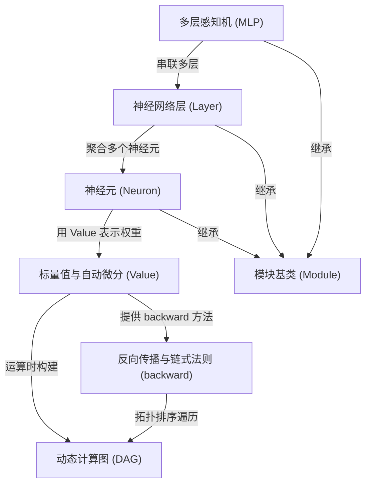

# Tutorial: micrograd

`micrograd` 是一个**极简的自动微分引擎**，仅用约 100 行代码就实现了基于**动态计算图**的*反向模式自动求导*（reverse-mode autodiff），并在其上构建了一个类似 *PyTorch* 风格的**小型神经网络库**（约 50 行代码）。
它的核心是 `Value` 类——一个包装**标量数值**并记录梯度的"带记忆的数字"，所有数学运算都会自动构建一张**有向无环图（DAG）**，从而支持调用 `backward()` 自动计算偏导数。
在引擎之上，项目提供了 `Module`、`Neuron`、`Layer`、`MLP` 四个抽象，让用户能像搭积木一样组装出**多层感知机**，并完成诸如二分类等真实训练任务。
虽然由于只支持标量运算导致效率不高，但它**直观、易读、麻雀虽小五脏俱全**，非常适合用于*教学*和理解深度学习框架的底层原理。

**Source Repository:** [https://github.com/karpathy/micrograd](https://github.com/karpathy/micrograd)

## Chapters

1. [标量值与自动微分 (Value)
](01_标量值与自动微分__value__.md)
2. [动态计算图 (DAG)
](02_动态计算图__dag__.md)
3. [反向传播与链式法则 (backward)
](03_反向传播与链式法则__backward__.md)
4. [模块基类 (Module)
](04_模块基类__module__.md)
5. [神经元 (Neuron)
](05_神经元__neuron__.md)
6. [神经网络层 (Layer)
](06_神经网络层__layer__.md)
7. [多层感知机 (MLP)
](07_多层感知机__mlp__.md)

---

Generated by [AI Codebase Knowledge Builder](https://github.com/The-Pocket/Tutorial-Codebase-Knowledge)