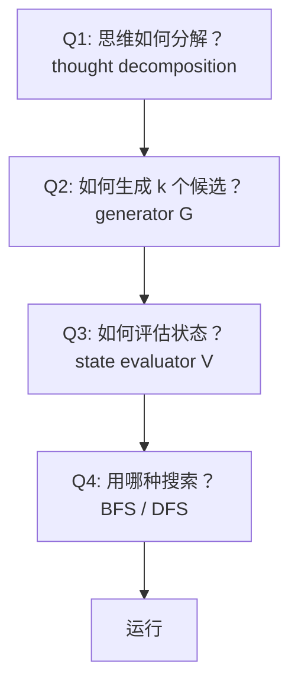

# 2. 方法详解

ToT 框架的整个方法部分（论文 Section 3）就是回答**4 个问题**。我们逐个拆开。

## 2.1 方法总览

ToT 把"解一个问题"看作**在状态空间里搜索**。

- **状态** $s = [x, z_{1..i}]$：输入 $x$ 加上到目前为止的思维序列
- **算子**：生成新的思维 $z_{i+1}$，把状态推进到 $s' = [x, z_{1..i+1}]$

要把这个抽象框架变成可执行算法，必须回答：



下面 4 节分别讲。

## 2.2 Q1：思维如何分解（Thought Decomposition）

CoT 把推理拆成一条链，但**链上每个"thought"$z_i$ 的粒度是模糊的**——可能一个词、一句话、一段。

ToT 要求**明确**：一个 thought 是什么？

**设计准则**：

- **小到 LLM 能并行采样多个不同的候选**（diverse）
- **大到 LLM 能对它做有意义的评估**（informative）

具体到三个任务：

| 任务 | thought 是什么 | thought 数量 (深度) |
|---|---|---|
| **Game of 24** | 一个中间方程，如 `13 - 9 = 4 (left: 4 4 10)` | 3 |
| **Creative Writing** | 一整段写作 plan | 1（先 plan 再写） |
| **5×5 Crosswords** | 给一个 clue 填一个单词 | 5–10（每个 clue 一个） |

> 💡 **个人见解**：
> 
> **观察**：在 Game of 24，thought 粒度刚好对应"一步算术"——既不是单 token（太细，没法做有意义的"sure / impossible"判断），也不是整条解（太粗，无法在中间剪枝）。
> 
> **判断**：**thought 粒度的选择本身比框架更重要**。论文的所有"创新"其实都依赖于"thought 粒度选得刚刚好"这个先决条件。在论文没覆盖的任务（如代码生成、复杂数学证明）上，能不能找到一个合适粒度，是 ToT 能不能用的**第一硬约束**——这也是后续工作（如 [SoT](https://arxiv.org/abs/2307.15337)、[LATS](https://arxiv.org/abs/2310.04406)）反复纠结的问题。
> 
> **延伸**：如果你试用 ToT 失败了，**先检查你的 thought 粒度对不对**，再去怀疑别的。

## 2.3 Q2：如何生成 k 个候选（Thought Generator $G(p_\theta, s, k)$）

给定一个状态 $s = [x, z_{1..i}]$，要生成 $k$ 个候选下一步思维 $z_{i+1}^{(1)}, \dots, z_{i+1}^{(k)}$。论文给两种策略：

### 2.3.1 策略 A：Sample（i.i.d. 采样）

从同一个 CoT prompt 反复采样：

$$
z^{(j)} \sim p_\theta^{\,CoT}(z_{i+1} \mid x, z_{1..i}), \quad j = 1, \dots, k
$$

**适合**：思维空间大、自由度高（如 Creative Writing 的写作 plan）。

**为什么**：让模型在高温度下多次独立采样，自然产生差异化的候选。

### 2.3.2 策略 B：Propose（提议）

用一个特别的"propose prompt"，**一次性让 LLM 列出多个不同的下一步**：

$$
[z^{(1)}, \dots, z^{(k)}] \sim p_\theta^{\,propose}(z_{i+1}^{(1..k)} \mid s)
$$

**适合**：思维空间小、容易重复（如 Game of 24，只有有限的"两数运算"组合）。

**为什么**：i.i.d. 采样在小空间里会大量重复（你采 5 次都拿到 `4+9=13`）；让模型一次提议，它会自动多样化。

### 2.3.3 Game of 24 的 Propose Prompt 实例

下面是真实代码里的 prompt（来自 [`src/tot/prompts/game24.py:52-64`](https://github.com/princeton-nlp/tree-of-thought-llm/blob/8050e67d/src/tot/prompts/game24.py#L52-L64)）：

```text
Input: 2 8 8 14
Possible next steps:
2 + 8 = 10 (left: 8 10 14)
8 / 2 = 4 (left: 4 8 14)
14 + 2 = 16 (left: 8 8 16)
2 * 8 = 16 (left: 8 14 16)
8 - 2 = 6 (left: 6 8 14)
14 - 8 = 6 (left: 2 6 8)
14 / 2 = 7 (left: 7 8 8)
14 - 2 = 12 (left: 8 8 12)
Input: {input}
Possible next steps:
```

**注意**：这只是一个 **1-shot** 示例（论文里说 "1-shot demonstrating ~8 candidates"），LLM 看到后会给当前 `{input}` 也吐出一堆候选。

## 2.4 Q3：如何评估状态（State Evaluator $V(p_\theta, S)$）

给定一组状态 $S$，要打分（或排序）。也是两种策略：

### 2.4.1 策略 A：Value（独立打分）

对每个状态 $s$ 独立采样一个值：

$$
V(p_\theta, S)(s) \sim p_\theta^{\,value}(v \mid s), \quad \forall s \in S
$$

可以是数字（1-10）也可以是分类（`sure / likely / impossible`）。

Game of 24 用的是**3 级分类**，然后映射到数字（[`game24.py:90`](https://github.com/princeton-nlp/tree-of-thought-llm/blob/8050e67d/src/tot/tasks/game24.py#L90)）：

```python
value_map = {'impossible': 0.001, 'likely': 1, 'sure': 20}
```

**注意这个不对称的映射**：`sure` 是 `likely` 的 20 倍，`impossible` 几乎是 0。**这是个工程取舍**——让模型对"确定能 24"和"可能能 24"产生剧烈区分，把搜索预算压到高置信分支上。

### 2.4.2 策略 B：Vote（投票比较）

把一组状态 $S$ 整个塞给 LLM，让它**选最好的那个**：

$$
V(p_\theta, S)(s) = \mathbb{1}[s = s^*], \quad s^* \sim p_\theta^{\,vote}(s^* \mid S)
$$

**适合**：直接打分困难的任务（如 Creative Writing 的"哪段更连贯"——单段没法独立评分，要对比才知道）。

### 2.4.3 Value Prompt 实例（Game of 24）

让 LLM 评估 "10 14 这两个数能不能凑出 24"（[`prompts/game24.py:66-89`](https://github.com/princeton-nlp/tree-of-thought-llm/blob/8050e67d/src/tot/prompts/game24.py#L66-L89)）：

```text
Evaluate if given numbers can reach 24 (sure/likely/impossible)
10 14
10 + 14 = 24
sure
11 12
11 + 12 = 23
12 - 11 = 1
11 * 12 = 132
11 / 12 = 0.91
impossible
4 4 10
4 + 4 + 10 = 8 + 10 = 18
4 * 10 - 4 = 40 - 4 = 36
(10 - 4) * 4 = 6 * 4 = 24
sure
...
```

**关键技巧**：prompt 里给的 demonstrations **包含了"lookahead simulation"**——示例里模型先**试几种运算**，再下判断。这是把 lookahead 嵌进 prompt 而不是嵌进搜索算法。

> 💡 **个人见解**：
> 
> **观察**：`value_map = {'impossible': 0.001, 'likely': 1, 'sure': 20}` 这个**不对称映射**论文正文一句没提，只在代码里出现，标了 `# TODO: ad hoc`。
> 
> **判断**：这是典型的"论文没说但实际很关键"的工程细节。如果把映射改成 `{0, 0.5, 1}`，BFS 会在大量"likely"状态间纠结，**实际效果会显著下降**。论文 74% 的成绩里有几个百分点其实是靠这个不对称映射撑住的。
> 
> **延伸**：要复现 ToT 的"惊艳数字"，必须连同这些"小数点配方"一起复现。这是 LLM 时代论文复现的常见雷区。

## 2.5 Q4：搜索算法（Search Algorithm）

ToT 用了**两个最朴素的**算法。

### 2.5.1 ToT-BFS（Algorithm 1）

适合**浅而广**的任务（深度 $T \le 3$）。维护一个 beam，大小为 $b$：

$$
\begin{aligned}
S_0 &\leftarrow \{x\} \\
\text{for } t &= 1, \dots, T: \\
&\quad S_t' \leftarrow \{[s, z] \mid s \in S_{t-1},\, z \in G(p_\theta, s, k)\} \quad \text{(扩展所有候选)} \\
&\quad V_t \leftarrow V(p_\theta, S_t') \quad \text{(评估)} \\
&\quad S_t \leftarrow \mathop{\arg\max}_{S \subset S_t', |S|=b} \sum_{s \in S} V_t(s) \quad \text{(保留 top-b)}
\end{aligned}
$$

**翻译成人话**：每一层，把所有当前状态都扩展候选，全部打分，只留分最高的 $b$ 个继续。

Game of 24 用 $b=5$，深度 $T=3$。

### 2.5.2 ToT-DFS（Algorithm 2）

适合**深而窄**的任务（如 Crosswords，深度 5–10）。维护一个深度优先的栈，加上**剪枝**和**回溯**：

```text
DFS(s, t):
    if t > T:
        record G(p_θ, s, 1)  # 到达深度限制，记录输出
        return
    for s' in sorted_candidates(G(p_θ, s, k)):  # 按 V(s') 降序
        if V(p_θ, {s'})(s') > v_thres:  # 评估通过阈值
            DFS(s', t+1)
        # else: 剪枝并回溯到 parent
```

**Crosswords 的关键技巧**：state evaluator 不只是"看当前像不像好答案"，而是**评估剩余 clue 是否还有解**——任何一个剩余 clue 被 LLM 判断为 "impossible"，整个子树就剪掉。

### 2.5.3 完整算法图（论文 Algorithm 1 复刻）

来自论文 Section 3 的伪代码（[paper p.4](https://arxiv.org/pdf/2305.10601)）：

```text
Algorithm 1 ToT-BFS(x, p_θ, G, k, V, T, b)
Require: Input x, LM p_θ, thought generator G & size limit k, 
         states evaluator V, step limit T, breadth limit b.
1: S_0 ← {x}
2: for t = 1, ..., T do
3:    S_t' ← {[s, z] : s ∈ S_{t-1}, z ∈ G(p_θ, s, k)}
4:    V_t ← V(p_θ, S_t')
5:    S_t ← argmax_{S⊂S_t', |S|=b} sum_{s∈S} V_t(s)
6: end for
7: return G(p_θ, argmax_{s∈S_T} V_T(s), 1)
```

## 2.6 把 4 个问题填好就成了 ToT

一个具体任务的 ToT 实例 = **决定 (Q1, Q2, Q3, Q4) 4 个钩子的取值**：

| 任务 | thought (Q1) | generator (Q2) | evaluator (Q3) | search (Q4) |
|---|---|---|---|---|
| Game of 24 | 一个中间方程 | **Propose** | **Value (sure/likely/impossible)** | BFS, $b=5$, $T=3$ |
| Creative Writing | 一段 plan | **Sample** ($k=5$) | **Vote** | BFS, $b=1$, $T=2$ |
| 5×5 Crosswords | 一个 clue 的单词 | **Propose** | **Value (over each remaining clue)** | **DFS** + pruning |

> 💡 **个人见解**：
> 
> **观察**：上面这张 2×2 的"Propose/Sample × Value/Vote"组合 + BFS/DFS 选择，构成了 ToT 的**整个设计空间**。每个任务等于"在 8 个格子里挑一组"。
> 
> **判断**：这种**极简的组合式设计空间**是 ToT 真正的概念贡献，比"74% on Game of 24"这个数字本身**重要 10 倍**。它给后续工作提供了一个**统一框架**：你只要回答这 4 个问题，就能把任何推理任务套进 ToT。这是 paper 的"剩余价值"，论文标题副标题"deliberate problem solving"也是在强调这点。
> 
> **延伸**：但是这个设计空间**没有覆盖 MCTS、Beam Search、A***。同期 [RAP](https://arxiv.org/abs/2305.14992) 就把 MCTS 填进了第 4 格——你完全可以把 ToT 看成"BFS/DFS-only 版的 RAP"。

## 2.7 小结

- **4 个钩子**：thought decomposition (Q1)、generator $G$ (Q2)、evaluator $V$ (Q3)、search (Q4)
- **2 种生成策略**：Sample（多次 i.i.d.）vs Propose（一次提议多个）
- **2 种评估策略**：Value（独立打分）vs Vote（对比挑最好）
- **2 种搜索**：BFS（浅广）vs DFS + 剪枝 + 回溯（深窄）
- **3 个任务的取值表**：本章 [表 2.6](#26-把-4-个问题填好就成了-tot)

下一章 → [实验与结果](03_实验与结果.md)
