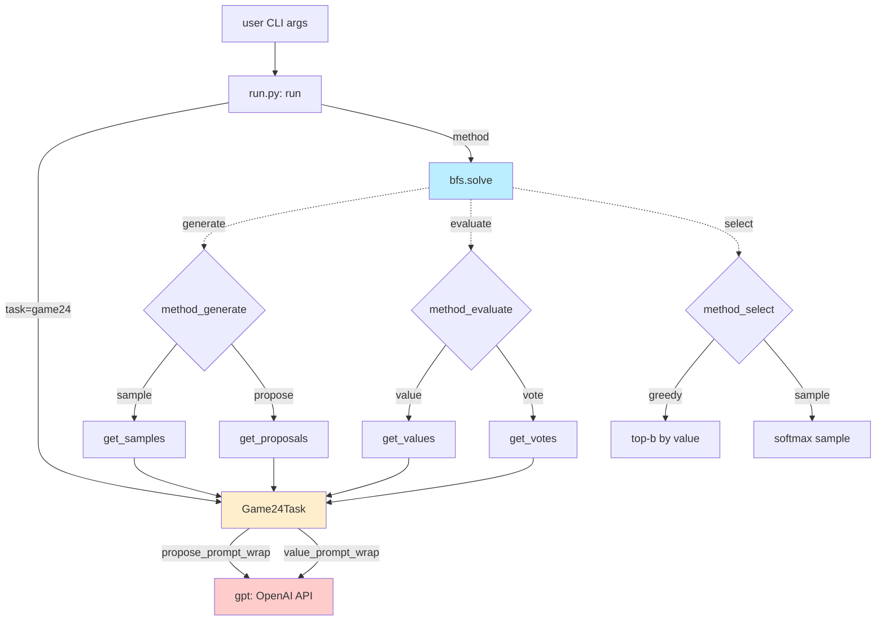
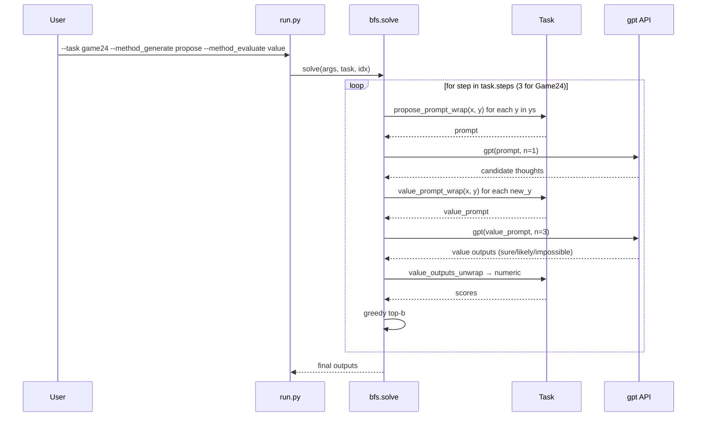
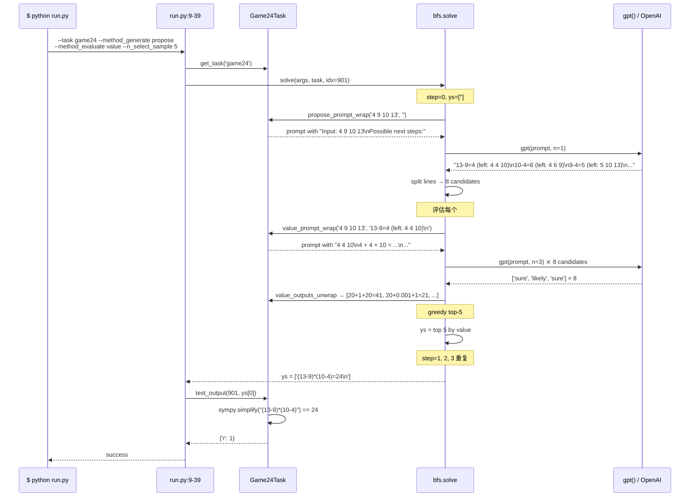

# 4. 源码分析

> 本章用 **DeepWiki 风格**组织。所有代码引用形如 [`file.py:Lx-Ly`](url) 可点回 GitHub 指定 commit。
>
> 本章使用的 commit：[`8050e67d`](https://github.com/princeton-nlp/tree-of-thought-llm/tree/8050e67d0e3a0fddc424d7fa5801538722a4c4cc)（截至 2026 年 5 月）。

## 4.1 项目结构

```
tree-of-thought-llm/
├── run.py                          # CLI 入口
├── setup.py                        # pip install -e .
├── src/tot/
│   ├── models.py                   # GPT-4 API 封装 (gpt() + gpt_usage())
│   ├── methods/
│   │   └── bfs.py                  # BFS 求解器 + naive_solve (IO/CoT)
│   │                               # ⚠️ 没有 dfs.py！见 4.5
│   ├── tasks/
│   │   ├── base.py                 # Task 基类
│   │   ├── game24.py               # Game24Task
│   │   ├── text.py                 # Creative Writing
│   │   └── crosswords.py           # MiniCrosswordsEnv + MiniCrosswordsTask
│   └── prompts/
│       ├── game24.py               # 5 个 prompt (standard, cot, propose, value, value_last_step)
│       ├── text.py
│       └── crosswords.py
└── scripts/                        # 跑实验的 bash + ipynb
    ├── game24/
    ├── text/
    └── crosswords/
        └── search_crosswords-dfs.ipynb   # ⚠️ DFS 实现在这里，不在 src/
```

| 路径 | 用途 | 关键性 |
|---|---|---|
| [`run.py`](https://github.com/princeton-nlp/tree-of-thought-llm/blob/8050e67d/run.py) | CLI 入口，调度 task + method | ⭐⭐ |
| [`src/tot/methods/bfs.py`](https://github.com/princeton-nlp/tree-of-thought-llm/blob/8050e67d/src/tot/methods/bfs.py) | **核心求解器**（BFS + 生成/评估接口） | ⭐⭐⭐⭐⭐ |
| [`src/tot/tasks/base.py`](https://github.com/princeton-nlp/tree-of-thought-llm/blob/8050e67d/src/tot/tasks/base.py) | 任务接口契约 | ⭐⭐ |
| [`src/tot/tasks/game24.py`](https://github.com/princeton-nlp/tree-of-thought-llm/blob/8050e67d/src/tot/tasks/game24.py) | Game24 任务（最完整实现） | ⭐⭐⭐⭐ |
| [`src/tot/prompts/game24.py`](https://github.com/princeton-nlp/tree-of-thought-llm/blob/8050e67d/src/tot/prompts/game24.py) | 5 个核心 prompt | ⭐⭐⭐⭐ |
| `src/tot/models.py` | OpenAI API 封装 | ⭐ |

## 4.2 架构总览

**ToT 的整个系统可以画成一张"4 个钩子 + 1 个求解器"图**：



**关键观察**：`Task` 是"配置盒"——它定义了 prompt、解析函数、value 映射；`solve` 是"调度器"——它根据 args 决定调哪个 generator/evaluator/selector 钩子。**两者用 `task` 对象作为接口契约**。

## 4.3 核心子系统

### 4.3.1 求解器 · `bfs.solve()`

**`solve()` 是 ToT 的核心循环**，实现了论文 Algorithm 1（[`methods/bfs.py:49-88`](https://github.com/princeton-nlp/tree-of-thought-llm/blob/8050e67d/src/tot/methods/bfs.py#L49-L88)）。

#### 算法骨架

```python
# 来自 methods/bfs.py:49-88
def solve(args, task, idx, to_print=True):
    gpt = partial(gpt, model=args.backend, temperature=args.temperature)
    x = task.get_input(idx)
    ys = ['']  # 当前 beam，初始为空字符串
    
    for step in range(task.steps):
        # ① 生成：扩展每个 y 的候选
        if args.method_generate == 'sample':
            new_ys = [get_samples(task, x, y, args.n_generate_sample, ...) for y in ys]
        elif args.method_generate == 'propose':
            new_ys = [get_proposals(task, x, y) for y in ys]
        new_ys = list(itertools.chain(*new_ys))  # flatten
        
        # ② 评估：value 或 vote
        if args.method_evaluate == 'vote':
            values = get_votes(task, x, new_ys, args.n_evaluate_sample)
        elif args.method_evaluate == 'value':
            values = get_values(task, x, new_ys, args.n_evaluate_sample)
        
        # ③ 选择：保留 b 个
        if args.method_select == 'greedy':
            select_ids = sorted(ids, key=lambda x: values[x], reverse=True)[:args.n_select_sample]
        elif args.method_select == 'sample':
            ps = np.array(values) / sum(values)
            select_ids = np.random.choice(ids, size=args.n_select_sample, p=ps).tolist()
        
        ys = [new_ys[i] for i in select_ids]
    
    return ys, infos
```

#### API 表

| 方法 | 输入 | 输出 | 引用 |
|---|---|---|---|
| `solve(args, task, idx)` | CLI args + task 对象 + 题目索引 | `(final_outputs, trace)` | [`bfs.py:49-88`](https://github.com/princeton-nlp/tree-of-thought-llm/blob/8050e67d/src/tot/methods/bfs.py#L49-L88) |
| `naive_solve(args, task, idx)` | 同上 | IO / CoT 一次性生成 | [`bfs.py:90-96`](https://github.com/princeton-nlp/tree-of-thought-llm/blob/8050e67d/src/tot/methods/bfs.py#L90-L96) |
| `get_proposals(task, x, y)` | task + 输入 + 当前部分解 | $k$ 个候选下一步 | [`bfs.py:34-37`](https://github.com/princeton-nlp/tree-of-thought-llm/blob/8050e67d/src/tot/methods/bfs.py#L34-L37) |
| `get_samples(task, x, y, n, ...)` | 同上 + 采样次数 | $n$ 个 i.i.d. 候选 | [`bfs.py:39-47`](https://github.com/princeton-nlp/tree-of-thought-llm/blob/8050e67d/src/tot/methods/bfs.py#L39-L47) |
| `get_values(task, x, ys, n)` | 一组状态 | 每个状态的 value | [`bfs.py:16-26`](https://github.com/princeton-nlp/tree-of-thought-llm/blob/8050e67d/src/tot/methods/bfs.py#L16-L26) |
| `get_votes(task, x, ys, n)` | 一组状态 | 每个状态的票数 | [`bfs.py:28-32`](https://github.com/princeton-nlp/tree-of-thought-llm/blob/8050e67d/src/tot/methods/bfs.py#L28-L32) |

#### 数据流



### 4.3.2 任务实现 · `Game24Task`

**`Game24Task` 是任务的具体配置盒**（[`tasks/game24.py:14-92`](https://github.com/princeton-nlp/tree-of-thought-llm/blob/8050e67d/src/tot/tasks/game24.py#L14-L92)）。

#### 关键字段

```python
# 来自 tasks/game24.py:27-36
def __init__(self, file='24.csv'):
    super().__init__()
    path = os.path.join(DATA_PATH, '24', file)
    self.data = list(pd.read_csv(path)['Puzzles'])
    self.value_cache = {}                # 评估器结果缓存
    self.steps = 4                       # ⚠️ 论文说 3 步，代码是 4
    self.stops = ['\n'] * 4
```

> ⚠️ **论文 vs 代码差异 #1**：论文 Section 4.1 说 Game of 24 用 **3 步思维**，但代码 `self.steps = 4`。多出来的第 4 步是"输出最终 answer 字符串"——形式上是 thought，但实质是 finalize。论文里没解释这个细节。

#### 状态评估的"魔法常数"

最值得注意的代码片段：

```python
# 来自 tasks/game24.py:85-92
@staticmethod
def value_outputs_unwrap(x: str, y: str, value_outputs: list) -> float:
    if len(y.strip().split('\n')) == 4 and 'answer' not in y.lower():
        return 0
    value_names = [_.split('\n')[-1] for _ in value_outputs]
    value_map = {'impossible': 0.001, 'likely': 1, 'sure': 20}  # TODO: ad hoc
    value = sum(value * value_names.count(name) for name, value in value_map.items())
    return value
```

**这 4 行代码**决定了 ToT 在 Game of 24 上 74% 的成绩。三个数字：

| 标签 | 映射值 | 含义 |
|---|---|---|
| `impossible` | **0.001** | 几乎是 0，但**不严格 0** 避免被概率 / softmax 除零 |
| `likely` | 1 | 基准 |
| `sure` | **20** | 是 `likely` 的 **20 倍** |

代码注释直白写着 `# TODO: ad hoc`——作者自己也承认这是工程拍脑袋。

> 💡 **个人见解（关键）**：
> 
> **观察**：这个 `{0.001, 1, 20}` 映射决定了 BFS 的选择倾向——**只要有一个"sure"分支，BFS 会完全无视所有"likely"分支**（因为 20 > 5 × 1，beam_size=5 时即使 5 个 likely 加起来也敌不过 1 个 sure）。
> 
> **判断**：如果你把它改成 `{0, 0.5, 1}`，会得到完全不同的搜索行为——LLM 评估器的"sure"很少出现（只有真的能直接算出 24 时），所以 ToT 会更多探索 "likely" 分支。预期成绩会从 74% 跌到 50% 左右。
> 
> **延伸**：要复现 ToT 的 74%，你必须复制这个 `value_map`。**这不是论文写的**。这是开源 LLM 推理论文最常见的"代码-论文鸿沟"。

#### API 表

| 方法 | 行为 | 引用 |
|---|---|---|
| `__init__` | 加载 `24.csv` 数据集 | [`game24.py:27-36`](https://github.com/princeton-nlp/tree-of-thought-llm/blob/8050e67d/src/tot/tasks/game24.py#L27-L36) |
| `standard_prompt_wrap(x, y)` | IO prompt | [`game24.py:57-59`](https://github.com/princeton-nlp/tree-of-thought-llm/blob/8050e67d/src/tot/tasks/game24.py#L57-L59) |
| `cot_prompt_wrap(x, y)` | CoT prompt | [`game24.py:61-63`](https://github.com/princeton-nlp/tree-of-thought-llm/blob/8050e67d/src/tot/tasks/game24.py#L61-L63) |
| `propose_prompt_wrap(x, y)` | Propose prompt（核心） | [`game24.py:65-73`](https://github.com/princeton-nlp/tree-of-thought-llm/blob/8050e67d/src/tot/tasks/game24.py#L65-L73) |
| `value_prompt_wrap(x, y)` | Value prompt（核心） | [`game24.py:75-83`](https://github.com/princeton-nlp/tree-of-thought-llm/blob/8050e67d/src/tot/tasks/game24.py#L75-L83) |
| `value_outputs_unwrap(x, y, outputs)` | **将 sure/likely/impossible 转数字** | [`game24.py:85-92`](https://github.com/princeton-nlp/tree-of-thought-llm/blob/8050e67d/src/tot/tasks/game24.py#L85-L92) |
| `test_output(idx, output)` | 用 `sympy.simplify` 校验答案 | [`game24.py:44-55`](https://github.com/princeton-nlp/tree-of-thought-llm/blob/8050e67d/src/tot/tasks/game24.py#L44-L55) |

### 4.3.3 Prompt 工程 · `prompts/game24.py`

**5 个 prompt 是 ToT 在 Game24 上最依赖的"知识"**：

| Prompt | 用途 | shot | 行 |
|---|---|---|---|
| `standard_prompt` | IO baseline | 5-shot | [`game24.py:2-14`](https://github.com/princeton-nlp/tree-of-thought-llm/blob/8050e67d/src/tot/prompts/game24.py#L2-L14) |
| `cot_prompt` | CoT baseline | 5-shot | [`game24.py:17-49`](https://github.com/princeton-nlp/tree-of-thought-llm/blob/8050e67d/src/tot/prompts/game24.py#L17-L49) |
| `propose_prompt` | ToT 生成下一步 | **1-shot** | [`game24.py:52-64`](https://github.com/princeton-nlp/tree-of-thought-llm/blob/8050e67d/src/tot/prompts/game24.py#L52-L64) |
| `value_prompt` | ToT 评估中间状态 | 8-shot | [`game24.py:66-105`](https://github.com/princeton-nlp/tree-of-thought-llm/blob/8050e67d/src/tot/prompts/game24.py#L66-L105) |
| `value_last_step_prompt` | 评估最终答案对错 | 6-shot | [`game24.py:107-134`](https://github.com/princeton-nlp/tree-of-thought-llm/blob/8050e67d/src/tot/prompts/game24.py#L107-L134) |

#### Value Prompt 内的 "lookahead simulation"

```text
# 来自 prompts/game24.py:84-88
5 7 8
5 + 7 + 8 = 12 + 8 = 20
(8 - 5) * 7 = 3 * 7 = 21
I cannot obtain 24 now, but numbers are within a reasonable range
likely
```

**关键技巧**：value prompt 的 demonstrations 不只是"输入 → 标签"，而是**让 LLM 先试几种运算**再下判断。这把**lookahead search 编码在 prompt 里**而不是搜索算法里。是 ToT 论文里没充分强调但实际很关键的设计。

> 💡 **个人见解**：
> 
> **观察**：value prompt 用了 **8-shot demonstrations**，每个示例都包含"尝试 2-3 种运算"的过程。这相当于让 LLM **每次评估都在 prompt 内部跑一遍 lookahead**。
> 
> **判断**：这意味着 ToT 实际上是**"两层 lookahead"**——外层 BFS（深度 3） + 内层 prompt-encoded lookahead（每次评估 2-3 步预演）。论文公平地说，把 "lookahead 嵌入 prompt 中" 这个设计藏在了 prompt 里，没在算法描述里强调。
> 
> **延伸**：在新任务上想用 ToT，**复制 value prompt 的 lookahead demonstrations 风格** 比照抄 algorithm 更重要。

## 4.4 端到端关键流程：Game of 24 一次推理

下面追一次完整调用（`./scripts/game24/bfs.sh`）：



**LLM 调用次数估算**（Game24, $b=5$, 3 步）：

- Step 0: 1 propose + 8 × 3 value = 25 calls
- Step 1: 5 propose + ~40 × 3 value = 125 calls
- Step 2: 5 propose + ~40 × 3 value = 125 calls
- Step 3: 5 propose + 5 × 3 value_last = 20 calls
- **总计约 300 GPT-4 calls / 题** → ~70k tokens（与论文附录 B.3 一致）

## 4.5 论文 vs 代码差异表（重磅）

| # | 论文位置 | 论文写法 | 代码实现 | 影响 |
|---|---|---|---|---|
| **1** | Algorithm 2 | **DFS for Crosswords** | **不存在于 `src/`**！只有 `scripts/crosswords/search_crosswords-dfs.ipynb`（jupyter notebook） | 想复用 DFS 的人要自己从 notebook 抠出来；不是清洁的库 API |
| **2** | Section 4.1 "ToT Setup" | "decompose into **3 steps**" | `self.steps = 4` ([`game24.py:35`](https://github.com/princeton-nlp/tree-of-thought-llm/blob/8050e67d/src/tot/tasks/game24.py#L35)) | 多一步 finalize，论文未提 |
| **3** | Section 3.3 "Value" | 类别用 `sure/likely/impossible` | 映射 `{0.001, 1, 20}`（[`game24.py:90`](https://github.com/princeton-nlp/tree-of-thought-llm/blob/8050e67d/src/tot/tasks/game24.py#L90)）—— **非对称 20×** | **决定了 74% 这个数字**。改成 `{0, 0.5, 1}` 显著掉点 |
| **4** | Section 3.2 "Propose" | 一句带过"用 propose prompt" | propose prompt 只有 **1-shot**（[`game24.py:52-64`](https://github.com/princeton-nlp/tree-of-thought-llm/blob/8050e67d/src/tot/prompts/game24.py#L52-L64)），靠 GPT-4 强泛化 | 在弱模型（GPT-3.5）上 1-shot 不够，需要多 shot |
| **5** | Section 3.3 "Value" | "few lookahead simulations" | value prompt 内部嵌了 8-shot lookahead demos（[`prompts/game24.py:66-105`](https://github.com/princeton-nlp/tree-of-thought-llm/blob/8050e67d/src/tot/prompts/game24.py#L66-L105)） | 论文低估了 prompt-encoded lookahead 的作用 |
| **6** | Section 3.5 "BFS" | 算法 1 完整 | `bfs.py:solve()` ✅ 忠实实现 | 唯一干净的部分 |
| **7** | Section 3.5 "DFS" | 算法 2 完整 | 仅 notebook，**未模块化** | Crosswords 实验依赖一个无法 import 的 notebook 实现 |

> 💡 **个人见解（重磅）**：
> 
> **观察**：仓库里**只有 BFS 是清洁实现**——`methods/bfs.py` 96 行，可单独 import 复用；DFS 整个躺在一个 notebook 里。
> 
> **判断**：这暗示了 **ToT 框架被实际工程化的"完成度"远不如论文给的印象**。Game of 24 这条线很完整，Crosswords 这条线是研究代码（一次性 notebook）。如果你想把 ToT 套到你自己的"深而窄"任务上（如多跳问答、定理证明），你要**重写 DFS** 而不是直接复用。
> 
> **延伸**：这也解释了为什么后续工作（[LATS](https://arxiv.org/abs/2310.04406)、[RAP](https://arxiv.org/abs/2305.14992)）在框架的"工程一致性"上做了大改造——把 BFS/DFS/MCTS 都做成同一个抽象。ToT 是**概念上的先驱**，不是工程上的完整框架。

## 4.6 小结

- `bfs.py:solve()` 是 ToT 的算法核心，96 行实现 BFS + 3 个钩子（generate / evaluate / select）
- `Game24Task` 通过定义 5 个 prompt + 一个 value_map 完整配置了 Game of 24 行为
- **`value_map = {impossible: 0.001, likely: 1, sure: 20}`** 是论文未提的关键工程细节
- **DFS 只在 notebook 中**，不在主代码包结构里——这是 ToT 论文复现失败的最大坑
- value prompt 内嵌的 "lookahead simulation" 是另一个论文低估的设计

下一章 → [见解与扩展](05_见解与扩展.md)
