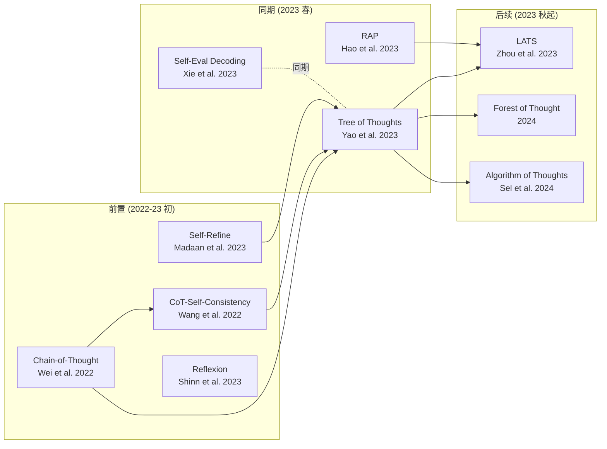

# 5. 见解与扩展

> 本章是作为深度读者的主观评价。**不是论文复述**，是真正读完论文 + 源码后的判断。

## 5.1 真正的创新点（按重要性排序）

### ① ⭐⭐⭐⭐⭐ "LLM 自评估 + 经典搜索"的统一框架

**真正改变格局的地方**：把 LLM 当成搜索算法里的**两个角色**（generator + heuristic evaluator）同时使用，**无需任何额外训练**。这是 2023 年 prompting 时代最重要的一个范式概念。

**为什么这是真创新**：

- AlphaGo 用 MCTS + 神经网络 → 需要训练价值网络
- AlphaZero 自博弈 → 需要环境模拟器
- ToT 用 BFS/DFS + 预训练 LLM → **零训练成本**

把"经典搜索 + 学习模型"组合需要的训练成本，被"LLM zero-shot value"消除了。这是搜索算法历史上第一次出现"评估器免训练"的可能。

### ② ⭐⭐⭐⭐ "4 个钩子"的设计空间

```
{ thought decomposition,
  generator (sample | propose),
  evaluator (value | vote),
  search (BFS | DFS) }
```

把"如何让 LLM 做规划"这个模糊问题压缩成一个**4 维配置空间**。每个任务都是这 4 个选项的一组取值。这种**形式化**比"74% on Game of 24"这个数字重要得多。

这个 abstraction 是后续工作（[LATS](https://arxiv.org/abs/2310.04406)、[RAP](https://arxiv.org/abs/2305.14992)、[ToT-improvers](https://arxiv.org/abs/2309.10814)）的起点。

### ③ ⭐⭐⭐ Crosswords 上 backtrack 的消融

**消融实验显示**：去掉 backtrack，Mini Crosswords 性能砍半（字母正确率 78 → 54.6%）。这是论文里**经验证据最强**的发现——它从数据上证明了"LLM 推理需要回头"。

在 ToT 之前没有任何工作展示过这点；之后所有"agentic LLM"方向都开始把 backtrack 当一等公民。

### ④ ⭐⭐ Lookahead 嵌入 prompt 的小技巧

`value prompt` 里 8 个示例每个都包含 "尝试 2-3 种运算后再判断" 的过程。这是 **prompt-encoded planning**，论文没专门讨论。

### ⑤ ⭐ 工程包装（不算创新）

- 用 `value_map = {0.001, 1, 20}` 把分类标签映射到数字 —— 是 hack
- 用 `sympy.simplify` 自动校验 Game of 24 答案 —— 是工程
- BFS 配 greedy top-b —— 是教科书内容

## 5.2 跟相关工作的关系



### 5.2.1 与 CoT / CoT-SC

ToT **泛化** CoT —— CoT 是 ToT 的特例（深度=任意，宽度=1，无评估）。CoT-SC 是 ToT 的另一个特例（深度=完整，宽度=$k$，无中间评估，最后多数投票）。

### 5.2.2 与 RAP（同期）

[RAP (Hao et al. 2023)](https://arxiv.org/abs/2305.14992) 与 ToT **几乎同期**（arXiv 差 1 周），独立提出"LLM as world model"。**差异**：

| | ToT | RAP |
|---|---|---|
| 搜索算法 | BFS / DFS | **MCTS** |
| 评估器 | LLM 直接打分 | reward + value 两层 |
| 模块化 | "4 个钩子" | "WorldModel + Agent" |

实际选择：**RAP 的 MCTS 框架更通用**，ToT 的"4 钩子"更具教学价值。两篇可以一起读。

### 5.2.3 与 Reflexion / Self-Refine

Reflexion / Self-Refine 是**线性迭代**（在同一条解上反复改），ToT 是**树状探索**。两者**正交**——论文里 +Refine 在 ToT 上仍然有提升（7.56 → 7.91），证明可以叠加。

### 5.2.4 与 NeuroLogic A*esque Decoding

[NeuroLogic A*esque](https://arxiv.org/abs/2112.08726) 在 ToT 之前就用 A* + lookahead 做约束生成，但只针对**短的 token-level 序列**。ToT 把这条线扩展到**段落级别 + 任意任务**。

## 5.3 适合 vs 不适合的场景

### ✅ ToT 是首选的场景

| 场景 | 推荐度 | 原因 |
|---|---|---|
| 数学 / 组合优化 / 算术（如 Game of 24） | ⭐⭐⭐⭐⭐ | 思维粒度天然清晰，state evaluator 准 |
| 约束满足问题（如 Crosswords、规划） | ⭐⭐⭐⭐⭐ | 需要回溯，DFS 是唯一选项 |
| 多步符号推理（GSM8K-hard、ARC） | ⭐⭐⭐⭐ | thought = 一个推理步 |
| 创意写作（需要先 plan 再写） | ⭐⭐⭐ | plan 可枚举，evaluator 用 vote |

### ❌ ToT 不适合的场景

| 场景 | 推荐度 | 原因 |
|---|---|---|
| 简单事实问答 | ⭐ | CoT 就够，ToT 是杀鸡用牛刀（100× 成本） |
| 单 token 输出（分类、回归） | ✗ | 没有"树" |
| 在线 / 低延迟（聊天） | ✗ | 100× 调用，延迟 30 秒+ |
| 用 GPT-3.5 或更弱模型 | ⭐⭐ | 论文附录 B.2 显示 GPT-3.5 上 ToT 提升微弱（evaluator 不够准） |
| **没法定义清晰 thought 粒度的任务**（如纯自由对话） | ✗ | Q1 答不上来，整套垮 |

## 5.4 没回答的问题（开放问题）

### Q1：ToT 在规模上稳定吗？

论文只跑了 Game of 24 (100 题)、Creative Writing (100 题)、Crosswords (20 题)。**数据集都很小**。
- 在 GSM8K (1k+)、MATH (5k+) 上呢？
- 在 SWE-bench 这类长时编程任务呢？
- ToT 跑大数据集时，**累积的 LLM 评估误差**是否会让收益消失？

后续 LATS、AoT 部分回答了这个，但**没有完整对照实验**。

### Q2：评估器自信度可信吗？

`value_outputs_unwrap` 是采样 3 次取众数。但 GPT-4 在边缘案例的 calibration 很差——经常**自信地说错**。这部分误差被 BFS 放大（一个错误评估导致整个高分支被丢）。
- 是否需要 ensemble 多个评估器？
- 是否应该用 reward model 而不是同一个 LLM？

### Q3：能不能 fine-tune？

论文 Discussion 提到 "fine-tuning LMs using a ToT-style high-level counterfactual decision making"。这条路两年过去几乎**没人走通**——可能是因为 ToT 数据**难收集**（要每个中间节点的 ground-truth value）。

### Q4：树结构是否真的"贴近"人类思维？

论文反复用 System 1 / System 2 类比，但**人类实际不画树**——人类更像是**懒计算 + 经验剪枝**。树是给计算机看的，类比可能过度。

## 5.5 我会怎么扩展

如果接着这篇做研究，我的优先级：

### A. ToT-Lite for cost-aware inference
ToT (b=5) 的 100× 成本是它最大硬伤。可以：
1. 用**小模型做 evaluator**，大模型只做 generator
2. **动态 budget**：评估器置信度高时直接走单分支，置信度低时再展开树
3. **缓存重用**：跨题目复用 value prompt 的中间状态（很多结构相似题目其实评估结果一样）

### B. 把 ToT 套到代码生成
代码 token 量大，但 thought 粒度可以是**一个函数定义** / 一个 commit message。
- thought decomposition: 用 AST 分割
- generator: propose 候选函数签名
- evaluator: LLM 看 docstring 和 type signature 评分（无需运行）
- search: DFS（编程是深而窄的）

### C. 评估器换成 verifier
现在 evaluator 是 LLM 主观打分。可以换成：
- **数学**：sympy / Lean / Coq 实际验证
- **代码**：unittest / type checker
- **常识**：retrieval-augmented fact checker

这其实是 ToT 论文 Section 6 提到的方向，2024 年的 [Process Reward Model](https://arxiv.org/abs/2305.20050) 走的就是这条线。

### D. ToT × Tools
ToT 是单纯的"LLM 自评估"——但很多任务需要**外部工具**（搜索、计算器、代码执行器）。把 ToT 的 search loop 与 ReAct / Toolformer 结合是个明显方向，但工程量大。

## 5.6 三句话总结（给不同读者）

### 给研究者
> ToT 是 2023 prompting 时代的代表作之一——它的核心贡献不是 "74% on Game of 24"，而是把"LLM 自评估 + 经典搜索"形式化成一个 4 维设计空间。这个抽象比数字重要 10 倍。

### 给工程师
> 想要 ToT 的效果，**复制不只算法，连 `value_map = {0.001, 1, 20}` 和 value prompt 里的 lookahead demos 都要照搬**。在 GPT-3.5 上慎用——评估器不准就垮。预算单题 < $0.1 就别用，CoT 性价比更高。

### 给学生
> 这是理解"prompting 到 agentic LLM"过渡期的最好入口。读完后接着读 [RAP](https://arxiv.org/abs/2305.14992)（同期 MCTS 版本）、[LATS](https://arxiv.org/abs/2310.04406)（统一框架）、[Reflexion](https://arxiv.org/abs/2303.11366)（反思机制），就能完整看到"让 LLM 想清楚再答"这条线的演化。

## 5.7 个人最后评价

| 维度 | 评分 | 说明 |
|---|---|---|
| 概念贡献 | ⭐⭐⭐⭐⭐ | "4 钩子"框架 + LLM 自评估范式 |
| 实证强度 | ⭐⭐⭐⭐ | Game24 数字漂亮；Crosswords 消融极强；但数据集小 |
| 写作清晰度 | ⭐⭐⭐⭐⭐ | 算法 1/2 简洁，公式记号干净 |
| 工程完成度 | ⭐⭐ | BFS 模块化好，DFS 是 notebook，复现存在隐含 hack |
| 长期影响 | ⭐⭐⭐⭐⭐ | NeurIPS 2023 高引用，是后续整个 agentic LLM 方向的起点之一 |

**最终一句话**：值得读，值得复现，但**别期待它 plug-and-play** 解决你的任务——`value_map` 那种工程细节会反复劝退你。

---

## 站点元信息

- 教学站点生成器：[paper-to-tutorial skill](https://github.com/zzp-seeker/) (本地 skill)
- 论文 commit 引用：[`8050e67d`](https://github.com/princeton-nlp/tree-of-thought-llm/tree/8050e67d0e3a0fddc424d7fa5801538722a4c4cc)
- 生成日期：2026-05-13
