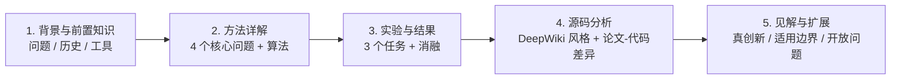

<!--
title: "Tree of Thoughts: Deliberate Problem Solving with Large Language Models"
arxiv_id: "2305.10601"
method_name: "ToT"
authors: ["Shunyu Yao", "Dian Yu", "Jeffrey Zhao", "Izhak Shafran", "Thomas L. Griffiths", "Yuan Cao", "Karthik Narasimhan"]
year: 2023
venue: NeurIPS 2023
code_url: "https://github.com/princeton-nlp/tree-of-thought-llm"
tags: ["LLM-reasoning", "tree-search", "prompting", "GPT-4", "BFS", "DFS"]
image_source: online
-->

# Tree of Thoughts: Deliberate Problem Solving with Large Language Models

> **TL;DR**：用一个 LLM 同时扮演**生成器 + 评估器 + 搜索器**，把"一条 token 路径"换成"一棵思维树"，在 Game of 24 上把 GPT-4 的成功率从 **4% 推到 74%**。这是把 50 年代认知科学（Newell-Shaw-Simon 的问题空间搜索）和 70 年前的经典搜索算法（BFS/DFS）套用到 LLM 推理上的范本。

| 项 | 值 |
|---|---|
| 作者 | Shunyu Yao（Princeton）†, Dian Yu, Jeffrey Zhao, Izhak Shafran (DeepMind), Thomas L. Griffiths (Princeton), Yuan Cao (DeepMind), Karthik Narasimhan (Princeton) |
| 发表 | NeurIPS 2023 |
| arXiv | [2305.10601](https://arxiv.org/abs/2305.10601) |
| 代码 | [princeton-nlp/tree-of-thought-llm](https://github.com/princeton-nlp/tree-of-thought-llm) ★5k+ |
| 标签 | LLM 推理 / 树搜索 / Prompting / GPT-4 |

## 一图看懂

**解读**：图 1 是全文最重要的图。从左到右：
- **(a) IO**：直接 prompt → 一个 output，零中间推理
- **(b) CoT**：一条线性的"想法链"
- **(c) CoT-SC**：采样 $k$ 条链，多数投票
- **(d) ToT**：维护一棵**思维树**，每个节点是一个 *thought*，可分叉、可剪枝、可回溯

绿色节点是"被认为有希望"的，红色是"被剪掉"的。**关键创新**是用 LLM 本身做评估器，决定哪个分支值得继续。

## 核心数字

- **Game of 24**：CoT 4.0% → ToT (b=5) **74%**（提升 18 倍）
- **Creative Writing**：人工评估 100 篇中 **ToT 胜 41 篇** vs CoT 胜 21 篇
- **Mini Crosswords 5×5**：字母级正确率 CoT 40.6% → ToT **78%**；游戏级 0% → **20%**

但代价：**ToT (b=5) 比 IO 多消耗约 100× tokens**（论文附录 B.3），这是它最大的硬伤之一。详见 [第 5 章见解](05_见解与扩展.md)。

## 全文导览

## 章节

1. [背景与前置知识](01_背景与前置知识.md) — 为什么 token-level 的左到右生成不够？认知科学给了什么线索？
2. [方法详解](02_方法详解.md) — ToT 的 4 个核心问题：思维分解、生成、评估、搜索
3. [实验与结果](03_实验与结果.md) — Game of 24、创意写作、迷你字谜，附消融
4. [源码分析](04_源码分析.md) — `methods/bfs.py` / `tasks/game24.py` 逐行剖析，**论文 vs 代码差异**
5. [见解与扩展](05_见解与扩展.md) — 真正的创新点、与 MCTS/RAP 的关系、什么场景用 / 不用

---

> 💡 **作为读者的第一印象**：ToT 看起来"很简单"——用 LLM 多 prompt 几次 + BFS——但**它的简单本身就是论点**：你不需要 RL fine-tune，不需要外部搜索引擎，只要让 LLM "想几次再写"，就能在结构化推理问题上吃掉 CoT 的几十倍误差。这是 prompting 时代少数几篇"概念创新"的论文之一。
