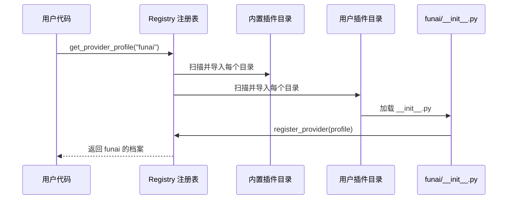

# Chapter 1: Provider 档案（Provider Profiles）

欢迎来到 `hermes-agent` 的第一章！在这一章里，我们将一起认识整个项目里"最像电话簿"的一个模块——**Provider 档案（Provider Profiles）**。别担心，即使你完全没有接触过 AI Agent，也能跟上节奏。

---

## 一、问题从哪里来？一个生活化的小故事

想象你开了一家小公司，需要给不同的"外卖平台"打电话下单：

- 给 **A 平台**打电话要说："你好，账号 1234，麻烦给我下单。"
- 给 **B 平台**打电话要说："Hello！请把订单加在我的 VIP 卡上。"
- 给 **C 平台**打电话则要先按 9 切换到英文菜单……

如果你每次下单都要记住每家的"接电话礼仪"，你的大脑很快就要爆炸了。聪明的做法是：**做一本"商户名片夹"**，每张名片上写好这家店的地址、电话、暗号、点单规则。打电话的时候你只看名片，照念就行。

`hermes-agent` 需要面对的"外卖平台"是各家 AI 推理服务商：OpenAI、Kimi、NVIDIA、OpenRouter…… 它们的 API 地址不同、鉴权方式不同、参数偏好不同。如果把这些差异都硬塞进主程序，主程序就会变成一锅"if-else 大杂烩"。

**Provider 档案**就是那本"商户名片夹"。

---

## 二、本章的核心用例

> 我们想新增一个名叫 `funai` 的推理服务商，让 `hermes-agent` 能直接使用它，**且不修改任何主代码**。

读完本章你就能做到这一点。

---

## 三、Provider 档案到底长什么样？

一份 Provider 档案，本质上就是一个**声明式的数据类**（`@dataclass`）。它不写复杂逻辑，只是"填表格"，告诉主程序：

- 我叫什么名字？
- 我的 API 地址在哪？
- 我用什么方式鉴权（API Key？OAuth？）？
- 我默认推荐哪些模型？
- 我有什么"小怪癖"（比如不接受 `temperature` 参数）？

我们来看一份最小的档案示例：

```python
from providers.base import ProviderProfile

profile = ProviderProfile(
    name="funai",                     # 唯一标识
    display_name="FunAI 云",          # 给用户看的名字
    base_url="https://api.funai.com/v1",
    env_vars=("FUNAI_API_KEY",),      # 从哪个环境变量取 key
    fallback_models=("funai-pro",),   # 备用模型清单
)
```

是不是非常像一张"名片"？字段都是声明性的，没有任何"打电话的实际动作"。

---

## 四、把名片放进"名片夹"

光有名片不够，还要把它**登记到名片夹**里。`hermes-agent` 提供了一个函数 `register_provider()`：

```python
from providers import register_provider
from providers.base import ProviderProfile

profile = ProviderProfile(name="funai", base_url="https://api.funai.com/v1")
register_provider(profile)   # 登记入册
```

调用 `register_provider(profile)` 之后，主程序就能通过名字 `"funai"` 找到这张名片。

---

## 五、放在哪里？两个合法的位置

`hermes-agent` 会在两处地方扫描 provider 插件：

| 位置                                              | 用途                       |
| ------------------------------------------------- | -------------------------- |
| `plugins/model-providers/<name>/`                 | 项目自带的内置档案         |
| `~/.hermes/plugins/model-providers/<name>/`       | 用户本地的私人档案（可覆盖内置） |

每个目录里只要放两样东西：

```
funai/
├── __init__.py     # 调用 register_provider()
└── plugin.yaml     # 简单的清单信息
```

> 💡 **关键设计**：用户目录里的同名档案会**覆盖**内置档案。这就像你可以在自己手机的通讯录里改"老王"的电话——不会影响公司总部的总通讯录。

---

## 六、一步步实现我们的 `funai` 档案

### 步骤 1：建目录

```
~/.hermes/plugins/model-providers/funai/
├── __init__.py
└── plugin.yaml
```

### 步骤 2：写 `plugin.yaml`

```yaml
name: funai
kind: model-provider
version: 0.1.0
description: FunAI Cloud provider
```

这只是一张"身份说明纸"，写明这是一个 model-provider 类型的插件。

### 步骤 3：写 `__init__.py`

```python
from providers import register_provider
from providers.base import ProviderProfile

register_provider(ProviderProfile(
    name="funai",
    base_url="https://api.funai.com/v1",
    env_vars=("FUNAI_API_KEY",),
    fallback_models=("funai-pro",),
))
```

只要这个文件被 Python 加载，`register_provider()` 就会立刻执行，把档案放进名片夹。

### 步骤 4：使用它

```python
from providers import get_provider_profile

p = get_provider_profile("funai")
print(p.base_url)   # → https://api.funai.com/v1
```

**输出**：主程序成功拿到了 `funai` 的所有"接电话礼仪"，无需修改任何核心代码 🎉。

---

## 七、内部是怎么运转的？

### 7.1 一段直白的流程描述

当你第一次调用 `get_provider_profile("funai")` 时：

1. 名片夹检查："咦，我还没扫描过插件呢。"
2. 它先扫描内置目录 `plugins/model-providers/`。
3. 再扫描用户目录 `~/.hermes/plugins/model-providers/`。
4. 每个目录里的 `__init__.py` 被自动导入，它们调用 `register_provider()`，名片就乖乖躺进了注册表。
5. 名片夹根据 `"funai"` 这个名字查表，返回对应的 `ProviderProfile` 对象。

### 7.2 用图来理解



整个过程是**惰性的**：只有真正有人来查名片时，才会去扫描目录。这样启动速度不受影响。

---

## 八、再深入一点：关键源码片段

### 8.1 注册函数（来自 `providers/__init__.py`）

```python
_REGISTRY: dict[str, ProviderProfile] = {}

def register_provider(profile: ProviderProfile) -> None:
    _REGISTRY[profile.name] = profile         # 名字 → 档案
    for alias in profile.aliases:
        _ALIASES[alias] = profile.name        # 别名也能查到
```

非常简单：底层就是一个字典，键是 provider 的名字，值是档案对象。`aliases` 字段允许一张名片有多个昵称（比如 `kimi` 也能写成 `moonshot`）。

### 8.2 查找函数

```python
def get_provider_profile(name: str) -> ProviderProfile | None:
    if not _discovered:
        _discover_providers()                 # 首次查询触发扫描
    canonical = _ALIASES.get(name, name)
    return _REGISTRY.get(canonical)
```

如果传进来的是别名，先翻译成"真名"，再去字典里取档案。找不到就返回 `None`，意味着会走通用回退逻辑。

### 8.3 发现函数（简化版）

```python
def _discover_providers() -> None:
    # 1. 先扫描内置插件
    for child in _BUNDLED_PLUGINS_DIR.iterdir():
        _import_plugin_dir(child, "bundled")
    # 2. 再扫描用户插件 —— 覆盖内置
    user_dir = _user_plugins_dir()
    if user_dir:
        for child in user_dir.iterdir():
            _import_plugin_dir(child, "user")
```

顺序很关键：**后到的覆盖先到的**。所以用户目录永远是"最终拍板者"。

### 8.4 档案的字段（来自 `providers/base.py`）

```python
@dataclass
class ProviderProfile:
    name: str
    base_url: str = ""
    env_vars: tuple = ()
    fallback_models: tuple = ()
    fixed_temperature: Any = None    # 设为 OMIT_TEMPERATURE 则不发该字段
```

一张档案的字段大概可以分成 4 类：
- **身份**：`name`、`aliases`、`display_name`
- **地址与鉴权**：`base_url`、`env_vars`、`auth_type`
- **模型清单**：`fallback_models`、`default_aux_model`
- **怪癖**：`fixed_temperature`、`default_headers`

### 8.5 重写消息的钩子

某些 provider 接受的消息格式略有差别。档案可以**重写一个方法**来处理：

```python
class FunAIProfile(ProviderProfile):
    def prepare_messages(self, messages):
        # 例如：FunAI 不接受 "developer" 角色
        return [m for m in messages if m["role"] != "developer"]
```

这相当于在名片背面附加一张"特殊说明"——主程序在发请求前会自动调用这个钩子。

---

## 九、它和谁打交道？

Provider 档案本身只是"声明"。真正"打电话"的活儿，是由 **传输层** 完成的。传输层会读档案、按档案里写的方式去拼请求。我们将在下一章详细看到这一点。

类比一下：
- **Provider 档案** = 名片（声明信息）
- **Provider 传输层** = 打电话的秘书（执行动作）

---

## 十、本章小结

恭喜！你已经掌握了 `hermes-agent` 中第一个核心抽象：

- Provider 档案是一份**声明式配置**，用 `ProviderProfile` 数据类描述。
- 通过 `register_provider()` 登记到全局注册表。
- 档案存放在 `plugins/model-providers/` 或 `~/.hermes/plugins/model-providers/`。
- **新增 provider 完全不用改主代码**，用户档案可以覆盖内置档案。
- 主程序通过 `get_provider_profile(name)` 像翻名片一样找到对应配置。

档案只是"静态信息"，下一步我们要看的是——**谁来读这些档案、并真正发出 API 请求**？这就是下一章的主角。

👉 继续学习：[Provider 传输层（Provider Transports）](02_provider_传输层_provider_transports__.md)

---

Generated by [AI Codebase Knowledge Builder](https://github.com/The-Pocket/Tutorial-Codebase-Knowledge)