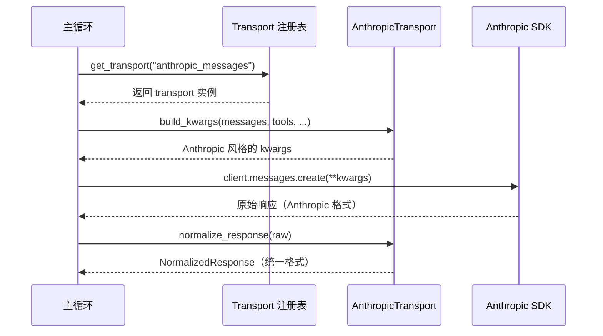

# Chapter 2: Provider 传输层（Provider Transports）

在上一章 [Provider 档案（Provider Profiles）](01_provider_档案_provider_profiles__.md) 里，我们学会了如何用一张"名片"声明一个 LLM 服务商的基本信息。但名片只是**静态的描述**——它不会自己打电话、不会自己发请求。

这一章我们要认识真正干活的那位"秘书"——**Provider 传输层（Provider Transports）**。

---

## 一、问题从哪里来？

想象 `hermes-agent` 的主循环就像一位老板，他每天的工作流程很简单：

1. 整理好要发的消息（OpenAI 风格）
2. 把消息和工具列表交给一个 LLM
3. 拿回回复，看里面是要不要调用工具
4. 循环重复

老板的脑子里只有**一种格式**：OpenAI 风格的 `messages` 列表和 `tools` 列表。

可现实是残酷的：

| 服务商 | API 格式特色 |
| --- | --- |
| **Anthropic** | `system` 单独放，`messages` 用 `content blocks`，停止理由叫 `stop_reason` |
| **OpenAI Codex Responses** | 用 `instructions` + `input`，工具叫 `function`，停止理由叫 `status` |
| **AWS Bedrock** | 用 boto3 客户端、`converse()` 方法，自己一套 `toolConfig` 格式 |
| **OpenAI 兼容（chat.completions）** | 原汁原味 OpenAI 格式 |

如果让老板自己学会每家的方言，他就会被淹没在 `if-else` 里。

> 💡 **解决方案**：派一位**翻译秘书**坐在老板和外面的世界之间。老板说"OpenAI 普通话"，秘书负责翻译给对应的服务商；服务商回话，秘书再翻成普通话报给老板。
>
> 这位秘书就是 **Provider 传输层（Provider Transports）**。

---

## 二、核心用例

> 我们有一段 OpenAI 风格的对话消息，想发给 **Anthropic Claude**。我们不想关心 Anthropic 那套 `content blocks` 的细节，只想调用一个统一接口，拿回一个统一的回复对象。

读完本章你就能做到这一点。

---

## 三、Transport 到底是什么？

每一个 transport 就是一个类，它**专门服务一种 `api_mode`**（API 协议）。`hermes-agent` 目前有四位翻译秘书：

| `api_mode` | 对应的 Transport |
| --- | --- |
| `anthropic_messages` | `AnthropicTransport` |
| `codex_responses` | `ResponsesApiTransport` |
| `bedrock_converse` | `BedrockTransport` |
| `chat_completions` | `ChatCompletionsTransport` |

它们都继承自同一个抽象基类 `ProviderTransport`，对外暴露**一模一样的四个动作**：

```
convert_messages  →  把消息翻译成对方能懂的
convert_tools     →  把工具列表翻译成对方能懂的
build_kwargs      →  组装最终请求参数
normalize_response → 把对方的回复翻回统一格式
```

这就像万能旅行转换头：插座（API）千差万别，但你的电器（agent 主循环）只认一种插头。

---

## 四、统一的"普通话"——`NormalizedResponse`

无论你发给哪家服务商，秘书翻译回来的回复**永远是同一个结构**：

```python
@dataclass
class NormalizedResponse:
    content: str | None          # 模型说的话
    tool_calls: list[ToolCall] | None  # 模型想调用的工具
    finish_reason: str           # "stop" / "tool_calls" / "length" / ...
    reasoning: str | None = None # 思维链（如果有）
    usage: Usage | None = None   # token 用量
```

这个 `NormalizedResponse` 就是**全公司的普通话**。老板从此只读这一种回复对象，再也不用关心 Anthropic 叫 `stop_reason` 还是 OpenAI 叫 `finish_reason`。

`ToolCall` 同理，是统一的工具调用结构：

```python
@dataclass
class ToolCall:
    id: str | None       # 工具调用的唯一 ID
    name: str            # 工具名
    arguments: str       # JSON 字符串
```

---

## 五、动手用一下！解决我们的用例

假设我们有这样一段消息，想发给 Anthropic：

```python
messages = [
    {"role": "system", "content": "You are a helpful assistant."},
    {"role": "user", "content": "今天北京天气怎么样？"},
]
tools = [{"type": "function", "function": {"name": "get_weather", ...}}]
```

### 步骤 1：从注册表里取出对应的秘书

```python
from agent.transports import get_transport

transport = get_transport("anthropic_messages")
```

只给一个字符串 `"anthropic_messages"`，就能拿到一位会说 Anthropic 方言的秘书。

### 步骤 2：让秘书拼装请求参数

```python
kwargs = transport.build_kwargs(
    model="claude-sonnet-4-5",
    messages=messages,
    tools=tools,
    max_tokens=1024,
)
```

秘书会内部完成"翻译消息 + 翻译工具 + 加上 Anthropic 必须的字段"，你拿到的 `kwargs` 是一个**可以直接喂给 Anthropic SDK** 的字典。

### 步骤 3：发请求（这步主程序自己做）

```python
import anthropic
client = anthropic.Anthropic()
raw_response = client.messages.create(**kwargs)
```

### 步骤 4：把回复翻成普通话

```python
result = transport.normalize_response(raw_response)
print(result.content)         # → "今天北京晴..."
print(result.finish_reason)   # → "stop" 或 "tool_calls"
print(result.tool_calls)      # → [ToolCall(...)] 或 None
```

**输出**：你拿到一个 `NormalizedResponse` 对象，结构和发给 OpenAI、Bedrock 时**完全一样**。主循环可以用同一份代码处理它们 🎉。

---

## 六、内部是怎么运转的？

### 6.1 一段直白的流程描述

当主程序需要发起一次推理调用时：

1. 主循环根据当前 [Provider 档案](01_provider_档案_provider_profiles__.md) 决定 `api_mode`（比如 `anthropic_messages`）。
2. 调用 `get_transport(api_mode)`，注册表把对应的 transport 实例化交出来。
3. 主循环调用 `transport.build_kwargs(...)`，秘书把 OpenAI 风格的输入翻译好。
4. 主循环用拼好的 `kwargs` 调用对应 SDK，发出真实的 HTTP 请求。
5. 拿到原始响应后，主循环调用 `transport.normalize_response(raw)`，秘书把响应翻回 `NormalizedResponse`。
6. 主循环统一处理 `NormalizedResponse`——根本不关心刚才打的是哪家电话。

### 6.2 用图来理解



注意：**主循环只和 `T`（秘书）打交道两次**，中间发请求那一步是它自己的事。这样秘书的职责非常聚焦——只负责"翻译"，不管"打电话"。

---

## 七、再深入一点：关键源码片段

### 7.1 注册表（`agent/transports/__init__.py`）

```python
_REGISTRY: dict = {}

def register_transport(api_mode: str, transport_cls: type) -> None:
    _REGISTRY[api_mode] = transport_cls

def get_transport(api_mode: str):
    if not _discovered:
        _discover_transports()
    cls = _REGISTRY.get(api_mode)
    return cls() if cls else None
```

非常熟悉是吧？和上一章的档案注册表是同一套思路：一个字典，键是 `api_mode`，值是 transport 类。

`_discover_transports()` 会去 `import` 每一个 transport 模块，触发它们文件末尾的自动注册：

```python
# agent/transports/anthropic.py 末尾
register_transport("anthropic_messages", AnthropicTransport)
```

每位秘书一进门就"打卡报到"，主程序从此就能用名字找到他们。

### 7.2 抽象基类（`agent/transports/base.py`）

```python
class ProviderTransport(ABC):
    @property
    @abstractmethod
    def api_mode(self) -> str: ...

    @abstractmethod
    def convert_messages(self, messages, **kwargs): ...

    @abstractmethod
    def build_kwargs(self, model, messages, tools=None, **params): ...

    @abstractmethod
    def normalize_response(self, response, **kwargs) -> NormalizedResponse: ...
```

四个抽象方法是每位秘书**必须会**的技能。这样不论换哪家服务商，主循环调用的方法名都是同一组——这就是"统一接口"的力量。

### 7.3 一位秘书的真实工作样例：`AnthropicTransport`

我们看 `convert_messages` 这一小段：

```python
def convert_messages(self, messages, **kwargs):
    from agent.anthropic_adapter import convert_messages_to_anthropic
    base_url = kwargs.get("base_url")
    return convert_messages_to_anthropic(messages, base_url=base_url)
```

它本身没写复杂逻辑，而是**委托**给 `anthropic_adapter` 里现成的纯函数去做翻译。Transport 这一层的价值在于"统一接口"，而不是重新发明翻译规则。

再看 `normalize_response` 的核心一段：

```python
for block in response.content:
    if block.type == "text":
        text_parts.append(block.text)
    elif block.type == "tool_use":
        tool_calls.append(ToolCall(
            id=block.id, name=block.name,
            arguments=json.dumps(block.input),
        ))
```

它一块一块读 Anthropic 返回的 `content blocks`，把文本、工具调用挑出来塞进统一的 `NormalizedResponse`。

最后是停止理由的映射：

```python
_STOP_REASON_MAP = {
    "end_turn": "stop",
    "tool_use": "tool_calls",
    "max_tokens": "length",
    "stop_sequence": "stop",
}
```

Anthropic 说的 `"end_turn"`，翻译成普通话就是 `"stop"`。每位秘书都有自己的"方言对照表"。

### 7.4 不一样的秘书：`BedrockTransport`

Bedrock 用 boto3，不是 OpenAI SDK，所以秘书的"配方"略有不同。看看它的 `build_kwargs` 结尾：

```python
kwargs["__bedrock_converse__"] = True
kwargs["__bedrock_region__"] = region
return kwargs
```

它额外塞了两个"哨兵字段"，告诉主循环"嘿，这次不要用 OpenAI SDK，要走 boto3 那条路"。主循环看到这俩字段就会自动 pop 出来、切换到 boto3 调用。

这就是 transport 设计的灵活之处：**统一接口**之下仍允许"协议特有信号"通过 kwargs 偷偷传出来。

---

## 八、它和"档案"的关系

回顾上一章的类比：

- **Provider 档案** = 名片（声明信息，比如 base_url、env_vars）
- **Provider 传输层** = 打电话的秘书（执行翻译动作）

两者协作的完整链路是这样的：

```mermaid
flowchart LR
    A[用户选择 provider] --> B[读取 Provider 档案]
    B --> C[档案里指定 api_mode]
    C --> D[get_transport(api_mode)]
    D --> E[Transport 翻译并发请求]
    E --> F[返回 NormalizedResponse]
```

档案告诉主程序"该打电话给谁、用什么钥匙"；transport 告诉主程序"该用什么语言说话"。

---

## 九、本章小结

恭喜！你已经掌握了 `hermes-agent` 的第二个核心抽象：

- **Provider 传输层**是一组翻译秘书，每位负责一种 `api_mode`。
- 所有 transport 实现同一个抽象基类 `ProviderTransport`，对外提供 `convert_messages`、`convert_tools`、`build_kwargs`、`normalize_response` 四个统一方法。
- 不论调用哪家服务商，回复永远是统一的 `NormalizedResponse` 类型。
- 通过 `get_transport(api_mode)` 从注册表取出秘书；新增一种协议时只要写一个新 transport 类并 `register_transport(...)` 即可。
- 主循环从此再也不用写一堆 `if anthropic ... elif openai ...` 的分支。

---

到此为止，我们已经搞清楚了**"消息怎么发出去、回复怎么收回来"**这件事。但还有一个更早的问题：**这些消息是从哪儿来的？** 主循环并不是凭空把 50 条 `messages` 写出来的——它们由一个专门的"导演"准备好。

那位导演就是下一章的主角——上下文引擎，它决定哪些信息进入 prompt、哪些被裁剪掉、哪些被压缩。

👉 继续学习：[上下文引擎（Context Engine）](03_上下文引擎_context_engine__.md)

---

Generated by [AI Codebase Knowledge Builder](https://github.com/The-Pocket/Tutorial-Codebase-Knowledge)