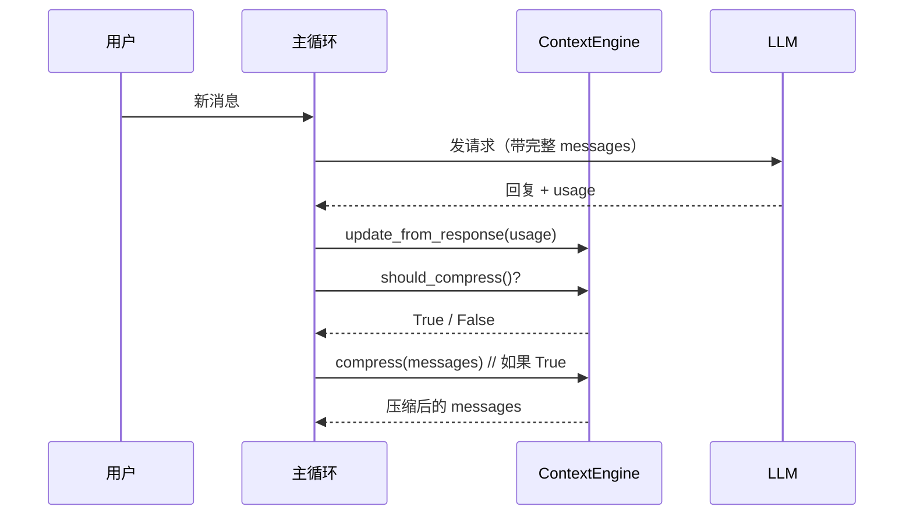
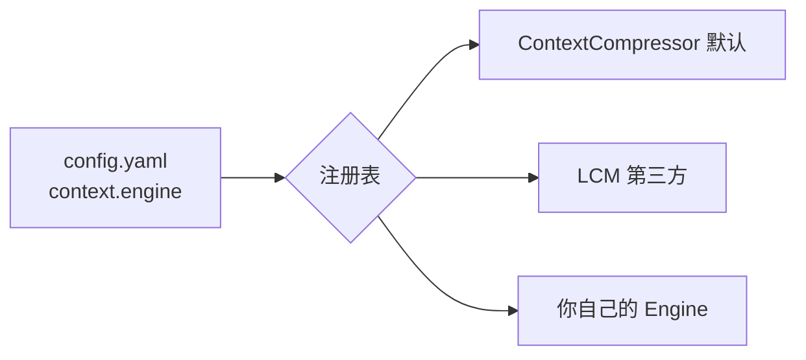

# Chapter 3: 上下文引擎（Context Engine）

在上一章 [Provider 传输层（Provider Transports）](02_provider_传输层_provider_transports__.md) 里，我们解决了"消息怎么发出去、回复怎么收回来"的问题。但还有一个更早、更关键的问题等着我们：**这些消息从哪儿来？里面塞了多少东西？会不会超出模型能吃下的容量？**

这就是本章主角——**上下文引擎（Context Engine）**——要管的事儿。

---

## 一、问题从哪里来？一个图书馆的小故事

想象你有一张**只能放 20 本书**的书架。

- 早上，你拿来了 5 本书，没问题。
- 中午，你又拿来 10 本，加起来 15 本，还撑得住。
- 下午，你想再放 8 本——糟糕，书架只能放 20 本，要爆了！

这时你不会乱扔，而是请来一位**图书管理员**：

1. 她看看哪些是"老书"（你最近没翻过），把它们整理成一份**索引摘要卡**。
2. 把厚厚的几本旧书换成一张薄薄的卡片，立刻腾出空位。
3. 新书顺利上架，你需要时还能凭卡片找回旧内容。

`hermes-agent` 的对话也一样：

- 模型的 **context window**（上下文窗口）就是"书架容量"，比如 200,000 tokens。
- 每轮对话的消息就是一本一本新书往书架上塞。
- 塞着塞着就会超——这时候必须有人来决定：**什么时候压缩？怎么压缩？压完保留哪些信息？**

这位"图书管理员"就是 **上下文引擎（Context Engine）**。

---

## 二、本章的核心用例

> 我们想知道：当对话历史快要爆掉模型的 context window 时，`hermes-agent` 是如何自动检测、自动压缩、并继续工作的？同时，我们想知道**如何把默认的压缩引擎换成自己写的引擎**，比如 LCM 这种基于 DAG 的方案。

读完本章你就能理解整套机制，并且会写一个最小的自定义引擎。

---

## 三、上下文引擎到底要管什么？

引擎的职责可以拆成 4 件事，每件都对应图书管理员的一个动作：

| 引擎方法 | 图书管理员的对应动作 |
| --- | --- |
| `update_from_response(usage)` | "刚刚又上架了多少本书？我心里有数。" |
| `should_compress()` | "书架快满了吗？要不要现在收拾？" |
| `compress(messages)` | "好嘞，开始整理——把旧书归档成摘要卡。" |
| `get_tool_schemas()` | "我还可以给你提供一个'查归档'的工具（如 LCM 的 grep）。" |

外加一些**生命周期钩子**（session 开始、结束、重置），让引擎能在合适的时机加载或保存状态。

---

## 四、关键概念逐个看

### 4.1 token 与 context window

- **token**：一个 token 大约是 4 个英文字符或 1~2 个汉字。模型按 token 计费、按 token 限容。
- **context window**：模型一次能"看到"的最大 token 数，例如 Claude Sonnet 4.5 是 200,000。
- **threshold（阈值）**：我们不会等"完全装满"才压缩——默认在 **75%** 就触发，留点缓冲。

```python
threshold_percent = 0.75
context_length    = 200_000
threshold_tokens  = int(context_length * threshold_percent)  # 150_000
```

这相当于："书架还剩 25% 空位时就开始整理"——保险起见。

### 4.2 "保护区"——哪些书永远不动

引擎不能把所有旧消息都压掉，否则模型就失忆了。所以有两个保护参数：

```python
protect_first_n = 3   # 最前面 3 条消息永不压缩（system prompt 等）
protect_last_n  = 6   # 最近 6 条消息永不压缩（当前任务上下文）
```

只有"夹在中间的老消息"才会被合并成摘要。这就像图书管理员不会动你**最开头的镇馆之宝**，也不会动**手边正在读的那几本**。

### 4.3 可插拔的设计

`hermes-agent` 不强迫你用某一种压缩策略。配置文件里写：

```yaml
context:
  engine: compressor   # 默认值；也可以换成 "lcm" 或别的
```

只要你的引擎实现了下面这套接口，就能直接顶替默认实现——主程序完全不需要改。

---

## 五、`ContextEngine` 抽象基类：所有引擎的"岗位说明书"

我们看一下基类最关键的几个字段（来自 `agent/context_engine.py`）：

```python
class ContextEngine(ABC):
    last_prompt_tokens: int = 0   # 上一轮 prompt 用了多少 token
    threshold_tokens:   int = 0   # 触发阈值
    context_length:     int = 0   # 模型窗口大小
    compression_count:  int = 0   # 这个 session 压缩过几次
```

这四个数字是引擎必须维护的"仪表盘"。`run_agent.py` 会直接读它们来显示给用户：

```
[ctx: 120,431 / 200,000 tokens (60%) | compressed: 1x]
```

接着是三个**必须实现**的方法：

```python
@abstractmethod
def update_from_response(self, usage): ...   # 收账
@abstractmethod
def should_compress(self, prompt_tokens=None) -> bool: ...   # 判断
@abstractmethod
def compress(self, messages, ...) -> list: ...   # 真正动手
```

任何引擎只要把这三个补齐，就能上岗。

---

## 六、动手用一下！跟着用例走一遍

假设我们正在和模型聊一个超长的任务，第 30 轮对话开始了。让我们一步步看主循环和引擎的协作。

### 步骤 1：每次拿到回复后，更新 token 仪表盘

```python
# 主循环拿到 API 回复后
engine.update_from_response(response.usage)
```

引擎内部会把 `usage.prompt_tokens` 等写进自己的 `last_prompt_tokens` 字段。**就像图书管理员清点今天上架了几本新书。**

### 步骤 2：问引擎"要不要压缩？"

```python
if engine.should_compress():
    print("书架快满，准备整理！")
```

默认实现的逻辑就是一行比较：`last_prompt_tokens >= threshold_tokens`。

### 步骤 3：真的开始压缩

```python
messages = engine.compress(messages)
```

**输入**：可能有 80 条消息的长列表。
**输出**：可能只有 30 条的短列表——中间的老消息被合并成一条"摘要消息"，前 3 条和后 6 条原封不动。

主循环拿到压缩后的 `messages`，下一轮就用它继续对话。模型看不到旧的细节，但能看到一段简短的"前情提要"。

### 步骤 4：会话结束时持久化（可选）

```python
engine.on_session_end(session_id, messages)
```

如果是 LCM 这种带索引的引擎，它会在这里把 DAG 写到磁盘，下次启动还能加载。默认压缩器啥也不做。

---

## 七、内部是怎么运转的？

### 7.1 一段直白的流程描述

一次完整的"对话回合 + 自动压缩"是这样的：

1. 用户输入新一条消息，主循环把它追加到 `messages` 列表。
2. 主循环挑选好 [Provider 档案](01_provider_档案_provider_profiles__.md) 和 [Transport](02_provider_传输层_provider_transports__.md)，把 `messages` 翻译后发请求。
3. 拿到回复，主循环调用 `engine.update_from_response(usage)`——引擎记下"这轮用了多少 token"。
4. 主循环问 `engine.should_compress()`——超过阈值就返回 True。
5. 如果要压缩，主循环调用 `engine.compress(messages)`，拿回压缩后的列表。
6. 下一轮对话继续。

### 7.2 用图来理解



注意：**主循环只问、不思考**——所有"什么时候压、压多少、怎么压"的决策都封装在引擎里。这就是策略与执行分离的好处。

---

## 八、再深入一点：默认引擎 `ContextCompressor`

默认引擎做的事情很朴素，可以总结成 3 步：

```python
# 伪代码示意
def compress(self, messages, ...):
    head = messages[:self.protect_first_n]       # 保护前 N
    tail = messages[-self.protect_last_n:]       # 保护后 M
    middle = messages[self.protect_first_n:-self.protect_last_n]
    summary = self._llm_summarize(middle)        # 让 LLM 写摘要
    return head + [summary] + tail
```

它的核心思想就是：**护住头尾，中间用一段摘要替换**。摘要本身是由一次额外的 LLM 调用生成的——所以压缩本身是"花一点 token 换更多 token 的空间"。

---

## 九、生命周期钩子：什么时候被叫醒？

引擎并不是只会"压缩"，它还会在关键时刻被通知：

```python
def on_session_start(self, session_id, **kwargs): ...
def on_session_end(self, session_id, messages): ...
def on_session_reset(self): ...
```

- **session_start**：CLI 启动或新建会话时调用。LCM 这种带索引的引擎会在这里**加载磁盘上的 DAG**。
- **session_end**：真正退出时调用（不是每轮！）。用于持久化。
- **session_reset**：用户敲了 `/reset` 或 `/new`，把计数器清零。

默认实现里 `on_session_reset()` 就是：

```python
def on_session_reset(self):
    self.last_prompt_tokens = 0
    self.last_completion_tokens = 0
    self.last_total_tokens = 0
    self.compression_count = 0
```

简简单单把仪表盘归零。

---

## 十、引擎还能"借工具给 agent 用"

这是上下文引擎一个很妙的设计：它不仅压缩，还可以**给 agent 提供额外的工具**。

```python
def get_tool_schemas(self) -> list:
    return []   # 默认啥也不给

def handle_tool_call(self, name, args, **kwargs) -> str:
    ...
```

举个例子：LCM 引擎可能把对话历史压成 DAG 存到本地，然后给 agent 提供一个 `lcm_grep` 工具——agent 想找"3 小时前那段关于数据库迁移的对话"时，可以主动调用 `lcm_grep(keyword="migration")` 去翻索引。

也就是说：**引擎既是"管家"，又是"档案室管理员"**。它不仅决定哪些旧消息被压缩走，还能让 agent 在需要时回头查档。

---

## 十一、写一个最小的自定义引擎

为了让你有个完整印象，我们来写一个**"永远不压缩"**的玩具引擎：

```python
from agent.context_engine import ContextEngine

class NoOpEngine(ContextEngine):
    @property
    def name(self): return "noop"
```

定义个名字。接下来是三个必备方法：

```python
    def update_from_response(self, usage):
        self.last_prompt_tokens = usage.get("prompt_tokens", 0)
```

记下来 token 数就行。

```python
    def should_compress(self, prompt_tokens=None):
        return False   # 永远不压
```

懒得压，永远说 False。

```python
    def compress(self, messages, **kw):
        return messages   # 原样返回
```

**输出**：把这个类注册成 `context.engine = noop`，`hermes-agent` 就完全不会触发压缩。当然，这只是演示——一旦真的塞爆窗口，模型会直接报错。

---

## 十二、引擎从哪儿来？

和前两章一样，引擎也是**可插拔**的。它的发现机制和 Provider 档案如出一辙：

```
plugins/context_engine/<name>/        # 内置
~/.hermes/plugins/context_engine/<name>/   # 用户私人
```

每个目录里放一个 `__init__.py`，导入并注册你的引擎类。主程序根据 `context.engine` 配置项选用其中一个。



一次会话里**只有一个引擎是激活的**，但你可以随时换。

---

## 十三、本章小结

恭喜！你已经掌握了 `hermes-agent` 的第三个核心抽象：

- **上下文引擎**像图书管理员，负责跟踪 token、判断是否压缩、真正执行压缩、还能给 agent 提供额外工具。
- 所有引擎实现同一个抽象基类 `ContextEngine`，对外暴露 `update_from_response`、`should_compress`、`compress` 三个必备方法。
- 通过保护**前 N 条 + 后 M 条**消息，引擎只压缩"中间的老内容"，避免丢失关键上下文。
- 引擎是**可插拔的**：配置文件里改一行 `context.engine: xxx` 就能换实现，主代码不动。
- 引擎还有生命周期钩子（`on_session_start` / `on_session_end` / `on_session_reset`），方便加载、保存、重置状态。

到这里我们解决了"消息**容器**会不会爆"的问题。但更早一层的问题是——**那些被压缩走的旧信息，能不能持久化下来，让 agent 在未来某天想起来时还能查到？** 单靠一个 session 内的摘要是不够的，我们需要一个真正长期的"记忆库"。

那就是下一章的主角——**记忆提供方**。

👉 继续学习：[记忆提供方（Memory Provider）](04_记忆提供方_memory_provider__.md)

---

Generated by [AI Codebase Knowledge Builder](https://github.com/The-Pocket/Tutorial-Codebase-Knowledge)