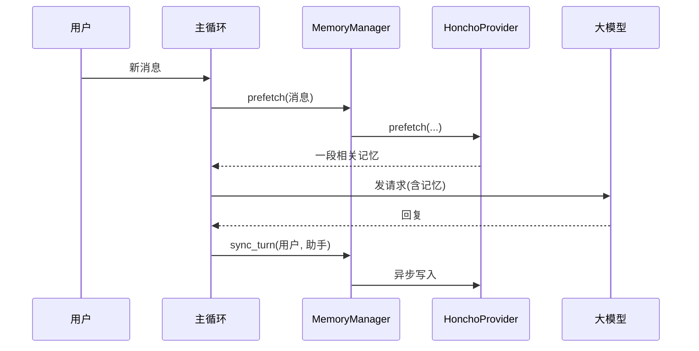
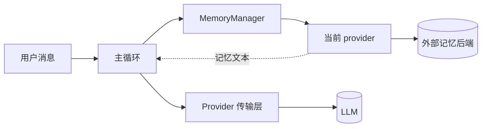

# Chapter 4: 记忆提供方（Memory Provider）

在上一章 [上下文引擎（Context Engine）](03_上下文引擎_context_engine__.md) 里，我们学到了"图书管理员"如何在书架快爆掉时整理旧书。但有一个遗留问题：**那些被压缩走的旧内容，其实只在当前这次会话里活着**——你下次重新打开 agent，前几天的对话就像没发生过一样。

如果 agent 能像真人助理一样"记住你这位客户"，每次开聊前先翻翻笔记本——"上次我们聊过 X、Y、Z"，那协作就会顺畅得多。这位"私人秘书"就是本章主角——**记忆提供方（Memory Provider）**。

---

## 一、问题从哪里来？一个销售经理的小故事

想象你是一位销售经理，每天要见 5 位客户。你有两种工作方式：

**方式 A**：每次见客户都从零开始。
- 客户："上周不是跟你说过我对功能 X 不感兴趣吗？"
- 你（一脸茫然）："呃……我们再聊一遍？"

**方式 B**：你有一本厚厚的客户笔记本。每次开会前**翻一翻**："这位客户上次说反对 X，倾向 Y，下次要给他寄样品。"开完会再把新事项**记下来**。

显然方式 B 才像个靠谱的助理。

`hermes-agent` 默认情况下接近方式 A——一次会话结束，记忆就消失了。但只要装上一个**记忆提供方**（如 Honcho、Hindsight、Mem0），它就能立刻升级成方式 B：

- 每轮对话**之前**，悄悄从外部记忆库里**预取**相关内容塞进 prompt。
- 每轮对话**之后**，把新内容**异步写**到记忆库里。
- 会话结束时，做一次**总结与抽取**，沉淀长期记忆。

---

## 二、本章的核心用例

> 我们想给 agent 装一个名叫 `honcho` 的外部记忆库。安装后，agent 应该在每次回答用户之前自动从 Honcho 拉一段相关上下文，回答之后再异步把这一轮对话写回 Honcho；并且**多个外部记忆提供方不能同时启用**，避免工具列表互相打架。

读完本章你会理解这套生命周期的钩子，以及如何写一个自己的最小记忆提供方。

---

## 三、记忆提供方到底要做什么？

整个生命周期可以套用"私人秘书的一天"来理解：

| 秘书的动作                | 对应的方法                          |
| ------------------------- | ----------------------------------- |
| 上岗第一天，准备好笔记本    | `initialize(session_id, ...)`       |
| 老板交代："我今天先看下笔记" | `system_prompt_block()`             |
| 每次会议开始前翻笔记      | `prefetch(query)`                   |
| 会议刚结束就记一笔        | `sync_turn(user, assistant)`        |
| 每轮可能提供"查归档"工具    | `get_tool_schemas()` + `handle_tool_call()` |
| 一天结束，整理总结        | `on_session_end(messages)`          |
| 下班，合上笔记本          | `shutdown()`                        |

`hermes-agent` 通过一个叫 **MemoryManager** 的"调度员"在合适的时机依次调用这些方法。

---

## 四、关键设计：只能有一个外部 provider

`hermes-agent` 明确规定：**同一时间只能启用一个外部记忆 provider**。原因很简单：

- 每个外部 provider 通常会向模型暴露 3~5 个工具（如 `honcho_query`、`mem0_search`）。
- 同时启用三家 = 工具列表瞬间膨胀到 10+ 个，模型很容易选错，schema 也吃掉宝贵的 token。

所以配置文件里只能选一家：

```yaml
memory:
  provider: honcho   # 或 hindsight / mem0 / none
```

> 💡 **类比**：你可以同时用纸质笔记本和电子文档记笔记，但秘书一次只用一本——否则她查的时候不知道翻哪边。

---

## 五、动手用一下！四个最常用的钩子

我们假设已经有了一个 `HonchoProvider` 实例。下面看看 MemoryManager 是怎么按节奏调用它的。

### 步骤 1：会话启动时初始化

```python
provider.initialize(
    session_id="sess-001",
    hermes_home="/home/me/.hermes",
    platform="cli",
    agent_context="primary",
)
```

这是秘书的"上岗仪式"。`hermes_home` 告诉她笔记本放哪、`platform` 告诉她在哪个终端工作、`agent_context="primary"` 表示她服务的是主 agent（不是 cron 这种后台任务）。

### 步骤 2:每轮对话前预取

```python
context = provider.prefetch(query="今天北京天气怎么样？")
# 例：context = "用户上周说他在北京，对暴雨预警比较关注。"
```

**输入**：用户这一轮要问的问题。
**输出**：一段从记忆库捞出的相关文本。主循环会把它**拼到 system prompt** 里，模型就有"前情提要"可看了。

### 步骤 3：每轮对话后写入

```python
provider.sync_turn(
    user_content="今天北京天气怎么样？",
    assistant_content="北京今天晴，最高 28 度。",
)
```

这一步通常是**非阻塞**的——provider 内部会把这对消息塞进队列，由后台线程慢慢写到 Honcho 后端。这样主循环不会因为网络慢而卡住。

### 步骤 4：会话结束时抽取

```python
provider.on_session_end(messages=full_history)
```

秘书会扫一遍整段对话，提炼出"今天的客户偏好"，比如"用户更倾向用 Python 而不是 JS"，存进长期记忆。**这一步只在真正退出时调用**，不是每轮都调。

---

## 六、内部是怎么运转的？

### 6.1 流程一遍过

一次完整的对话回合，MemoryManager 大致做这些事：

1. 主循环把用户新消息追加到 `messages`。
2. **预取**：调用 `provider.prefetch(user_msg)`，拿到一段记忆文本。
3. 主循环把记忆文本拼进 system prompt，再走 [Provider 传输层（Provider Transports）](02_provider_传输层_provider_transports__.md) 发请求。
4. 拿到回复，主循环调用 `provider.sync_turn(user_msg, assistant_msg)`——把这轮写回后台。
5. 调用 `provider.queue_prefetch(next_hint)`——为下一轮预取候选答案排队。
6. 用户敲了 `/exit`，主循环调用 `provider.on_session_end(messages)` 做总结。

### 6.2 用图来理解



关键点：**主循环只和 MemoryManager 对话，从不直接接触 provider**。这样 provider 可以随意被换掉，主代码不动。

---

## 七、再深入一点：基类长什么样

我们看 `agent/memory_provider.py` 里基类的几个核心抽象方法（必须实现）：

```python
class MemoryProvider(ABC):
    @property
    @abstractmethod
    def name(self) -> str: ...           # 短名字
    @abstractmethod
    def is_available(self) -> bool: ...  # 配置齐全吗？
    @abstractmethod
    def initialize(self, session_id, **kwargs): ...
    @abstractmethod
    def get_tool_schemas(self): ...
```

四个抽象方法是"上岗准入"。`is_available()` 特别重要——它不能发网络请求，只检查"环境变量在不在、依赖装没装"。如果返回 False，MemoryManager 就跳过这个 provider。

下面这些钩子有**默认空实现**，你需要哪个就重写哪个：

```python
def prefetch(self, query, *, session_id=""): return ""
def sync_turn(self, user_content, assistant_content, *, session_id=""): pass
def on_session_end(self, messages): pass
def on_pre_compress(self, messages) -> str: return ""
def on_delegation(self, task, result, **kwargs): pass
```

这种"少量必选 + 大量可选"的设计让上手成本很低——**你可以只实现 4 个抽象方法就跑起来**。

---

## 八、与上下文压缩协作的小巧思

记得上一章的图书管理员吗？她在压缩前会调用 provider 一次：

```python
extra = provider.on_pre_compress(messages_to_drop)
# extra 会被拼进压缩 prompt
```

意思是："秘书姐姐，这几本旧书我要塞进归档卡，你有什么想保留的关键信息吗？" provider 可以返回一段"用户偏好 / 项目背景"，压缩器会把它写进摘要。这样 **session 内的压缩** 和 **跨 session 的长期记忆** 能彼此协作，不至于丢掉关键事实。

---

## 九、写一个"最最小"的自定义 provider

来体验一下完整流程。我们写一个把对话存到本地 JSON 文件的玩具 provider。

### 步骤 1：定义类与名字

```python
from agent.memory_provider import MemoryProvider
import json, os

class JsonProvider(MemoryProvider):
    @property
    def name(self): return "json"
```

只是声明，没什么逻辑。

### 步骤 2：可用性检查与初始化

```python
    def is_available(self):
        return True        # 本地文件，永远可用

    def initialize(self, session_id, **kwargs):
        self.path = os.path.join(kwargs["hermes_home"], "mem.json")
        self.session_id = session_id
```

`hermes_home` 是 MemoryManager 帮我们传进来的家目录——别硬编码 `~/.hermes`。

### 步骤 3：预取与写入

```python
    def prefetch(self, query, *, session_id=""):
        if not os.path.exists(self.path): return ""
        notes = json.load(open(self.path))
        return "之前的笔记：" + "; ".join(notes[-3:])  # 取最近 3 条
```

读出最近 3 条笔记拼成一段文本。模型会在 system prompt 里看到它们。

```python
    def sync_turn(self, user_content, assistant_content, *, session_id=""):
        notes = json.load(open(self.path)) if os.path.exists(self.path) else []
        notes.append(f"Q:{user_content[:40]} A:{assistant_content[:40]}")
        json.dump(notes, open(self.path, "w"))
```

简单地追加一条问答到 JSON 数组里。

### 步骤 4：工具 schemas（这个 provider 不暴露工具）

```python
    def get_tool_schemas(self): return []
```

返回空列表表示"我不需要给模型加新工具"——这是合法的，叫做 **context-only provider**。

**输出**：把这个文件放进 `~/.hermes/plugins/memory/json/__init__.py`，注册一下，再在 `config.yaml` 里写 `memory.provider: json`，就大功告成。下次启动 agent，它会自动从 `~/.hermes/mem.json` 读取上次的笔记 🎉。

---

## 十、provider 还能"潜伏"做的事

除了核心四件套，基类还埋了几个有趣的可选钩子：

| 钩子                          | 什么时候被叫醒                                |
| ----------------------------- | --------------------------------------------- |
| `on_turn_start(turn, msg, ...)` | 每轮开始时——计数、轮询维护                   |
| `on_session_switch(new_id, ...)` | 用户敲 `/branch` / `/resume` / `/reset` 时    |
| `on_delegation(task, result)` | 主 agent 收到 subagent 的产物时                 |
| `on_memory_write(action, ...)` | 内置 memory 工具新增/删除条目时              |
| `get_config_schema()`         | 用户运行 `hermes memory setup` 走配置向导时   |

举个直观例子：当用户用 `/branch` 复制一份会话探索分叉时，MemoryManager 会调 `on_session_switch(new_session_id, parent_session_id=old, reset=False)`。provider 就知道："哦，这是同一段对话的分叉，不是新对话，我得维护父子关系。" 

这种"细粒度通知"让 provider 能在不破坏主循环的情况下做非常聪明的事。

---

## 十一、它和谁打交道？一张全景图



- **主循环**只问 MemoryManager 要"记忆文本"，不关心是 Honcho 还是 Mem0。
- **MemoryManager** 是调度员，决定"现在该敲哪个钩子"。
- **Provider** 是真正干活的秘书，连接外部记忆后端。
- 系统里**最多一位外部秘书**在岗，保证工具表干净。

---

## 十二、本章小结

恭喜！你已经掌握了 `hermes-agent` 的第四个核心抽象：

- **记忆提供方**是 agent 的"私人秘书"——每轮前预取、每轮后写入、会话末抽取。
- 所有 provider 实现同一个抽象基类 `MemoryProvider`，**必须实现** `name` / `is_available` / `initialize` / `get_tool_schemas`，其它钩子按需重写。
- 同一时间**只能启用一个外部 provider**，避免工具 schema 膨胀。
- provider 与 [上下文引擎（Context Engine）](03_上下文引擎_context_engine__.md) 通过 `on_pre_compress` 协作，让短期压缩和长期记忆配合。
- 写一个最小 provider 只需要 ~20 行代码：实现 4 个抽象方法 + 重写 `prefetch` / `sync_turn` 即可。

---

到这里 agent 已经能"记住你"了，但它做事时会调用各种工具——`Bash`、`Read`、`WebFetch`……这些工具的产物（比如一份几万行的日志、或者一张图片）可能瞬间塞爆整个上下文。这就引出了下一章的问题：**怎么给工具产物上一个"预算"，谁占多了就裁谁？**

👉 继续学习：[工具产物预算系统（Tool Result Budget）](05_工具产物预算系统_tool_result_budget__.md)

---

Generated by [AI Codebase Knowledge Builder](https://github.com/The-Pocket/Tutorial-Codebase-Knowledge)