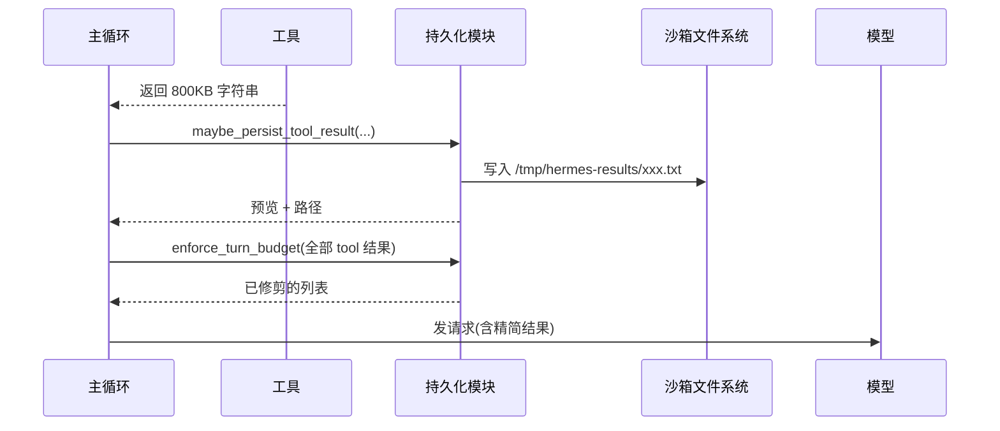

# Chapter 5: 工具产物预算系统（Tool Result Budget）

在上一章 [记忆提供方（Memory Provider）](04_记忆提供方_memory_provider__.md) 里，我们让 agent 拥有了"私人秘书"，能跨会话记住客户的偏好。但秘书再厉害也救不了一种突发状况：**agent 调用了一个工具（比如 `bash` 跑了一句 `cat huge.log`），结果工具一口气吐出 5 MB 文本**，这一下就能把上下文窗口撑爆。

这一章我们要认识 `hermes-agent` 里**最像"快递分拣中心"**的那一套机制——**工具产物预算系统（Tool Result Budget）**。

---

## 一、问题从哪里来？一个快递公司的小故事

想象你住在一间客厅只有 20 平米的小公寓，每天都会有快递送上门：

- **小件**（一封信、一个手机壳）——直接抱进客厅，没问题。
- **中件**（一个微波炉）——勉强能堆进客厅，但已经有点拥挤了。
- **超大件**（一台冰箱、一个沙发）——直接搬进客厅？客厅就废了。

聪明的快递公司会怎么做？

1. **小件**：照常送进客厅。
2. **超大件**：先放在街角的"自提柜"里，给你一张**取件码**："您要时去 23 号柜取。"
3. 万一某天你一次性收了 **30 件中等大小的快递**，加起来也能撑爆客厅——这时候快递公司会再次把**最大的几件**搬去自提柜，确保你的客厅永远走得动人。

`hermes-agent` 面临的情况一模一样：

- **客厅** = LLM 的 context window（比如 200,000 tokens）。
- **每个快递** = 一次工具调用的产物（`read_file` / `bash` / `web_fetch` 的返回）。
- **取件码** = 一个文件路径，agent 想看时再调用 `read_file` 自取。

这套"分拣 + 自提柜"机制就是 **工具产物预算系统**。

---

## 二、本章的核心用例

> agent 在一轮对话里调用了 5 个工具，其中一个 `bash` 命令输出了 800,000 个字符的日志，另外几个工具加起来又有 300,000 字符。我们想知道：`hermes-agent` 是如何**自动**把超大输出转存到沙箱临时文件、在对话里只留下预览和路径，让一轮工具总量仍然落在预算之内的？同时——**如何通过 `BudgetConfig` 调整阈值**？

读完本章你就能理解三层防御的全部细节，并知道在哪里改阈值。

---

## 三、三层防御长什么样？

整个预算系统是**三层叠加**的，每一层都能独立兜底。我们用"快递分拣中心"的角色来对应：

| 层级 | 在哪里发生 | 干什么 | 类比 |
| --- | --- | --- | --- |
| **第 1 层** | 工具内部 | 工具自己先把输出截到一个上限（比如 50KB） | 快递公司**装箱**前就把蓬松填充物压实 |
| **第 2 层** | 工具返回后 | 单条结果超过阈值 → 写入沙箱临时文件，对话里只留**预览 + 路径** | **超大件直接进自提柜**，客户拿"取件码" |
| **第 3 层** | 一轮的所有结果收齐后 | 累计仍超预算 → 把**最大的几条**继续溢出 | **客厅还是太挤** → 把最大那几件再搬一次 |

任何一层都拦不住，下一层就接着拦——三道闸门，几乎不可能漏。

---

## 四、关键概念一个个看

### 4.1 第 1 层：工具自己的"预截断"

最简单的一层，没有什么"魔法"——每个工具的作者自己负责。比如 `bash` 工具会在返回前看自己的输出长不长，长了就掐掉：

```python
# 来自 tools/tool_output_limits.py
DEFAULT_MAX_BYTES = 50_000       # 终端输出上限（字符）
DEFAULT_MAX_LINES = 2000         # read_file 分页上限
DEFAULT_MAX_LINE_LENGTH = 2000   # 单行长度上限
```

这些数字写在 `tool_output_limits.py` 里，并且**可以在 `config.yaml` 里覆盖**：

```yaml
tool_output:
  max_bytes: 100000        # 我想看更长的终端输出
  max_lines: 5000
```

> 💡 这层是"快递员的良心"——靠每个工具自觉。但如果工具忘了截，没关系，下面还有两层。

### 4.2 第 2 层：单条结果的"自提柜"

这才是预算系统的**核心创新**。当一个工具返回结果时，主循环会问：

> "这次返回多长？超过你这个工具注册时声明的阈值了吗？"

- **没超** → 原样塞进对话。
- **超了** → 把**全文**写到沙箱里的一个临时文件（比如 `/tmp/hermes-results/abc123.txt`），对话里只放一个**预览 + 文件路径**，并加一段提示："你想看完整的就用 `read_file` 来取"。

默认阈值是 **100,000 字符**（约 25K tokens），来自：

```python
# 来自 tools/budget_config.py
DEFAULT_RESULT_SIZE_CHARS: int = 100_000
DEFAULT_TURN_BUDGET_CHARS: int = 200_000
DEFAULT_PREVIEW_SIZE_CHARS: int = 1_500
```

最妙的是：**模型并没有"丢失"信息**——它只是改用 `read_file(path, offset=..., limit=...)` 按需取，需要哪页翻哪页。

### 4.3 第 3 层：一轮的"总预算"

第 2 层已经管住了"单件超大"。但如果一轮里有 10 个 80KB 的结果（每个都不超阈值），加起来 800KB——同样会撑爆。

第 3 层就是为这种"群殴"准备的：

1. 收齐这一轮所有工具结果后，把它们的字符数加起来。
2. 如果**总和** > `turn_budget`（默认 200,000），就按结果大小**从大到小**排序。
3. 把最大的那几条**再扔进自提柜**，直到总和回到预算内。

> 💡 类比："客厅装不下了，先把最占地的沙发搬走，再不行就搬冰箱，直到能走人为止。"

### 4.4 `BudgetConfig`：你的总调节器

三层的所有阈值都集中在一个 `dataclass` 里：

```python
@dataclass(frozen=True)
class BudgetConfig:
    default_result_size: int = 100_000   # 单条阈值
    turn_budget:         int = 200_000   # 一轮总预算
    preview_size:        int = 1_500     # 预览长度
    tool_overrides:      Dict[str, int] = ...   # 特定工具的覆盖
```

想让某个工具更"宽松"或更"苛刻"？用 `tool_overrides`：

```python
cfg = BudgetConfig(tool_overrides={"web_fetch": 50_000})
```

意思是："`web_fetch` 的结果只要超过 50KB 就送自提柜，比默认的 100KB 还严格。"

### 4.5 一个特殊的"豁免名单"

```python
PINNED_THRESHOLDS: Dict[str, float] = {
    "read_file": float("inf"),   # 永远不持久化
}
```

`read_file` 被设成**无限大**——为什么？因为它本身就是用来从自提柜取件的。如果 `read_file` 的输出也被送回自提柜，agent 想看完整日志时就会陷入"持久化 → 读取 → 又被持久化 → 又读取"的死循环。这条"钉死的"规则保护了系统的根基。

---

## 五、动手用一下！跟着核心用例走一遍

假设 agent 这一轮调用了一个 `bash` 命令：

```python
bash_output = "ERROR ...\n" * 50000   # 大概 800KB
```

### 步骤 1：工具返回后调用第 2 层

```python
from tools.tool_result_storage import maybe_persist_tool_result

new_content = maybe_persist_tool_result(
    content=bash_output,
    tool_name="bash",
    tool_use_id="call_007",
    env=env,
)
```

**输入**：原始 800KB 字符串。
**输出**：一个短得多的字符串，长这样——

```
<persisted-output>
This tool result was too large (819,200 characters, 800.0 KB).
Full output saved to: /tmp/hermes-results/call_007.txt
Use the read_file tool with offset and limit to access specific sections...

Preview (first 1500 chars):
ERROR ...
ERROR ...
...
</persisted-output>
```

完整的 800KB 已经写到 `/tmp/hermes-results/call_007.txt`，对话里只有 ~1.5KB 的预览。

### 步骤 2：一轮所有结果收齐后，调用第 3 层

```python
from tools.tool_result_storage import enforce_turn_budget

tool_messages = enforce_turn_budget(tool_messages, env=env)
```

**输入**：本轮所有的 tool message（一个列表）。
**输出**：同一个列表，但如果总字符 > 200,000，最大的几条会被原地替换成"自提柜引用"。

主循环就用这个清理后的列表继续下一轮——模型从此只看到精简版。

### 步骤 3：模型想看全部时

模型会在下一轮主动调用：

```python
read_file(path="/tmp/hermes-results/call_007.txt", offset=0, limit=200)
```

**输出**：拿到那 800KB 文件里的前 200 行。它可以按需翻页，**不需要一次性吞下整个日志**。

---

## 六、内部是怎么运转的？

### 6.1 一段直白的流程描述

一轮 agent 工作流大致是这样：

1. 模型生成一组工具调用。
2. 主循环把它们交给 [执行环境（Execution Environments）](06_执行环境_execution_environments__.md) 跑。
3. 每个工具返回字符串——主循环对每个调用一次 `maybe_persist_tool_result()`。
   - 没超阈值 → 原样保留。
   - 超了 → 写沙箱临时文件、换成预览 + 路径。
4. 把所有 tool message 收成一个列表，调用 `enforce_turn_budget()`。
   - 总和不超 → 直接返回。
   - 总和超了 → 按大小排序，把最大的几条继续送进自提柜。
5. 主循环把清理后的 tool messages 追加到对话里，下一轮发给模型。

### 6.2 用图来理解



注意：**模型从头到尾不知道这些细节**——它只看到"这个工具说结果太大，存在文件 X 里，你想看就 read_file"。预算系统对模型是**透明的**。

---

## 七、再深入一点：关键源码片段

### 7.1 写入沙箱（来自 `tool_result_storage.py`）

```python
def _write_to_sandbox(content, remote_path, env) -> bool:
    storage_dir = os.path.dirname(remote_path)
    cmd = f"mkdir -p {shlex.quote(storage_dir)} && cat > {shlex.quote(remote_path)}"
    result = env.execute(cmd, timeout=30, stdin_data=content)
    return result.get("returncode", 1) == 0
```

为什么用 `cat > file` 加 `stdin_data`，而不是直接写命令？因为 Linux 限制单个 argv 元素最长 128KB——把 800KB 当命令参数传进去会直接报错。改成"用 stdin 喂"就没有这个上限。

### 7.2 单条持久化（核心逻辑简化版）

```python
def maybe_persist_tool_result(content, tool_name, tool_use_id, env=None, config=DEFAULT_BUDGET, ...):
    threshold = config.resolve_threshold(tool_name)
    if len(content) <= threshold:
        return content                         # 没超，原样返回
    preview, has_more = generate_preview(content, max_chars=config.preview_size)
    remote_path = f"{_resolve_storage_dir(env)}/{tool_use_id}.txt"
    if env and _write_to_sandbox(content, remote_path, env):
        return _build_persisted_message(preview, has_more, len(content), remote_path)
    return preview + "\n\n[Truncated...]"     # 写失败 → 退化为简单截断
```

逻辑像三个连续的"if"：能跳过就跳过、能写盘就写盘、写不动就退化截断。一切尽量降级，保证不报错。

### 7.3 一轮预算执行（关键算法）

```python
def enforce_turn_budget(tool_messages, env=None, config=DEFAULT_BUDGET):
    total = sum(len(m["content"]) for m in tool_messages)
    if total <= config.turn_budget:
        return tool_messages
    # 找出"还没被持久化"的、按大小从大到小排
    candidates = sorted(...)
    for idx, size in candidates:
        if total <= config.turn_budget: break
        # 用 threshold=0 强制持久化
        tool_messages[idx]["content"] = maybe_persist_tool_result(..., threshold=0)
```

注意 `threshold=0`——这意味着"无论多大都持久化"。第 3 层比第 2 层更激进，因为这时候是"客厅真挤不下了"，必须搬。

### 7.4 阈值解析顺序（来自 `budget_config.py`）

```python
def resolve_threshold(self, tool_name):
    if tool_name in PINNED_THRESHOLDS:          # 1. 钉死名单（read_file）
        return PINNED_THRESHOLDS[tool_name]
    if tool_name in self.tool_overrides:        # 2. 用户的覆盖
        return self.tool_overrides[tool_name]
    from tools.registry import registry
    return registry.get_max_result_size(...)    # 3. 注册表 / 默认
```

优先级一目了然：**钉死名单 > 用户覆盖 > 工具自己声明 > 全局默认**。改阈值时只需要往 `tool_overrides` 里加一行。

---

## 八、自提柜的位置：沙箱友好

```python
def _resolve_storage_dir(env) -> str:
    if env and hasattr(env, "get_temp_dir"):
        temp_dir = env.get_temp_dir()
        if temp_dir:
            return f"{temp_dir.rstrip('/')}/hermes-results"
    return "/tmp/hermes-results"
```

很关键的一点是——**写文件用的是 `env.execute()`，不是 Python 直接的 `open()`**。原因：agent 可能跑在 Docker、SSH、Modal、Termux 等各种环境里，**这些环境里的 `/tmp` 跟主程序的 `/tmp` 不是同一个**。必须经过执行环境（下一章详细介绍），文件才会落在和工具同一个沙箱里，`read_file` 才能取到。


这也是为什么 [执行环境（Execution Environments）](06_执行环境_execution_environments__.md) 是下一章的主题——预算系统必须依赖它才能把"自提柜"真正搭在正确的地方。

---

## 九、本章小结

恭喜！你已经掌握了 `hermes-agent` 的第五个核心抽象：

- **工具产物预算系统**是一个**三层防御**机制，专门防止超大工具输出撑爆上下文窗口。
- **第 1 层**：工具内部自己预截断（如 `bash` 输出截到 50KB）。
- **第 2 层**：单条结果超阈值 → 写到沙箱临时文件，对话里只留预览 + 路径。
- **第 3 层**：一轮所有结果加总仍超预算 → 把最大的几条继续溢出。
- 所有阈值集中在 `BudgetConfig` 里，可以**按工具单独调**；`read_file` 被钉死为"永不持久化"，防止死循环。
- 这套机制对**模型完全透明**——它只是看到"结果太大，存在文件 X 里"，需要时主动 `read_file` 自取。

---

预算系统能正常工作的前提，是要能**把文件可靠地写进 agent 真正使用的那个文件系统**——本地、Docker、SSH、Modal……它们的"文件系统"各不相同。我们需要一个统一的"执行环境"抽象，让 `env.execute(...)` 一行代码就能跨所有后端工作。

那就是下一章的主角——**执行环境**。

👉 继续学习：[执行环境（Execution Environments）](06_执行环境_执行环境_execution_environments__.md)

---

Generated by [AI Codebase Knowledge Builder](https://github.com/The-Pocket/Tutorial-Codebase-Knowledge)