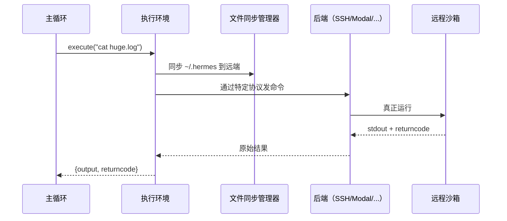
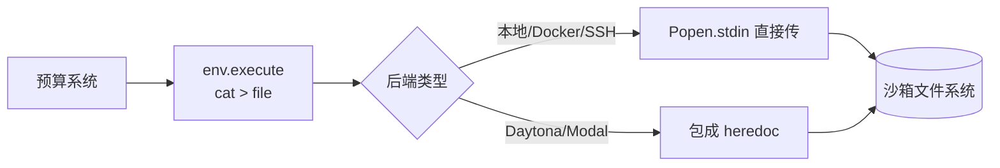

# Chapter 6: 执行环境（Execution Environments）

在上一章 [工具产物预算系统（Tool Result Budget）](05_工具产物预算系统_tool_result_budget__.md) 的结尾，我们留下了一个悬念：预算系统要把超大产物**写到沙箱临时文件里**，但写到哪个"沙箱"？写到 `/tmp` 就一定对吗？万一 agent 此刻正运行在远程服务器、Docker 容器、或者 Modal 云端，那它眼中的 `/tmp` 跟你主机上的 `/tmp` 根本不是同一个目录。

为了把这道难题彻底封装起来，`hermes-agent` 提供了一层"统一双手"——本章主角 **执行环境（Execution Environments）**。

---

## 一、问题从哪里来？一只"远程双手"的故事

想象你坐在办公室里，但需要操控不同地方的双手帮你做事：

- 有时候要在**自己电脑**上跑一句 `python build.py`。
- 有时候要在**远程服务器**上跑 `systemctl restart nginx`。
- 有时候要在**云端沙箱**里运行一段可能有风险的脚本（防止把本机搞坏）。
- 有时候要在**Docker 容器**里测试一个干净环境。

如果每种场景你都得记住一套不同的 API：本地用 `subprocess.run`、远程用 `paramiko`、Docker 用 `docker exec`、Modal 用 SDK……主代码会被切碎成一堆 `if-else`。

聪明的设计是：**给所有"双手"穿同一副手套**。无论这双手物理上在哪里，主程序对它说的话永远只有一句：

```python
env.execute("ls -la")
```

剩下的"伸到哪儿、用什么协议、文件怎么同步、出错怎么取消"统统由 `env` 自己负责。这副"统一手套"就是 **执行环境**。

---

## 二、本章的核心用例

> agent 想跑一句 `cat huge.log` 收集日志。我们希望**主程序里只有一行 `env.execute(...)`**，但底层可以无缝切换成本地、Docker、SSH、Singularity、Modal、Daytona 中任意一种——而上一章的[工具产物预算系统（Tool Result Budget）](05_工具产物预算系统_tool_result_budget__.md)也能把超大输出**写进同一个沙箱**，让 `read_file` 之后能取得回来。

读完本章，你会理解这套抽象的接口、各种后端如何挂载到它上面、以及为什么这是"自提柜能跨环境工作"的关键。

---

## 三、执行环境到底是什么？

每一个执行环境都是一个类，**统一继承自抽象基类 `BaseEnvironment`**。基类规定了"这副手套必须能做什么"——对外只有寥寥几个方法：

| 方法 | 它干什么 | 类比 |
| --- | --- | --- |
| `execute(cmd, ...)` | 跑一句 shell 命令，返回 `{output, returncode}` | "去做这件事" |
| `cwd`（属性） | 当前在哪个目录 | "你站在哪一格地板上" |
| `init_session()` | 启动后做一次环境初始化 | "穿好手套" |
| `cleanup()` | 收尾，关连接、卸沙箱、同步文件 | "下班，洗手回家" |

主程序只看这几个方法。**它从不直接调用 `subprocess`、`paramiko`、`docker.client`**——这些细节藏在每个具体后端里。

### 3.1 一张全景图：手套有几款？

```
BaseEnvironment（抽象基类）
├── LocalEnvironment          → 本机直接跑
├── DockerEnvironment         → 本地 Docker 容器
├── SSHEnvironment            → 远程服务器（SSH）
├── SingularityEnvironment    → HPC 集群常用容器
├── ModalEnvironment          → Modal 云沙箱（直连）
├── ManagedModalEnvironment   → Modal 云沙箱（经 Nous 网关）
├── DaytonaEnvironment        → Daytona 云沙箱
└── VercelSandboxEnvironment  → Vercel 云沙箱
```

**8 副手套，同一个接口**。在 `config.yaml` 里改一行就能切换：

```yaml
terminal:
  env: docker         # 改成 ssh / modal / daytona ...
```

---

## 四、关键概念逐个看

### 4.1 `execute()`：唯一的"伸手动作"

主程序只用这一个方法。例子：

```python
result = env.execute("echo hello && pwd")
print(result["output"])      # → "hello\n/home/me\n"
print(result["returncode"])  # → 0
```

无论是本地还是 Modal 云端，返回的字典结构完全一样——这是和上一章 `NormalizedResponse` 同一种"普通话"哲学。

### 4.2 CWD（当前目录）跟踪

每副手套都自己记着"我现在站在哪个目录"。这一点很关键，因为大多数后端是**spawn-per-call**——每次 `execute` 都新开一个进程，原本 `cd /tmp` 是不会被记住的。

`BaseEnvironment` 通过在命令尾巴上偷偷加一个标记，把"现在的 pwd"通过 stdout 报回主程序，主程序把它存进 `env.cwd`。下一条命令再执行时，自动 `cd $cwd` 一下再开干。这样从 agent 视角看，目录是"持久的"。

### 4.3 文件同步（FileSyncManager）

如果 agent 在云沙箱里跑，那它本来看不到你电脑上的 `~/.hermes/skills/` 文件夹。怎么办？

**解决方案**：每个远程/容器后端都自带一个 **FileSyncManager**——执行前把本地 `~/.hermes/` 同步到沙箱，执行后再同步回来。这样无论手套伸到哪儿，agent 都能用上你的 skills、credentials、cache。

### 4.4 中断与取消

用户按 Ctrl+C 想叫停？每副手套都要能干净地"缩回来"：

- 本地：发 SIGTERM 给进程。
- SSH：关掉 SSH 连接。
- Daytona：调用 `sandbox.stop()`。
- Modal：调用 `cancel_modal_exec()`。

主程序不需要关心细节，它只知道"叫停了就叫停了"。

### 4.5 持久化文件系统（可选）

像 Daytona、Modal、Singularity 这些云后端，支持**持久化沙箱**——下次启动还能拿到上次的文件。这通常通过 `persistent_filesystem=True` 参数开启。本地、SSH 天然就是持久的，所以不需要这个参数。

---

## 五、动手用一下！跟着核心用例走一遍

我们假设 agent 当前用的是 Docker 后端，要跑 `cat huge.log` 然后让预算系统把产物存进沙箱。

### 步骤 1：根据配置选一副手套

```python
from tools.environments.docker import DockerEnvironment

env = DockerEnvironment(
    image="ubuntu:22.04",
    cwd="/root",
    timeout=60,
)
```

工厂函数（`tools/terminal_tool.py` 里的 `_create_environment`）会按配置自动挑出对应类——你平时不需要手动 new。

### 步骤 2：跑命令

```python
result = env.execute("cat huge.log")
print(len(result["output"]))   # → 比如 800000 个字符
```

**输入**：一条 shell 命令字符串。
**输出**：一个 `{output, returncode}` 字典——和你直接在本地跑 `subprocess.run` 拿到的形状一样。

### 步骤 3：预算系统调用 `env.execute` 写自提柜

回顾上一章 `tool_result_storage.py` 里那段：

```python
cmd = f"mkdir -p {dir} && cat > {file}"
env.execute(cmd, timeout=30, stdin_data=content)
```

这里的 `env` 就是当前激活的执行环境。**Docker 后端会在容器内创建文件**，而不是写到主机的 `/tmp`——这样后续 `read_file` 在容器里跑时也能取到 🎉。

### 步骤 4：会话结束时清理

```python
env.cleanup()
```

Docker 会停容器、Daytona 会停沙箱、SSH 会关闭 ControlMaster 连接。**主程序什么都不用管。**

---

## 六、内部是怎么运转的？

### 6.1 一段直白的流程描述

当主程序调用 `env.execute("cat huge.log")` 时，幕后发生：

1. **`_before_execute()` 钩子触发**——比如 SSH/Docker/Daytona 会先做一次文件同步。
2. **包装命令**——给命令尾巴加上 cwd 跟踪标记，必要时把 stdin 数据塞进 heredoc。
3. **后端特有的"打电话"**——SSH 用 `ssh ...` 子进程、Daytona 用 SDK、Modal 用 HTTP API、Local 直接 `Popen`。
4. **等结果**——轮询/阻塞读取，同时监听是否有中断信号。
5. **解析 stdout**——从尾部标记里抠出新的 cwd，更新 `self.cwd`。
6. **返回 `{output, returncode}`**——主程序拿到统一格式的结果。

### 6.2 用图来理解



注意：**主循环只和 `E`（执行环境）对话**。中间那条"协议特异链路"完全被封在手套里——这就是抽象的力量。

---

## 七、再深入一点：关键源码片段

### 7.1 抽象基类的核心约定

`tools/environments/__init__.py` 的注释一句话讲清楚了：

```python
"""Each backend provides the same interface (BaseEnvironment ABC) for running
shell commands in a specific execution context: local, Docker, SSH,
Singularity, Modal, Daytona, or Vercel Sandbox."""
```

所有后端**对外接口完全一致**。下面我们看几个有代表性的"实现细节"。

### 7.2 SSH 后端：connection 复用

SSH 后端用 OpenSSH 的 `ControlMaster` 机制把一条 TCP 连接保持 5 分钟，避免每次 execute 都重新握手。来自 `tools/environments/ssh.py`：

```python
cmd.extend(["-o", f"ControlPath={self.control_socket}"])
cmd.extend(["-o", "ControlMaster=auto"])
cmd.extend(["-o", "ControlPersist=300"])
```

这就像你拨第一通电话后**别挂断**，后续几通对话就直接接着说，不用再拨号。

### 7.3 SSH 后端：批量上传文件

如果 agent 启动时要同步 580 个 skill 文件，逐个 `scp` 会慢到怀疑人生。SSH 后端改成**一次 tar 管道**：

```python
tar_cmd = ["tar", "-chf", "-", "-C", staging, "."]
ssh_cmd.append("tar xf - --no-overwrite-dir -C /")
# 本地 tar -> SSH 管道 -> 远端 tar 解包
```

效果：580 个文件从"5 分钟"压缩到"<2 秒"。**主代码完全无感**——它只调用 `_sync_manager.sync()`。

### 7.4 Daytona 后端：用 SDK 调度

Daytona 是云沙箱，得通过它的 Python SDK 干活。来自 `tools/environments/daytona.py`：

```python
def exec_fn() -> tuple[str, int]:
    response = sandbox.process.exec(shell_cmd, timeout=timeout)
    return (response.result or "", response.exit_code)

return _ThreadedProcessHandle(exec_fn, cancel_fn=cancel)
```

注意：SDK 的 `exec` 是**阻塞的**，所以这里用了 `_ThreadedProcessHandle` 把它包成"看起来像 `Popen`"——主循环就可以用同一套 `_wait_for_process` 代码处理它。**统一接口**靠这种小巧思才能撑住。

### 7.5 Daytona 后端：持久化沙箱

```python
if self._persistent:
    self._sandbox.stop()      # 不删除，下次启动还能复用
else:
    self._daytona.delete(self._sandbox)
```

`persistent_filesystem=True` 时，cleanup 只是停掉沙箱；下次同一 `task_id` 启动时会自动 `start()`，文件原封不动还在。这就是"云端长期工位"的实现。

### 7.6 Modal 后端：通过 HTTP 网关

Managed Modal（经 Nous 网关）连 SDK 都不用——直接发 HTTP 请求。来自 `tools/environments/managed_modal.py`：

```python
response = self._request(
    "POST", f"/v1/sandboxes/{self._sandbox_id}/execs",
    json={"execId": exec_id, "command": prepared.command, ...},
)
```

它发完请求后**不会一直等**——而是周期性 poll：

```python
while True:
    if is_interrupted(): self._cancel_modal_exec(handle); return ...
    result = self._poll_modal_exec(handle)
    if result is not None: return result
    time.sleep(0.25)
```

中断也是通过 HTTP 调一下 `/cancel`。**所有这些都被 `BaseModalExecutionEnvironment.execute()` 封好了**——具体的 transport 子类只需要实现 `_start_modal_exec` / `_poll_modal_exec` / `_cancel_modal_exec` 三个钩子。

### 7.7 Singularity 后端：安全加固

Singularity 是 HPC 集群上常用的容器，安全约束比 Docker 更严格。来自 `tools/environments/singularity.py`：

```python
cmd.extend(["--containall", "--no-home"])
if self._memory > 0: cmd.extend(["--memory", f"{self._memory}M"])
if self._cpu > 0:    cmd.extend(["--cpus", str(self._cpu)])
```

`--containall` + `--no-home` 表示"完全隔离，不挂用户家目录"。资源上限也能直接传——主程序根本看不见这些复杂参数。

---

## 八、它和"工具产物预算"的协作（再回头看一眼）

回顾上一章那段写自提柜的代码：

```python
cmd = f"mkdir -p {dir} && cat > {file}"
result = env.execute(cmd, timeout=30, stdin_data=content)
```

注意 `stdin_data=content`——为什么用 stdin 而不是把 800KB 字符串塞进命令？因为 Linux 单个 argv 上限 128KB，会爆。但每副"手套"对 stdin 的支持方式不同：

```python
# 来自 modal_utils.py
_stdin_mode = "heredoc"   # Daytona / Modal：不支持直接 stdin，改用 heredoc 包一层
# Local / Docker / SSH 默认: 直接通过 Popen.stdin 传
```

这一行配置告诉基类"我这副手套不支持原生 stdin，请帮我自动包成 heredoc"。基类负责适配，主程序还是只看到一行 `env.execute(cmd, stdin_data=...)`。完美的"抽象之下还能照顾差异"。



---

## 九、本章小结

恭喜！你已经掌握了 `hermes-agent` 的第六个核心抽象：

- **执行环境**是 agent 的"远程双手"——把 shell 命令执行抽象成统一的 `BaseEnvironment` 接口。
- 当前共有 8 副手套：本地、Docker、SSH、Singularity、Modal（直连/网关）、Daytona、Vercel Sandbox。
- 主程序只调用 `env.execute(cmd, ...)` 和 `env.cleanup()`——所有"伸到哪儿、用什么协议、文件怎么同步、中断怎么取消"细节都封装在后端里。
- 每副手套都自带 **CWD 跟踪**（spawn-per-call 也能持久目录）、**FileSyncManager**（远端同步本地 `~/.hermes`）、**中断取消**、可选的**持久化文件系统**。
- 上一章的[工具产物预算系统（Tool Result Budget）](05_工具产物预算系统_tool_result_budget__.md)**必须**透过 `env.execute()` 才能把超大产物写到 agent 真正在用的那个沙箱里——这是"自提柜跨环境工作"的根基。

---

到这里，agent 已经能在各种环境里跑 shell 命令、还能把超大产物妥善存放。但 agent 写代码的时候，光靠 shell 还不够——它需要更精细的代码理解能力：跳到函数定义、找所有引用、查类型错误。这些都不是 shell 能提供的，必须接入语言服务器（LSP）。

那位"代码理解专家"就是下一章的主角——LSP 集成服务。

👉 继续学习：[LSP 集成服务（LSP Service）](07_lsp_集成服务_lsp_service__.md)

---

Generated by [AI Codebase Knowledge Builder](https://github.com/The-Pocket/Tutorial-Codebase-Knowledge)