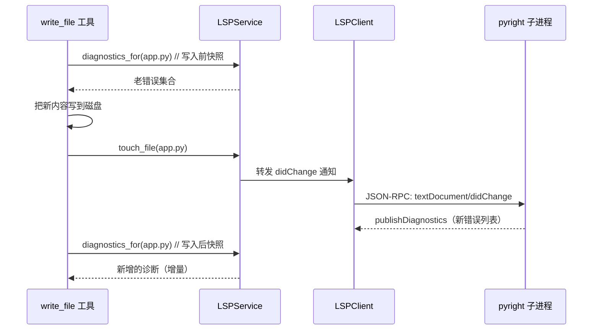
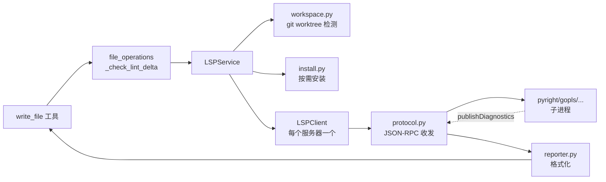

# Chapter 7: LSP 集成服务（LSP Service）

在上一章 [执行环境（Execution Environments）](06_执行环境_execution_environments__.md) 里，我们让 agent 拥有了一副"统一手套"——无论命令最终跑在本地、Docker、SSH 还是 Modal 沙箱里，主程序都只看一个 `env.execute(...)`。配合 [工具产物预算系统（Tool Result Budget）](05_工具产物预算系统_tool_result_budget__.md)，超大输出也能妥善地存进沙箱。

但 agent 写代码的时候，光会 `bash` 还不够——它需要更"懂语义"的眼睛。比如：

- 我把一个函数改了名字，会不会有别的地方还在用旧名？
- 我刚加进来的这行 import，类型对得上吗？
- 我把 `int` 改成 `str`，下面那串 `+ 5` 是不是炸了？

这些问题用 `grep` 是查不出来的。但 IDE 能立刻在编辑器里画一道红线告诉你——那是因为 IDE 背后跑着一个 **语言服务器（Language Server）**。`hermes-agent` 也想要这样的"红线"。这就是本章主角——**LSP 集成服务（LSP Service）**。

---

## 一、问题从哪里来？一位"贴身代码审稿人"的故事

想象你在写 Python 代码，旁边坐了一位审稿人：

- 你刚保存文件，他立刻扫一眼——"嘿，第 47 行的变量没定义！"
- 你把一个函数签名改了——他又说："等等，下面第 80 行还在按旧签名调用呢。"
- 他不会拦着你写代码，只是在每次你**写完一刻**就把"新冒出来的错"指给你看。

这位审稿人就是语言服务器。`pyright` 看 Python，`gopls` 看 Go，`rust-analyzer` 看 Rust，`typescript-language-server` 看 TS——每种语言一位专家。

`hermes-agent` 写文件的工具叫 `write_file` 和 `patch`。问题是：agent 写完之后没有"红线"反馈，错误可能要等运行才能发现，循环很慢。**LSP 集成服务**做的就是：

1. 在合适的时机把这些专家**作为子进程拉起来**。
2. 通过 JSON-RPC 拿到他们的 `publishDiagnostics`（诊断信息）。
3. 把"这次写入新冒出来的错"塞进工具结果里给模型看。
4. 模型立即在下一轮**自动修**。

---

## 二、本章的核心用例

> agent 用 `write_file` 修改了一个 Python 文件 `app.py`，引入了一个类型错误。我们希望工具结果里**自动附带一段诊断**，告诉模型："你这次写入新增了 1 个错误，第 23 行第 5 列：变量 `x` 未定义"。同时——**这套机制不能在 agent 站在 `~` 这种非项目目录时乱跑**，免得平白拉起 pyright 进程吃内存。

读完本章你会看到整套机制如何串起来工作。

---

## 三、关键概念逐个看

### 3.1 LSP 是什么？为什么用 JSON-RPC？

LSP 全称 Language Server Protocol，由微软定义。它规定语言服务器和编辑器之间用 **JSON-RPC 2.0** 通信，消息格式是：

```
Content-Length: <bytes>\r\n
\r\n
<utf-8 JSON body>
```

比如告诉服务器"我打开了文件 app.py"，编辑器会发一条 `textDocument/didOpen` 通知；服务器扫完后会主动发一条 `textDocument/publishDiagnostics` 通知，里面列出错误。`hermes-agent` 就是在扮演"编辑器"这一侧。

### 3.2 工作区门禁：只对 git 项目生效

如果你正在 `~/Documents` 里随便聊两句天、改一个临时文件，agent 应该拉起 pyright 吗？**不应该**——这会平白启动一个上百 MB 的后台进程。

所以 LSP 有一道"门禁"：只有当 cwd 或要写的文件**位于一个 git worktree 里**时，LSP 才会被激活。否则就走原来的、轻量的语法检查回退。

这个判断由 `agent/lsp/workspace.py` 里的 `find_git_worktree()` 完成——往上找 `.git` 目录，找到了就开门，找不到就关门。

### 3.3 自动安装：缺什么补什么

模型想看 pyright 的诊断，但用户没装 pyright 怎么办？

`agent/lsp/install.py` 提供了"按需安装"——第一次需要某个服务器时，自动用 `npm`/`go`/`pip` 把它装到 `<HERMES_HOME>/lsp/bin/`。装完后续就直接复用。重型服务器（如 `rust-analyzer`、`clangd`）标记为 `manual`，留给用户自己装。

### 3.4 诊断报告：只看 ERROR、只看新出现的

如果一个文件原本就有 50 个 warning，agent 写入后还是 50 个——这种"和我没关系"的旧错误不应该报给模型。所以 LSP 集成只关注：

- **严重程度过滤**：默认只看 `ERROR`（等级 1），跳过 warn / info / hint。
- **新错误增量**：写入前先记一遍"老错误"，写入后只把"新增的"塞进工具结果。

这就是所谓的"lint delta（增量诊断）"——只看自己这次写入捅出来的篓子。

---

## 四、动手用一下！跟着核心用例走一遍

我们看 LSP 服务对外暴露的接口（来自 `agent/lsp/__init__.py`）：

### 步骤 1：拿到全局单例

```python
from agent.lsp import get_service

svc = get_service()   # 拿到 LSPService，或 None
```

**输入**：什么都不给。
**输出**：一个 `LSPService` 实例（如果 LSP 启用且能跑起来），否则 `None`。

注意是"懒加载"——只有第一次调用时才真正初始化，避免影响启动速度。

### 步骤 2：判断这个文件值不值得跑 LSP

```python
if svc and svc.enabled_for("app.py"):
    print("这个文件在 git 项目里，并且有匹配的语言服务器")
```

`enabled_for(path)` 内部会调 `resolve_workspace_for_file()` 做 git worktree 检查、再看扩展名（`.py` → pyright）有没有对应的服务器。

### 步骤 3：通知服务器"我要碰这个文件了"

```python
await svc.touch_file("app.py")   # 触发 didOpen / didChange
```

这一步会确保对应的语言服务器已经启动，并把文件最新内容推给它。**之后服务器会异步把诊断发回来**——通过 `publishDiagnostics` 通知。

### 步骤 4：取出诊断结果

```python
diags = svc.diagnostics_for("app.py")
# diags = [{"severity": 1, "range": {...}, "message": "x is undefined"}, ...]
```

`diagnostics_for(path)` 返回服务器最新报告的诊断列表。每条是一个 LSP 标准的 `Diagnostic` 字典。

### 步骤 5：格式化给模型看

```python
from agent.lsp.reporter import report_for_file

block = report_for_file("app.py", diags)
# block 大致长这样：
# <diagnostics file="app.py">
# ERROR [23:5] x is undefined [reportUndefinedVariable] (pyright)
# </diagnostics>
```

`report_for_file()` 会把诊断压成紧凑的一行一条，加上 `<diagnostics>` 标签——这样模型就能直接把它当上下文看，下一轮立刻去修 🎉。

> 💡 真实调用链上，**这些细节都封装在 `tools/file_operations.py` 的 `_check_lint_delta` 里**。`write_file`/`patch` 工具调用它一次就够了，普通用户根本不用碰 LSP 的 API。

---

## 五、内部是怎么运转的？

### 5.1 一段直白的流程描述

当 agent 调用 `write_file("app.py", new_content)` 时：

1. **写入前快照**：file_operations 调用 `svc.diagnostics_for("app.py")`，把现有诊断记成"老错误集合"。
2. **真正写入**：把新内容写到磁盘。
3. **通知 LSP**：调用 `svc.touch_file("app.py")`——LSP 服务通过 JSON-RPC 把新内容推给 pyright。
4. **等待诊断**：根据 `wait_mode`（短超时，比如 500 ms）等待 pyright 发回 `publishDiagnostics`。
5. **算增量**：再次 `diagnostics_for("app.py")`，减掉"老错误集合"，得到"这次新增的错"。
6. **塞进工具结果**：用 `report_for_file()` 格式化后拼到 `write_file` 的返回字符串末尾。
7. **模型看到红线**：下一轮模型立即知道自己的写入引发了什么错。

### 5.2 用图来理解



关键点：**模型完全不知道这套机制**——它只看到工具结果里多了一段 `<diagnostics>` 块。整个流程对模型是透明的。

---

## 六、再深入一点：关键源码片段

### 6.1 服务单例 + 退出清理（`agent/lsp/__init__.py`）

```python
def get_service():
    global _service
    if _service is not None:
        return _service if _service.is_active() else None
    with _service_lock:
        _service = LSPService.create_from_config()
        atexit.register(_atexit_shutdown)   # 进程退出时清理子进程
    return _service if _service.is_active() else None
```

第一次调用时创建服务，同时注册 `atexit` 钩子——保证 `hermes chat` 退出时 pyright/gopls 等子进程不会变成僵尸进程。

### 6.2 JSON-RPC 帧解析（`agent/lsp/protocol.py`）

```python
def encode_message(obj: dict) -> bytes:
    body = json.dumps(obj, separators=(",", ":")).encode("utf-8")
    header = f"Content-Length: {len(body)}\r\n\r\n".encode("ascii")
    return header + body
```

往子进程的 stdin 写一条消息时就这样组帧——Content-Length 头 + 空行 + JSON 体。和 vscode-jsonrpc 完全兼容。

读取的逻辑稍长，要先按行读 headers，再按字节读 body。模块里有 8 KiB / 64 MiB 的"理性上限"，防止异常服务器把 reader 拖死。

### 6.3 工作区检测（`agent/lsp/workspace.py`）

```python
def find_git_worktree(start: str):
    cur = Path(normalize_path(start))
    for _ in range(64):                     # 防御性深度上限
        if (cur / ".git").exists():
            return str(cur)
        parent = cur.parent
        if parent == cur: break
        cur = parent
    return None
```

简单地"往上爬找 `.git`"。`64` 是兜底——正常项目结构永远到不了这个深度，但加上能防止某些奇葩符号链接把循环卡死。

### 6.4 NearestRoot：每种服务器认不同的标记

```python
def nearest_root(start, markers, *, excludes=None):
    # markers: 比如 Python 的 ["pyproject.toml", "setup.py"]
    # excludes: 找到 deno.json 就不要走 typescript 这条路
    # 返回包含 marker 的目录
    ...
```

这就让 pyright 在 Python 项目根目录启动（认 `pyproject.toml`），gopls 在 Go 项目根目录启动（认 `go.mod`）——每位专家都在自己最熟悉的工位上工作。

`excludes` 是个巧妙设计：如果一个目录里有 `deno.json`（Deno 项目），就不该让 `typescript-language-server` 去插手——它会和 Deno 的运行时打架。

### 6.5 诊断格式化（`agent/lsp/reporter.py`）

```python
def format_diagnostic(d):
    sev = SEVERITY_NAMES.get(d.get("severity") or 1, "ERROR")
    line = int(d["range"]["start"]["line"]) + 1     # LSP 用 0-indexed
    col = int(d["range"]["start"]["character"]) + 1
    msg = str(d.get("message") or "").rstrip()
    return f"{sev} [{line}:{col}] {msg}"
```

把 LSP 的 0-indexed 坐标转成人类习惯的 1-indexed，再拼成 `ERROR [23:5] x is undefined` 这种紧凑格式。每个文件最多列 20 条，超过的说"... and N more"——避免长文件刷屏。

### 6.6 自动安装（`agent/lsp/install.py`）

```python
INSTALL_RECIPES = {
    "pyright":       {"strategy": "npm", "pkg": "pyright", ...},
    "gopls":         {"strategy": "go",  "pkg": "golang.org/x/tools/gopls@latest", ...},
    "rust-analyzer": {"strategy": "manual", ...},   # 太重，用户自己装
}
```

每个服务器一份"安装食谱"：用 npm 装的、用 go install 装的、必须手动的。`try_install()` 第一次需要时执行，结果缓存——并发请求由 per-package 锁串行化，不会重复装。

### 6.7 静默化日志（`agent/lsp/eventlog.py`）

LSP 每次写文件都会被触发——一天可能上千次。如果每次都打满 INFO 日志，agent.log 会爆。所以这里做了精细的级别划分：

- **DEBUG**：稳态事件（clean、ext 未映射等）——默认看不到。
- **INFO**：状态转换（首次为某 root 启动 client、有诊断发回）。
- **WARNING**：要采取行动的失败（服务器装不上、超时）。

并且**首次出现的事件才打 INFO/WARNING，之后降级到 DEBUG**，避免同一个错误刷一百遍。这个去重表用 `set` 在进程内维护。

### 6.8 CLI 子命令（`agent/lsp/cli.py`）

```
hermes lsp status         # 看哪些服务器装了、哪些在跑
hermes lsp install pyright   # 单独装一个
hermes lsp install-all    # 把所有 auto 食谱跑一遍
hermes lsp restart        # 重启所有 client
hermes lsp which gopls    # 看 gopls 用哪个二进制
hermes lsp list           # 列出注册表
```

这是给人用的"运维入口"——上面那些内部 API 不需要用户自己调，但用户可能想知道"我的 pyright 装在哪了""为什么 gopls 没启动"。这些 CLI 命令都是查询/修复用的。

---

## 七、各部分如何串成一张图



- **工具层**只调 `_check_lint_delta`，对 LSP 内部毫无感知。
- **LSPService** 是协调员：决定哪些文件值得跑、用哪个服务器、有没有装好。
- **LSPClient** 是每个语言服务器对应的一个长生命周期对象，封装 JSON-RPC 通信。
- **subprocess** 是真正干活的"代码审稿人"。

---

## 八、本章小结

恭喜！你已经掌握了 `hermes-agent` 的第七个核心抽象：

- **LSP 集成服务**是 agent 的"贴身代码审稿人"——把 pyright、gopls、rust-analyzer 等真实语言服务器作为子进程拉起来，通过 JSON-RPC 拿诊断。
- 通过**工作区门禁**确保 LSP 只在 git 项目里工作，不打扰临时目录的轻量场景。
- 通过 **NearestRoot** 让每种服务器在自己认识的项目根（`pyproject.toml` / `go.mod` / `Cargo.toml`）启动。
- 通过**按需自动安装**让用户开箱即用，重型服务器留给手动；安装产物全部隔离在 `<HERMES_HOME>/lsp/bin/`，不污染用户环境。
- 只把**新增的 ERROR 级诊断**塞回工具结果，让模型自己看到红线、立刻自动修——对模型完全透明。
- 配套提供 **`hermes lsp` CLI** 让用户排查状态、装服务器、重启 client。

---

到这里，agent 已经能写代码、跑命令、读诊断、记忆用户偏好、压缩长对话、跨 8 种环境作业。但还有一个层面没碰：**agent 偶尔需要访问云端服务**——比如要把一个本地文件上传到某个云存储、或者用某个搜索服务、或者发短信通知用户。这些服务的提供方各不相同，agent 不能写死成"只支持 AWS"或"只支持 Cloudflare"。

下一章我们就看看 `hermes-agent` 是怎么把云服务抽象成可插拔后端的。

👉 继续学习：[云服务可插拔后端（Cloud Service Providers）](08_云服务可插拔后端_cloud_service_providers__.md)

---

Generated by [AI Codebase Knowledge Builder](https://github.com/The-Pocket/Tutorial-Codebase-Knowledge)