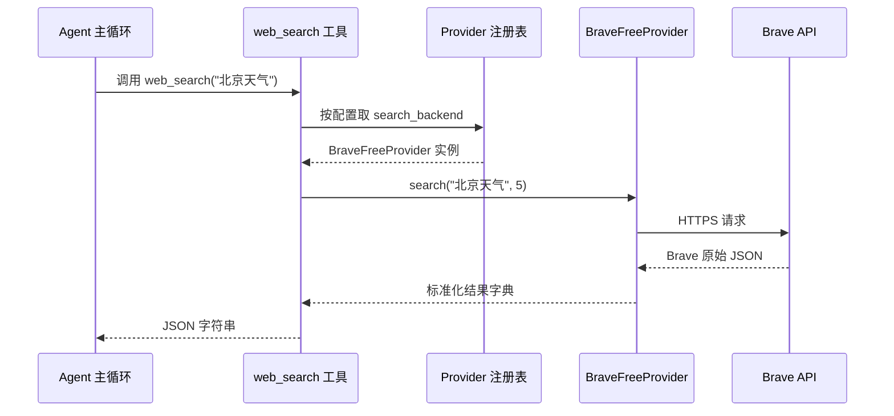
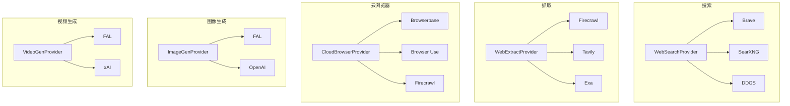

# Chapter 8: 云服务可插拔后端（Cloud Service Providers）

在上一章 [LSP 集成服务（LSP Service）](07_lsp_集成服务_lsp_service__.md) 里，我们让 agent 拥有了一位"贴身代码审稿人"，可以在每次写完文件后立刻看到诊断红线。到现在为止，agent 已经能写代码、跑命令、记忆用户偏好、压缩长对话、跨 8 种环境作业、看代码诊断——这些都是**编码相关**的能力。

但 agent 经常还要做一些"不在本地"的事：

- 搜一下"今天北京天气怎么样"——得调一个**搜索引擎**。
- 把某个网页内容抓回来分析——得调一个**网页抓取服务**。
- 打开一个真实浏览器去填一张表单——得用一个**云浏览器**。
- 根据描述生成一张配图——得调一个**图像生成 API**。

每一类需求都有**好多家厂商**在抢生意：搜索有 Brave、SearXNG、DDGS；云浏览器有 Browserbase、Browser Use、Firecrawl；图像有 FAL、xAI……价格不一、限速不一、可用区不一。

如果让 agent 把这些差异都背在身上，那是噩梦。本章主角——**云服务可插拔后端（Cloud Service Providers）**——就是用来把这一切藏在统一接口背后的"万能遥控器"。

---

## 一、问题从哪里来？一个"万能遥控器"的故事

想象你家客厅里有 5 台不同品牌的电视：索尼、LG、三星、TCL、小米。每台都附一只专属遥控器——5 只遥控器堆在茶几上，光找音量键就要翻三遍。

聪明做法：买一只**万能遥控器**。

- 你按"音量+"——它会自动用当前那台电视的协议发信号。
- 你按"换台"——同理。
- 哪天你换了一台新电视，只要"对一下码"就接上了。

**遥控器的按键永远是那几个**，对接的电视品牌可以随时换。这就是"接口与实现分离"的精髓。

`hermes-agent` 的云服务也是这样组织的：

```
搜索遥控器  ──按下"搜索"键──┐
                          ├── 背后实际可以接 Brave / SearXNG / DDGS / Tavily ...
网页抓取遥控器 ──按下"抓取"键──┘
                          
云浏览器遥控器 ──按下"开浏览器"键── 背后可以接 Browserbase / Browser Use / Firecrawl
图像遥控器 ──按下"生成"键── 背后可以接 FAL / OpenAI / Replicate
视频遥控器 ──按下"生成"键── 背后可以接 FAL / xAI / Google Veo
```

每一类都是"**ABC（抽象基类） + 注册表**"的双层结构。

---

## 二、本章的核心用例

> 用户想让 agent 用"网页搜索"工具找一下今天的新闻。我们想知道：
>
> 1. agent 怎么"按下搜索键"？
> 2. **不修改任何主代码**，怎么从"用 Brave"切换到"用自己内网的 SearXNG"？
> 3. 想新加一家搜索服务商（比如 `Kagi`），需要做哪些事？

读完本章，你就能回答这三个问题，并能照葫芦画瓢理解云浏览器、图像/视频生成这些"同款结构"的兄弟模块。

---

## 三、关键概念逐个看

### 3.1 "ABC + 注册表"双层结构

每一类云服务都长这副样子：

```
┌──────────────────────────────────────┐
│ 抽象基类 (ABC)                       │
│   规定"每位选手必须会的动作"          │
│   例：search() / extract()           │
└──────────────────────────────────────┘
              ▲
              │ 继承
   ┌──────────┼──────────┐
   │          │          │
┌─────┐   ┌──────┐   ┌──────┐
│Brave│   │SearXNG│  │ DDGS │
└─────┘   └──────┘   └──────┘
   ▲          ▲          ▲
   └──────────┴──────────┘
              │ 注册
        ┌─────────────┐
        │   注册表    │  ← 主程序通过名字查表
        └─────────────┘
```

**抽象基类**说："想做搜索的，都必须实现 `search(query, limit)` 方法。"
**注册表**说："谁注册了我就让谁上岗。"
**主程序**说："给我现在配置里那一家就行，我不管你是谁。"

### 3.2 三个核心动作

任何"云服务可插拔后端"对外只暴露 3 个动作：

| 动作 | 干什么 | 例子 |
| --- | --- | --- |
| `provider_name()` / `name` | 报名 | `"brave-free"` / `"searxng"` |
| `is_configured()` / `is_available()` | 自报"我能不能用" | 检查环境变量是否齐全 |
| `search()` / `create_session()` / `generate()` | 真正干活 | 发请求、返回标准化结果 |

注意第二个动作——**自报家门**。这是"插拔"的关键：注册表会问每位选手"你能不能上场"，没配 API Key 的就跳过，不会让你看到一个能选但一点都没用的选项。

### 3.3 标准化的返回格式

无论你选哪家搜索服务商，搜索结果**永远长这样**：

```python
{
    "success": True,
    "data": {
        "web": [
            {"title": "...", "url": "...", "description": "...", "position": 1},
            ...
        ]
    }
}
```

失败时也永远长这样：

```python
{"success": False, "error": "为什么失败的说明"}
```

这种"统一普通话"和前面 [Provider 传输层（Provider Transports）](02_provider_传输层_provider_transports__.md) 的 `NormalizedResponse` 是同一种哲学——**调用方**永远只学一种格式，**实现方**负责把自家的数据翻译成这种格式。

### 3.4 "搜索" vs "抓取"——两个独立的遥控器

`hermes-agent` 把 web 能力切成了两类：

- **搜索（Search）**：给关键词，返回结果链接列表。
- **抓取（Extract）**：给一个 URL，返回这个网页的纯文本/Markdown 内容。

**这两个能力是独立配置的**——你可以用 SearXNG 搜索（免费、私有），同时用 Firecrawl 抓取（专业、能渲染 JS）。配置文件长这样：

```yaml
web:
  search_backend: "searxng"        # 这家只会搜，不会抓
  extract_backend: "firecrawl"     # 这家两个都能干
```

---

## 四、动手用一下！解决我们的用例

我们走一遍"agent 调用搜索工具"的完整链路。

### 步骤 1：抽象基类长什么样

来自 `tools/web_providers/base.py`：

```python
class WebSearchProvider(ABC):
    @abstractmethod
    def provider_name(self) -> str: ...
    @abstractmethod
    def is_configured(self) -> bool: ...
    @abstractmethod
    def search(self, query: str, limit: int = 5) -> Dict[str, Any]: ...
```

三个抽象方法是"上岗准入"。`is_configured()` 不能发网络请求——只检查环境变量是否齐全。

### 步骤 2：一个最简单的实现——SearXNG

来自 `tools/web_providers/searxng.py`（核心部分）：

```python
class SearXNGSearchProvider(WebSearchProvider):
    def provider_name(self) -> str:
        return "searxng"

    def is_configured(self) -> bool:
        return bool(os.getenv("SEARXNG_URL", "").strip())
```

只要环境变量 `SEARXNG_URL` 配了，这位选手就报名"我能上场"。

```python
    def search(self, query, limit=5):
        base_url = os.getenv("SEARXNG_URL").rstrip("/")
        resp = httpx.get(f"{base_url}/search",
                         params={"q": query, "format": "json"}, timeout=15)
        raw = resp.json()["results"][:limit]
        web = [{"title": r["title"], "url": r["url"],
                "description": r["content"], "position": i+1}
               for i, r in enumerate(raw)]
        return {"success": True, "data": {"web": web}}
```

工作流程很直白：发 HTTP 请求 → 拿到 JSON → 转成标准格式。**注意最后返回的字典结构和前面规定的"普通话"完全一致**。

### 步骤 3：换一家——Brave

来自 `tools/web_providers/brave_free.py`：

```python
class BraveFreeSearchProvider(WebSearchProvider):
    def provider_name(self): return "brave-free"
    def is_configured(self):
        return bool(os.getenv("BRAVE_SEARCH_API_KEY", "").strip())
```

它的 `is_configured` 检查的是另一个环境变量。`search()` 内部细节也不同——用 `X-Subscription-Token` 头、走 `https://api.search.brave.com/...`——但**返回格式还是那一套标准字典**。

### 步骤 4：在配置文件里换台

```yaml
web:
  search_backend: "brave-free"     # 改成 "searxng" / "ddgs" / ...
```

**主代码不动一行**，搜索后端就切换了 🎉。

### 步骤 5：agent 怎么调用？

工具层（`web_search` 工具）大致这样做：

```python
provider = _select_search_provider()   # 读配置 → 查注册表 → 取实例
result = provider.search(query="今天北京天气", limit=5)
return json.dumps(result)
```

工具层从头到尾**不知道**自己在调 SearXNG 还是 Brave——它只看到一个实现了 `WebSearchProvider` 接口的对象。

---

## 五、内部是怎么运转的？

### 5.1 一段直白的流程描述

agent 调用搜索工具时：

1. 工具层读取 `config["web"]["search_backend"]`，比如得到字符串 `"brave-free"`。
2. 它去注册表里查 `"brave-free"` → 拿回 `BraveFreeSearchProvider` 实例。
3. 它问实例 `is_configured()` → 看看环境变量配了没。
4. 调用 `provider.search(query, limit=5)`。
5. provider 内部发 HTTP 请求、解析响应、转成标准格式。
6. 工具层把标准格式的字典 JSON 序列化，作为工具结果交给主循环。
7. 主循环把它喂给模型——模型只看到"网页结果列表"，根本不关心是哪家。

### 5.2 用图来理解



注意：**整个流程里"标准化"发生在 provider 内部**——只有 provider 知道 Brave 的 JSON 结构，外面的世界统一只看标准格式。

---

## 六、再深入一点：注册表的核心代码

我们看 `agent/image_gen_registry.py`——所有"云服务注册表"都是这套结构：

### 6.1 注册一家选手

```python
_providers: Dict[str, ImageGenProvider] = {}
_lock = threading.Lock()

def register_provider(provider: ImageGenProvider) -> None:
    with _lock:
        _providers[provider.name] = provider
```

底层就是一个字典：键是名字，值是 provider 实例。`_lock` 保证多线程注册时不会出乱子。

### 6.2 解析"当前激活的"是哪家

```python
def get_active_provider():
    configured = _read_from_config("image_gen.provider")
    if configured and configured in _providers:
        return _providers[configured]
    if len(_providers) == 1:
        return next(iter(_providers.values()))   # 只有一家就用这家
    if "fal" in _providers:
        return _providers["fal"]                 # 历史遗留默认
    return None
```

优先级清晰：**配置文件指定 > 唯一一家就直接用 > 兜底默认 > 实在没有就 None**。

注意"兜底为 `None`"很重要——工具拿到 None 时会给用户一个友好的错误信息，提示他去 `hermes tools` 配置一下，**而不是崩溃**。

### 6.3 用同一套模板拷一份——视频版本

`agent/video_gen_registry.py` 几乎和 `image_gen_registry.py` 一模一样：

```python
_providers: Dict[str, VideoGenProvider] = {}

def register_provider(p): ...
def get_active_provider(): ...
```

只是把 `ImageGenProvider` 换成 `VideoGenProvider`，把 `"image_gen"` 换成 `"video_gen"`。

> 💡 **设计哲学**：每一类云服务都有自己**独立的注册表**——这样升级一个不会影响另一个，新加一类（比如未来想加"语音合成"）只要复制粘贴一份注册表模板就行。

---

## 七、各家"遥控器"长什么样？一张全家福

下面这张图展示了 `hermes-agent` 当前 5 类云服务的全景：



**5 类遥控器，每类都是同一个套路**：

- 一个抽象基类规定动作。
- N 个具体实现负责干活。
- 一个独立的注册表负责发现和选用。
- 配置文件里改一行字符串就切换。

---

## 八、看一眼"云浏览器"是怎么照着这套思路写的

来自 `tools/browser_providers/base.py`：

```python
class CloudBrowserProvider(ABC):
    @abstractmethod
    def provider_name(self) -> str: ...
    @abstractmethod
    def is_configured(self) -> bool: ...
    @abstractmethod
    def create_session(self, task_id: str) -> Dict[str, object]: ...
    @abstractmethod
    def close_session(self, session_id: str) -> bool: ...
```

熟悉的味道是不是？还是 `provider_name` + `is_configured` + 几个干活方法。但因为浏览器有"开/关会话"的概念，所以这里有两个核心动作：`create_session` 和 `close_session`。

每位具体选手只要把这套接口实现一遍——比如 `BrowserbaseProvider` 用 `https://api.browserbase.com/v1/sessions` 创建会话，`BrowserUseProvider` 用 `https://api.browser-use.com/api/v3/browsers`——它们返回的字典都长这样：

```python
{
    "session_name": "...",   # 给主程序内部用
    "bb_session_id": "...",  # 提供方那边的 ID
    "cdp_url": "...",        # Chrome DevTools 协议连接 URL
    "features": {...},       # 启用了什么特性
}
```

**调用方拿到这个字典就够了**——它根本不需要知道幕后是 Browserbase 还是 Browser Use。

---

## 九、想自己加一家新的搜索服务商？三步走

假设我们想接入 `Kagi`：

### 步骤 1：建一个新文件

```
tools/web_providers/kagi.py
```

### 步骤 2：继承基类，实现三个方法

```python
from tools.web_providers.base import WebSearchProvider

class KagiSearchProvider(WebSearchProvider):
    def provider_name(self): return "kagi"
    def is_configured(self):
        return bool(os.getenv("KAGI_API_KEY"))
```

身份和"自报家门"。

```python
    def search(self, query, limit=5):
        resp = httpx.get("https://kagi.com/api/v0/search",
                         params={"q": query, "limit": limit},
                         headers={"Authorization": f"Bot {os.getenv('KAGI_API_KEY')}"})
        # ... 把 Kagi 的 JSON 转成标准格式
        return {"success": True, "data": {"web": [...]}}
```

发请求、转格式。**只要返回字典的形状正确，外面没人在乎你内部是怎么调的**。

### 步骤 3：在配置里启用

```yaml
web:
  search_backend: "kagi"
```

外加在某个加载钩子里调一次 `_PROVIDER_REGISTRY["kagi"] = KagiSearchProvider()`（一般已经在 `web_providers/__init__.py` 里自动完成）。

完事——主代码一行没动 🎉。

---

## 十、和前面章节的联系

让我们回头看看这套"可插拔后端"和之前的核心抽象是怎么呼应的：

| 章节 | 同款"可插拔"模式 |
| --- | --- |
| [Provider 档案（Provider Profiles）](01_provider_档案_provider_profiles__.md) | LLM 服务商档案 |
| [Provider 传输层（Provider Transports）](02_provider_传输层_provider_transports__.md) | 一种 api_mode 对应一个 Transport |
| [上下文引擎（Context Engine）](03_上下文引擎_context_engine__.md) | 一种压缩策略对应一个 Engine |
| [记忆提供方（Memory Provider）](04_记忆提供方_memory_provider__.md) | 一种长期记忆后端对应一个 Provider |
| [执行环境（Execution Environments）](06_执行环境_execution_environments__.md) | 一种沙箱后端对应一个 Environment |
| **本章** | 一种搜索/浏览器/图像 API 对应一个 Provider |

是的——`hermes-agent` 整个项目可以总结成一句话：**"凡是有'多家厂商抢生意'的地方，都用 ABC + 注册表 把它做成可插拔的。"** 这是项目最一以贯之的设计哲学。

---

## 十一、本章小结

恭喜！你已经掌握了 `hermes-agent` 的第八个核心抽象：

- **云服务可插拔后端**用"**ABC + 注册表**"的双层结构把搜索、抓取、云浏览器、图像/视频生成统一成"万能遥控器"。
- 每一类服务都有自己的抽象基类（`WebSearchProvider` / `CloudBrowserProvider` / `ImageGenProvider` / `VideoGenProvider` …）和**独立的注册表**。
- 所有 provider 都必须实现三件事：**报名**（`provider_name`）、**自报家门**（`is_configured` / `is_available`）、**真正干活**（`search` / `create_session` / `generate` …）。
- 返回值是**标准化字典**——调用方学一种"普通话"就够，不需要管底层是 Brave、SearXNG 还是 Kagi。
- **配置文件改一行**就能换厂商，主代码完全不动；新加一家厂商只需写一个继承基类的新文件。
- 这套模式是 `hermes-agent` 整个项目最重复出现的设计哲学——和 Provider 档案、Transport、Context Engine、Memory Provider、Execution Environment 同根同源。

---

到这里，agent 已经能调用各种外部云服务了——搜东西、开浏览器、生成图片视频。但有了这些能力**也意味着有了风险**：万一 agent 一不小心搜了奇怪的内容、或者打开浏览器去访问一个不该访问的网站、或者生成了一张不合规的图片，怎么办？这就引出了下一章的问题：**我们需要一道"门禁系统"，在关键动作执行前向用户征求同意，避免 agent 做出不可逆的危险动作**。

那就是下一章的主角——**安全与同意护栏**。

👉 继续学习：[安全与同意护栏（Safety & Consent Guardrails）](09_安全与同意护栏_safety___consent_guardrails__.md)

---

Generated by [AI Codebase Knowledge Builder](https://github.com/The-Pocket/Tutorial-Codebase-Knowledge)