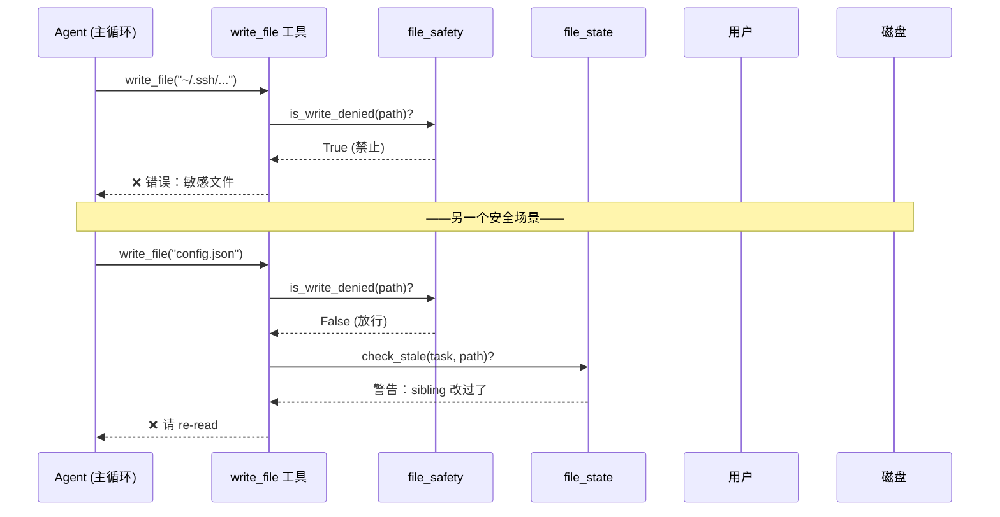
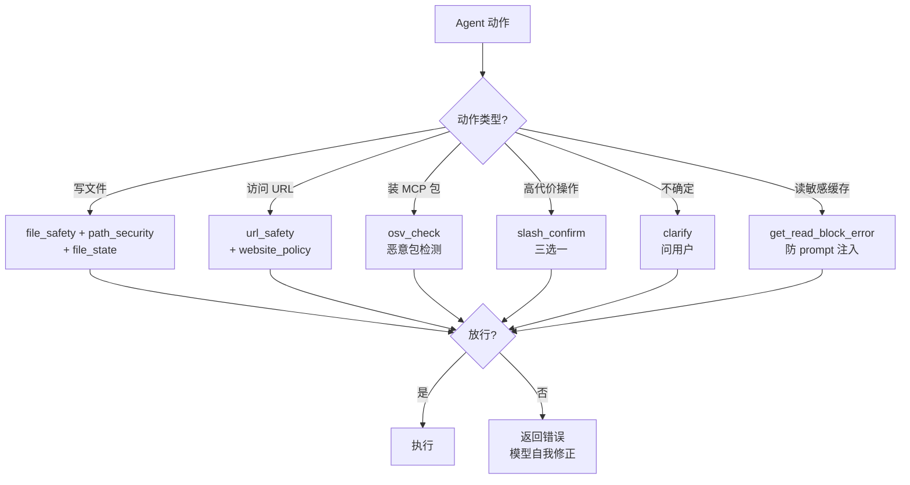

# Chapter 9: 安全与同意护栏（Safety & Consent Guardrails）

在上一章 [云服务可插拔后端（Cloud Service Providers）](08_云服务可插拔后端_cloud_service_providers__.md) 里，我们让 agent 拥有了"万能遥控器"——可以调用搜索、云浏览器、图像/视频生成等各种外部服务。到现在为止，agent 的能力已经非常强：能写文件、跑命令、记忆偏好、跨环境作业、看代码诊断、调云服务。

**但能力越大，闯祸的代价也越大**。想象这些场景：

- agent 一时手抖，把 `~/.ssh/id_rsa`（你的私钥）当作普通文件给覆盖了。
- 一段被注入的提示词诱导 agent 去访问 `http://169.254.169.254/`（云服务商的元数据接口），把你机器上的临时凭证泄露出去。
- 两个并发的 subagent 同时改同一个文件——agent A 读了一份旧版本，agent B 已经更新过了，A 写回去把 B 的修改覆盖了。
- agent 准备执行一个"清空所有缓存"的高代价操作——但用户其实只想清当前项目的。

这就是本章主角 **安全与同意护栏（Safety & Consent Guardrails）** 要解决的问题——给 agent 装上一套**门禁系统**：危险动作在开门之前，先三问。

---

## 一、问题从哪里来？一栋房子的门禁系统

想象你家是一栋装了完整安保的房子：

| 房子上的设备 | 对应的护栏模块 |
| --- | --- |
| **保险柜门** ——某些贵重物品所在的房间永远不能进 | `file_safety`（禁写敏感文件） |
| **猫眼** ——访客在按门铃前先看清楚是谁 | `url_safety`（SSRF 拦截） |
| **黑名单** ——你列出"这几位邻居我不见" | `website_policy`（用户自定义黑名单） |
| **门牌核对** ——访客必须报清楚要找几号房 | `path_security`（防路径穿越） |
| **共享日历** ——多个家人同时安排活动不冲突 | `file_state`（多 agent 并发文件协调） |
| **合同复查员** ——签大额合同前必须问一句"您确定吗？" | `slash_confirm` / `clarify`（用户同意） |

这一整套设备共同组成一道"危险动作开门前先三问"的护栏。下面我们一个一个看。

---

## 二、本章的核心用例

> agent 收到一个看似无害的请求："帮我把 `~/.ssh/authorized_keys` 里多加一行 key"。这个动作如果真的执行了——攻击者就能从此免密码登录你的机器。我们想知道：`hermes-agent` 是**在哪一道闸门**把这种请求拦下来的？同时，如果是一个**有风险但用户真的想做**的操作（比如清缓存），系统是如何**先问一下**用户、再继续的？

读完本章你会看到这六道防线如何串成一个整体。

---

## 三、关键概念逐个看

### 3.1 `file_safety`：保险柜门（敏感文件禁写名单）

最直接的防线——**有一些文件，无论 agent 多想写都不让写**。比如 SSH 私钥、`/etc/sudoers`、`.bashrc` 这种"一写就出大事"的文件。

这个名单是**钉死在代码里**的（来自 `agent/file_safety.py`），用户改不了——这是设计上的"刚性底线"。

```python
# 简化版示意
def build_write_denied_paths(home):
    return {
        os.path.join(home, ".ssh", "authorized_keys"),
        os.path.join(home, ".ssh", "id_rsa"),
        "/etc/sudoers",
        "/etc/shadow",
        # ... 还有 .bashrc / .pgpass / .npmrc 等十几个
    }
```

这里列的是**精确路径**（"这个文件本身不能写"）。另外还有"目录前缀"列表——比如整个 `~/.ssh/` 目录、`~/.aws/` 目录都被禁止写入：

```python
def build_write_denied_prefixes(home):
    return [
        os.path.join(home, ".ssh"),
        os.path.join(home, ".aws"),
        os.path.join(home, ".gnupg"),
        # ...
    ]
```

判断逻辑就一行：

```python
def is_write_denied(path):
    resolved = os.path.realpath(path)   # 关键：解析符号链接
    return resolved in DENIED_PATHS or any(
        resolved.startswith(p) for p in DENIED_PREFIXES
    )
```

> 💡 **`realpath` 是关键**——如果不解析符号链接，攻击者可以做一个 `~/decoy.txt → ~/.ssh/id_rsa` 的软链，绕过精确路径匹配。解析过后，无论怎么伪装都会被识破。

还有一个可选的 **"安全写入根目录"** 机制（`HERMES_WRITE_SAFE_ROOT` 环境变量）——设了它之后，agent **只能**在这个目录内写文件，其他地方一律拒绝。这是给企业部署用的"白名单模式"。

### 3.2 `url_safety`：猫眼（SSRF 拦截）

agent 调用 `web_fetch` 时，URL 可能藏着陷阱。最经典的是 **云元数据接口**：

- AWS / GCP / Azure：`http://169.254.169.254/`
- Alibaba：`http://100.100.100.200/`
- AWS ECS：`http://169.254.170.2/`

这些地址在云服务器**内部**能访问，返回的内容是**当前机器的临时凭证**。一旦 agent 帮攻击者 fetch 了这种 URL，凭证就泄露了。这就是 SSRF（Server-Side Request Forgery）攻击。

`tools/url_safety.py` 给所有 web 工具加了一道前置检查：

```python
_ALWAYS_BLOCKED_IPS = frozenset({
    ipaddress.ip_address("169.254.169.254"),
    ipaddress.ip_address("169.254.170.2"),
    ipaddress.ip_address("100.100.100.200"),
    # ...
})
_ALWAYS_BLOCKED_NETWORKS = (
    ipaddress.ip_network("169.254.0.0/16"),   # 整段链路本地
)
```

更绝的是，它会**真的去 DNS 解析一遍**，防止攻击者用域名包装这些 IP：

```python
def is_safe_url(url):
    hostname = urlparse(url).hostname
    for _, _, _, _, sockaddr in socket.getaddrinfo(hostname, None, ...):
        ip = ipaddress.ip_address(sockaddr[0])
        if ip in _ALWAYS_BLOCKED_IPS:
            return False         # 拦截
        if ip.is_private or ip.is_loopback:
            return False         # 拦截内网
    return True
```

也就是说，攻击者就算建一个 `evil.com → 169.254.169.254` 的 DNS 记录，agent 解析后照样拒绝。

> ⚠️ **限制**：DNS rebinding 攻击（解析时返回公网 IP、真连接时返回内网 IP）这一层挡不住——文件注释里诚实地写明了这一点。要彻底防御需要在连接层做（如 egress proxy）。安全设计就是这样——明确知道自己的边界，比假装"绝对安全"靠谱得多。

### 3.3 `website_policy`：黑名单（用户自定义）

`url_safety` 防的是"技术性危险"（私网/元数据）。但用户可能还想加自己的"政策性黑名单"——比如"我不让 agent 访问任何社交媒体"、"我们公司禁止访问竞品官网"。

`tools/website_policy.py` 让用户在 `~/.hermes/config.yaml` 里自定义：

```yaml
security:
  website_blocklist:
    enabled: true
    domains:
      - "twitter.com"
      - "*.facebook.com"      # 通配符支持
      - "competitor.com"
    shared_files:
      - "team-blocklist.txt"  # 也可以指向共享列表文件
```

`check_website_access(url)` 在每次访问前查这张表，命中就返回一个错误字典：

```python
{
    "host": "twitter.com",
    "rule": "twitter.com",
    "message": "Blocked by website policy: ...",
}
```

为了不让每次 fetch 都重新读 YAML，模块内置了 **30 秒的缓存**——大批量爬取时也不会拖慢。

### 3.4 `path_security`：门牌核对（防路径穿越）

很多工具接受"路径"作为参数。如果用户传 `../../etc/passwd`，agent 不小心就会读到不该读的地方。`tools/path_security.py` 提供一个共享的"门牌核对器"：

```python
def validate_within_dir(path, root):
    try:
        resolved = path.resolve()
        root_resolved = root.resolve()
        resolved.relative_to(root_resolved)   # 关键
    except (ValueError, OSError) as exc:
        return f"Path escapes allowed directory: {exc}"
    return None
```

`relative_to()` 是 Python 自带的优雅方法——如果 `resolved` 不在 `root_resolved` 下面，它会抛 `ValueError`。再加上前面 `resolve()` 解析符号链接，等于双重保险。

哪里用到？skill 加载器、cron job 注册器、凭证文件读取器都共用这一个函数——**避免每个地方各自实现一遍可能不一样的检查**。

### 3.5 `file_state`：共享日历（多 agent 并发协调）

这是最巧妙的一道护栏。设想：

1. 主 agent 派出 subagent A 和 B，都让它们修改 `config.json`。
2. A 先读了文件（mtime=10:00:00），看到内容是 `{"x": 1}`。
3. B 也读了文件，但**没等 A 写完，就先写**了 `{"x": 2}`（mtime=10:00:05）。
4. A 仍然以为内容是 `{"x": 1}`，于是写 `{"x": 1, "y": 3}`——**B 的修改被覆盖了！**

`tools/file_state.py` 用一个**进程级共享注册表**追踪这种情况：

```python
class FileStateRegistry:
    _reads: dict          # {task_id: {path: (mtime, read_ts, partial)}}
    _last_writer: dict    # {path: (task_id, write_ts)}
    _path_locks: dict     # {path: Lock}
```

工具在写文件之前调用 `check_stale(task_id, path)`：

```python
warning = check_stale(task_id, "config.json")
if warning:
    return tool_error(warning)
```

`check_stale` 会回答三种情况：

1. **"sibling subagent 写过了"** → 报告："这个文件被 subagent B 在 10:00:05 改过了——而你最后读取是 10:00:00。请重新 read_file 后再写。"
2. **"mtime 漂移了（外部修改）"** → 同样要求重新读。
3. **"你根本没读过这个文件"** → 报告："你都没读过，写啥呢？先 read_file 一下。"

加上 `lock_path()` 这个 context manager，对同一个文件的"读→改→写"序列还能串行化。**这就让多 agent 共享文件系统时也不容易出现互相覆盖。**

### 3.6 `slash_confirm` / `clarify`：合同复查员（用户同意）

最后一道防线是"开口问一下用户"。`hermes-agent` 把它分成两种性格不同的场景：

#### `slash_confirm`：高代价操作的"确认 / 总是允许 / 取消"

例子：用户敲了 `/reload-mcp`——这会让所有 MCP 服务器重启、prompt 缓存失效，是个"贵"的操作。系统不会闷头执行，而是先弹三个按钮：

```
[ 这次允许 ]  [ 总是允许 ]  [ 取消 ]
```

`tools/slash_confirm.py` 维护一张"待确认"表：

```python
def register(session_key, confirm_id, command, handler):
    _pending[session_key] = {
        "confirm_id": confirm_id, "command": command,
        "handler": handler, "created_at": time.time(),
    }
```

用户按下任何按钮 → 平台层调 `resolve(session_key, confirm_id, choice)` → 触发对应的 handler。如果 5 分钟没回应就**自动作废**——防止僵尸确认堆积。

#### `clarify`：让 agent 主动问用户

这是 agent **自己**调用的工具。"我不确定下一步该怎么做，先问问用户"：

```python
clarify(
    question="你希望我清理哪个目录的缓存？",
    choices=["仅当前项目", "整个用户目录", "全局缓存"]
)
```

在 CLI 里就是箭头键选；在 Telegram 里是 inline buttons；在没有 UI 的地方就是"回复 1/2/3"。**关键设计**：agent 调用 `clarify` 后，它的线程会**阻塞**等用户回答——这必须用线程安全的事件来实现：

```python
@dataclass
class _ClarifyEntry:
    clarify_id: str
    question: str
    choices: list
    event: threading.Event = field(default_factory=threading.Event)
    response: str = None
```

agent 线程 `event.wait()`，平台线程收到回复后 `event.set()`——经典的生产者/消费者模型。还配合**1 秒一次的活动心跳**避免被超时杀死：

```python
while True:
    if entry.event.wait(timeout=1.0): break   # 等到了
    touch_activity_if_due(state, "waiting for user clarify response")
```

---

## 四、动手用一下！跟着核心用例走一遍

回到本章用例："agent 想往 `~/.ssh/authorized_keys` 里加一行"。我们看看防线是怎么生效的。

### 第 1 道：`file_safety` 直接拦截

`write_file` 工具在动手前会先调用：

```python
from agent.file_safety import is_write_denied

if is_write_denied("~/.ssh/authorized_keys"):
    return tool_error("Refusing to write to a sensitive system file.")
```

**输入**：路径 `~/.ssh/authorized_keys`。
**输出**：`True`（被禁止）→ 工具立刻返回错误。**模型看到错误后会自己放弃这个动作**，并向用户解释为什么。

请求被钉死在第一道门，**根本走不到 `env.execute()` 那一步**。

### 第 2 道：假设有人想"曲线救国"——用符号链接绕过

攻击者改用 `write_file("~/.config/myapp/keys")`——但这个路径其实是一个软链，指向 `~/.ssh/authorized_keys`。

`is_write_denied` 内部第一句就是 `os.path.realpath(path)`——它会**先把软链解析掉**，再去查名单。所以照样拦下。

### 第 3 道：用户主动给一个看起来正常的 URL，但解析后是元数据接口

用户（或被注入的提示词）说："帮我 fetch 一下 `http://internal-metadata.io/`"，而 `internal-metadata.io` 在 DNS 里指向 `169.254.169.254`。

`web_fetch` 工具调用 `is_safe_url(url)`：

```python
addr_info = socket.getaddrinfo("internal-metadata.io", ...)
# 解析结果：[("169.254.169.254", ...)]
# 命中 _ALWAYS_BLOCKED_IPS → 返回 False
```

**输出**：`False` → 工具立刻拒绝，记一条 warning 到日志。

### 第 4 道：subagent 的并发写覆盖

主 agent 派 A 和 B 同时改 `config.json`。A 读完后还没写，B 已经写完了。等 A 准备写时：

```python
warning = check_stale("agent-A", "/path/config.json")
# 返回："config.json was modified by sibling subagent 'agent-B' at 10:00:05..."
```

工具把这条警告作为错误返回给 A——A 的模型收到后会**主动 re-read** 文件，看到 B 的新内容，再决定怎么合并。

### 第 5 道：高代价操作的同意

agent 准备清理所有缓存。它不会直接动手，而是调用 `clarify`：

```python
result = clarify(
    question="确定要清理所有缓存吗？这会清掉约 2GB 数据。",
    choices=["确定", "仅清当前项目", "取消"]
)
```

agent 线程阻塞等用户选——用户选了"仅清当前项目"，agent 就走对应分支。**用户的同意被显式记录在工具结果里**，不会被忽略。

---

## 五、内部是怎么运转的？

### 5.1 一段直白的流程描述

让我们把六道防线串起来——看一次"agent 调用 write_file" 完整地经过哪些关卡：

1. **路径解析**：把用户给的路径用 `Path.resolve()` 解析符号链接。
2. **`path_security` 检查**：如果有效目录范围限制（比如安全 root），先核对在不在范围内。
3. **`file_safety` 检查**：用 `is_write_denied()` 查"敏感文件名单"。
4. **`file_state.check_stale` 检查**：看看其他 agent 有没有刚改过这个文件。
5. **如果是高风险写入**：调 `clarify` 问用户。
6. **`lock_path` 加锁**：进入"读→改→写"临界区。
7. **真正写入**。
8. **`file_state.note_write` 记账**：告诉别的 agent 我写了这个文件、什么时候写的。

### 5.2 用图来理解



注意：**模型不需要知道这些防线的存在**——它只看到工具返回的错误信息，自己读懂"哦我应该换个方式"。整套护栏对模型是**透明的指导**：错误信息越具体，模型自我修正越快。

---

## 六、再深入一点：几个值得细看的设计

### 6.1 `file_safety`：为什么要解析 `realpath`

```python
def is_write_denied(path):
    resolved = os.path.realpath(os.path.expanduser(str(path)))
    if resolved in build_write_denied_paths(home):
        return True
    # ...
```

`realpath` 同时做了两件事：解析 `~`、解析符号链接。这是**安全检查的金科玉律**——**永远在解析后的真实路径上检查**，否则攻击者可以通过别名、软链、相对路径绕过任何字符串匹配。

### 6.2 `url_safety`：失败时"封闭"还是"开放"？

注意 `is_safe_url` 在 DNS 解析失败时的行为：

```python
try:
    addr_info = socket.getaddrinfo(hostname, ...)
except socket.gaierror:
    logger.warning("Blocked request — DNS resolution failed")
    return False    # ← fail-closed：解析不出来就直接拒绝
```

这就是 **fail-closed（失败时封闭）** 设计原则。**安全检查里"宁愿误杀也不放过"**——如果 DNS 都解析不出来，HTTP 客户端也连不上，拦截掉没有任何损失，但能挡住一些 DNS 攻击。

相比之下 `website_policy` 在配置文件出错时是 fail-open（继续工作）——因为这是用户的政策，配置错了不应该把整个 web 工具瘫痪。**两种策略各有适用场景**。

### 6.3 `file_state`：环境变量逃生口

```python
def _disabled():
    return os.environ.get("HERMES_DISABLE_FILE_STATE_GUARD") == "1"
```

每次 `check_stale` 之前都会先看这个环境变量——如果设了 `=1` 就直接返回 `None`（不检查）。**为什么留这道口子？** 因为有时候开发者真的需要绕过——比如本地脚本调试、或者跑测试。**好的安全机制要能让用户自己关掉它**——而不是无脑挡所有人。

### 6.4 `clarify_gateway`：心跳的细节

回顾刚才那段 `wait_for_response`：

```python
while True:
    remaining = deadline - time.monotonic()
    if remaining <= 0: break
    if entry.event.wait(timeout=min(1.0, remaining)): break
    touch_activity_if_due(state, "waiting for user clarify response")
```

为什么不直接 `event.wait(timeout=600)`？因为 [执行环境（Execution Environments）](06_执行环境_执行环境_execution_environments__.md) 那一层有"心跳监听"——如果 agent 线程 5 分钟没动静，会被当成卡死强行杀掉。这里用 1 秒一次的小循环每次都"打个卡"，告诉外层"我没卡死，我在等用户呢"。

**这种细节是真实工程里护栏成功的关键**——理想的"等用户回答"和现实的"看门狗在监听"必须协调好。

### 6.5 `env_passthrough`：连"安全机制本身"也要防被绕过

最后一个值得看的细节在 `tools/env_passthrough.py`。背景：skill 可以声明"我需要 `MY_API_KEY` 这个环境变量传到沙箱里"。一切美好。但要是有恶意 skill 声明"我需要 `ANTHROPIC_API_KEY`"——就把 hermes 自己的凭证泄露给沙箱进程了。

```python
def register_env_passthrough(var_names):
    for name in var_names:
        if _is_hermes_provider_credential(name):
            logger.warning("refusing to register Hermes provider credential")
            continue   # 直接拒绝
        _get_allowed().add(name)
```

`_HERMES_PROVIDER_ENV_BLOCKLIST` 是钉死的核心凭证名单——**skill 永远无法把它们加进 passthrough 列表**。这是修复一个真实 CVE（GHSA-rhgp-j443-p4rf）的产物——**好的安全机制是从被攻破中学习的**。

---

## 七、各部分如何串成一张图



六道防线**协同工作**，覆盖了 agent 主要的"动手前"决策点。每一道都遵循同样的设计哲学：

- **fail-closed 优先**——拿不准就拒绝，安全机制不应有"灰色地带"。
- **解析后再判断**——永远在最终真实路径/IP 上检查，不依赖字符串。
- **给模型清晰的错误**——返回的错误信息要明确告诉模型"为什么、怎么改"，让它自我修正。
- **用户可以同意**——`slash_confirm` 和 `clarify` 不是"拒绝执行"而是"先问一下"，给用户保留控制权。
- **不假装完美**——`url_safety` 文件注释里明确写了 DNS rebinding 挡不住，因为修这个需要在更底层做。

---

## 八、本章小结

恭喜！你已经掌握了 `hermes-agent` 的第九个核心抽象：

- **安全与同意护栏**是 agent 的"门禁系统"，由六个互相协作的模块组成——`file_safety`、`url_safety`、`website_policy`、`path_security`、`file_state`、`slash_confirm` / `clarify`。
- **`file_safety`** 用钉死的名单 + 解析 `realpath` 阻止写入敏感文件（SSH key、shadow、bashrc...）。
- **`url_safety`** 在 DNS 解析后检查 IP，**始终拒绝**云元数据接口（169.254.169.254 等），不论配置如何。
- **`website_policy`** 让用户在配置文件里自定义黑名单，30 秒缓存避免性能损耗。
- **`path_security`** 用 `resolve() + relative_to()` 防 `..` 路径穿越，被 skill、cron、credential 三处复用。
- **`file_state`** 通过进程级注册表追踪每个 agent 的读/写时间戳，防止多 subagent 互相覆盖。
- **`slash_confirm` / `clarify`** 在"高代价"或"不确定"的关口主动问用户，保留人类决策权。
- 所有护栏共同遵循 **fail-closed、realpath-then-check、清晰错误信息** 三大设计原则。

---

到这里，agent 已经被装备得相当完整了——能力多、能跑多种环境、有记忆、有诊断、有安全护栏。但还有一个层面悄悄影响着一切：**速率限制**。你调 OpenAI 太快了、你调 Brave 太频繁了——服务商会返回 429，工具会失败，重试不当还会让封号雪上加霜。

下一章我们就看看 `hermes-agent` 是怎么把"速率限制与重试治理"也做成一个独立的、聪明的子系统的。

👉 继续学习：[速率限制与重试治理（Rate Limit Tracker & Guard）](10_速率限制与重试治理_rate_limit_tracker___guard__.md)

---

Generated by [AI Codebase Knowledge Builder](https://github.com/The-Pocket/Tutorial-Codebase-Knowledge)