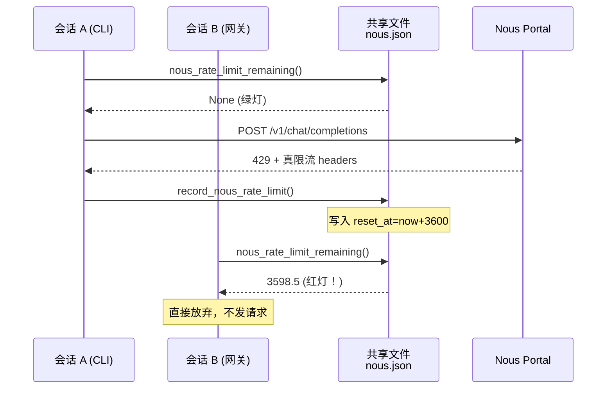
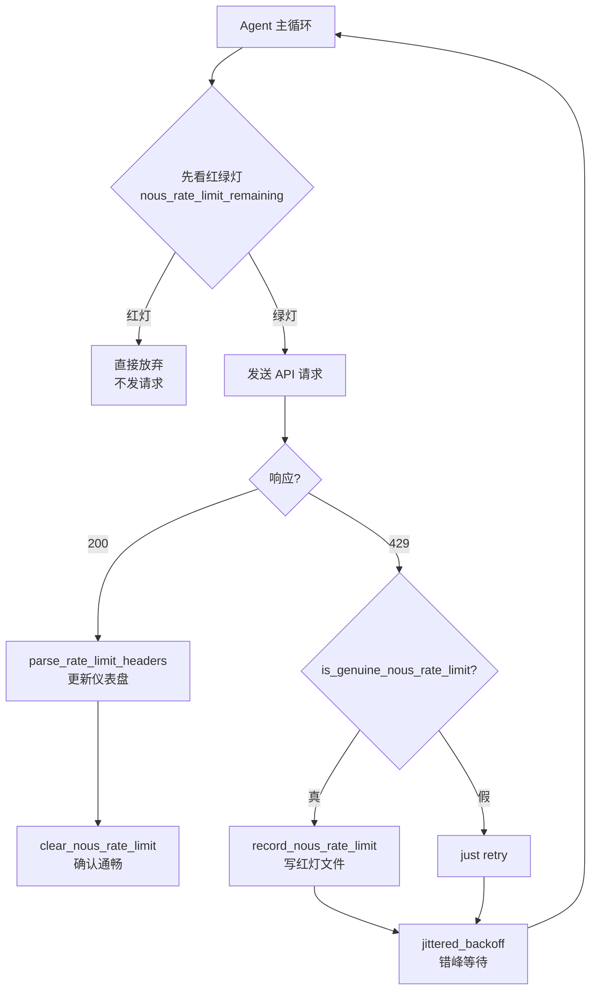

# Chapter 10: 速率限制与重试治理（Rate Limit Tracker & Guard）

在上一章 [安全与同意护栏（Safety & Consent Guardrails）](09_安全与同意护栏_safety___consent_guardrails__.md) 里，我们给 agent 装上了一整套"门禁系统"——保险柜门、猫眼、合同复查员……agent 现在已经被武装得相当完整了。

但还有一个隐形的"交通警察"在背后默默调度——**速率限制**。

- 你调 OpenAI 太快了 → 服务商返回 429。
- 你调 Brave 太频繁了 → 工具失败。
- 一旦 429 后还不停重试 → 重试本身又消耗配额，雪上加霜。
- 更糟的是：你有 5 个会话同时跑（CLI + 网关 + cron + 一堆 subagent），它们**互相不知道彼此已经触发了限流**，于是 5 路一起拼命重试——配额被翻 5 倍速消耗。

本章主角 **速率限制与重试治理（Rate Limit Tracker & Guard）** 就是来当这位交通警察的：在多车道高速公路上立"前方拥堵预警 + 红绿灯"，让所有车道（会话）**统一减速**，而不是一起踩油门加剧拥堵。

---

## 一、问题从哪里来？一个"高速公路堵车"的故事

想象一条 5 车道的高速路：

**糟糕的场景**：
- 前方出了点小拥堵，车道 A 的司机踩油门变道想超车 → 没用，他也卡住了。
- 同一时刻，车道 B、C、D、E 的司机也都踩油门想超车 → 5 个人一起冲，堵得更死。
- 大家一起 honking，然后**全员同时再踩一次油门**——所谓的"重试风暴"或"惊群效应"（thundering herd）。

**正确的做法**：
1. **前方预警**：路边电子屏告诉所有人"前方 3 公里有拥堵，你目前剩余通行配额 30%"。
2. **红绿灯**：真出事了（事故封路），就在所有入口同步亮红灯——每个车道都看得见，统一等。
3. **错峰起步**：红灯转绿时，不让所有车一起冲，每辆车随机等 0~5 秒（jitter）再走，避免又堵在一起。

`hermes-agent` 用三个小模块对应这三件事：

| 模块 | 角色 | 解决的问题 |
| --- | --- | --- |
| `RateLimitTracker`（`rate_limit_tracker.py`） | 电子预警屏 | 解析 `x-ratelimit-*` 响应头，告诉你"还剩多少配额、什么时候重置" |
| `nous_rate_guard`（`nous_rate_guard.py`） | 红绿灯 | 真的 429 配额耗尽时，把状态写到**共享文件**，所有会话同步避让 |
| `retry_utils`（`retry_utils.py`） | 错峰起步规则 | 重试时用**带抖动的指数退避**，避免雪崩 |

---

## 二、本章的核心用例

> agent 通过 Nous Portal 调用模型，遇到 429 错误，错误信息里写着"小时配额已耗尽，3600 秒后重置"。我们希望：
>
> 1. **正在跑的这次请求**用带 jitter 的退避策略重试，不要立刻死扛。
> 2. 这个"3600 秒后才能恢复"的状态被**持久化到磁盘**，所以即便另一个并发的 CLI、网关或 cron 会话同时跑起来，它们**也能立刻看到红灯**，根本不发请求。
> 3. **能区分"真限流"和"假限流"**——上游某个模型偶发抽风的小 429 不应该把整个 Nous 锁死。

读完本章你会看清这三件事是怎么协同的。

---

## 三、关键概念逐个看

### 3.1 `x-ratelimit-*`：服务商给你的"仪表盘"

现代 LLM API（Nous、OpenRouter、OpenAI 兼容）都会在响应头里附带这一套数字：

```
x-ratelimit-limit-requests        每分钟请求上限
x-ratelimit-remaining-requests    本分钟还剩几次
x-ratelimit-reset-requests        本分钟窗口几秒后重置
x-ratelimit-limit-requests-1h     每小时请求上限
x-ratelimit-remaining-requests-1h ...
... 还有 tokens 的 4 个对应字段
```

总共 **4 个维度 × 3 类字段 = 12 个 header**。`RateLimitTracker` 把它们解析成一个 Python 对象，让 agent 能像看仪表盘一样查看："咦，RPH 还剩 30%，再用谨慎一点。"

### 3.2 真 429 vs 假 429：Nous Portal 的特殊之处

Nous Portal 在一个端点后面**多路复用**了好几个上游模型（DeepSeek、Kimi、MiMo……）。所以 429 其实有两种含义：

- **真限流**：你自己账户在 Nous 上的 RPM/RPH 桶用光了 → 这是真的没配额，硬扛没用。
- **假限流**：某个具体上游模型（比如 DeepSeek）瞬时容量不够 → 几秒就恢复，跟你账户没关系。

如果把"假限流"也当真的 → 你会把整个 Nous 锁死几分钟，所有模型都不能用。这就是 `is_genuine_nous_rate_limit()` 要细致区分的事——只有响应头明确表示"某个桶 remaining=0 且 reset>=60 秒"才认定为真。

### 3.3 共享文件作"红绿灯"：为什么要持久化？

每个 429 在 Nous 这边可能触发**多达 9 次重试调用**（SDK 3 次 × Hermes 3 次）。如果你同时跑 5 个会话——那就是 45 次几乎同时的请求。这就是**重试放大效应**。

解决方案：第一次确认"真限流"后，立刻把状态写进 `~/.hermes/rate_limits/nous.json`：

```json
{
  "reset_at": 1715701200.0,
  "recorded_at": 1715697600.0,
  "reset_seconds": 3600.0
}
```

**任何会话**（CLI、网关、cron）在发请求前先 `cat` 一下这个文件——发现还在限流期就**直接跳过**，根本不发请求。这就是跨进程的"红绿灯"。

### 3.4 带 jitter 的指数退避：错峰起步

最经典的退避策略是"指数退避"：第 1 次等 5 秒、第 2 次等 10 秒、第 3 次等 20 秒……但如果两个进程**同步**触发，它们也会**同步**地在第 5、10、20 秒一起重试——又一次惊群。

加上 jitter（抖动）就好了：

```
delay = min(5 * 2^(attempt-1), 120) + random(0, 0.5 * delay)
```

每次重试时间加一点"随机噪声"，让多个并发会话**自动错峰**。这是 AWS Architecture Blog 推广的经典做法。

---

## 四、动手用一下！跟着核心用例走一遍

### 步骤 1：每次成功响应后，解析 `x-ratelimit-*` 头

```python
from agent.rate_limit_tracker import parse_rate_limit_headers

state = parse_rate_limit_headers(response.headers, provider="nous")
# state 是 RateLimitState 对象，包含 4 个 bucket
```

**输入**：HTTP 响应的 headers 字典。
**输出**：一个结构化对象，你能问它"requests_hour.remaining 还剩多少？"。

### 步骤 2：以人类友好的方式展示

```python
from agent.rate_limit_tracker import format_rate_limit_display

print(format_rate_limit_display(state))
```

**输出**大致长这样：

```
Nous Rate Limits (captured just now):

  Requests/min   [██░░░░░░░░░░░░░░░░░░]  10.0%  10/100 used  (90 left, resets in 47s)
  Requests/hr    [████████████░░░░░░░░]  60.0%  600/1000 used  (400 left, resets in 38m)

  Tokens/min     [████░░░░░░░░░░░░░░░░]  20.0%  40K/200K used  (160K left, resets in 30s)
```

这是 `/usage` 斜杠命令显示的内容——一目了然地告诉用户"前方还剩多少燃料"。

### 步骤 3：遇到真 429 时，记录红灯状态

```python
from agent.nous_rate_guard import record_nous_rate_limit, is_genuine_nous_rate_limit

if is_genuine_nous_rate_limit(headers=response.headers, last_known_state=state):
    record_nous_rate_limit(headers=response.headers)
```

**输入**：429 响应的 headers + 上一次成功时记录的 state。
**效果**：如果判定为真限流，把"reset_at"写到 `~/.hermes/rate_limits/nous.json`。这是个原子写——别的会话立刻能读到。

### 步骤 4：每次发请求前先看红绿灯

```python
from agent.nous_rate_guard import nous_rate_limit_remaining, format_remaining

remaining = nous_rate_limit_remaining()
if remaining is not None:
    print(f"⛔ Nous is rate-limited. Wait {format_remaining(remaining)}.")
    return
```

**输入**：什么都不给。
**输出**：要么 `None`（绿灯，可以走），要么"还剩多少秒"（红灯，赶紧停）。

这一段会在每次调用 Nous **之前**跑一遍——是跨会话同步避让的核心。

### 步骤 5：真要重试时，用 jitter 退避

```python
from agent.retry_utils import jittered_backoff
import time

for attempt in range(1, 4):
    try: return call_api()
    except RateLimitError:
        time.sleep(jittered_backoff(attempt))
```

**输入**：第几次重试。
**输出**：一个介于"基础退避时间"和"基础退避+50% jitter"之间的随机延迟。多个会话同时跑这段代码时，它们会**自动错峰**重试。

---

## 五、内部是怎么运转的？

### 5.1 一段直白的流程描述

一次完整的"调用 + 限流处理"链路是这样的：

1. **预检**：调 `nous_rate_limit_remaining()`——如果文件里写着"还在限流期"，直接放弃，根本不发请求。
2. **发请求**：调 Nous API。
3. **成功路径**：
   - 用 `parse_rate_limit_headers()` 把响应头解析成 `RateLimitState`，缓存起来（供 `/usage` 命令显示）。
   - 调 `clear_nous_rate_limit()` 删除红灯文件（确认通畅）。
4. **失败路径（收到 429）**：
   - 调 `is_genuine_nous_rate_limit()` 判定真假——看响应头里 `remaining==0 且 reset>=60s` 吗？
   - 真限流 → 调 `record_nous_rate_limit()` 写红灯文件。
   - 假限流 → 不写文件，只让本次请求失败，重试机制接管。
5. **重试**：用 `jittered_backoff(attempt)` 计算延迟，sleep 之后回到第 1 步。

### 5.2 用图来理解



**关键洞察**：会话 A 替会话 B "挨了那一刀"——B 没浪费一次请求就知道现在不能调。这就是跨会话协调的价值。

---

## 六、再深入一点：关键源码片段

### 6.1 解析头字段（来自 `rate_limit_tracker.py`）

核心是一个"小工厂方法"，给定资源名和后缀就能造一个 bucket：

```python
def _bucket(resource: str, suffix: str = "") -> RateLimitBucket:
    tag = f"{resource}{suffix}"
    return RateLimitBucket(
        limit=_safe_int(lowered.get(f"x-ratelimit-limit-{tag}")),
        remaining=_safe_int(lowered.get(f"x-ratelimit-remaining-{tag}")),
        reset_seconds=_safe_float(lowered.get(f"x-ratelimit-reset-{tag}")),
        captured_at=now,
    )
```

四类 bucket 用同一个函数生成：`_bucket("requests")`、`_bucket("requests", "-1h")`、`_bucket("tokens")`、`_bucket("tokens", "-1h")`——避免重复代码。

### 6.2 "实时剩余时间"的小聪明

```python
@property
def remaining_seconds_now(self) -> float:
    elapsed = time.time() - self.captured_at
    return max(0.0, self.reset_seconds - elapsed)
```

为什么需要这个？因为响应头里写的"还有 47 秒重置"是**那个瞬间**的——你 30 秒后再看，应该显示"还有 17 秒重置"。这里减去已流逝时间，让显示数字一直保持新鲜。

### 6.3 原子写文件（来自 `nous_rate_guard.py`）

```python
fd, tmp_path = tempfile.mkstemp(dir=state_dir, suffix=".tmp")
with os.fdopen(fd, "w") as f:
    json.dump(state, f)
atomic_replace(tmp_path, path)
```

**为什么不直接 `open(path, "w")`？** 因为如果在写到一半时进程崩了，文件会变成"半写状态"——其他会话读到时会拿到坏 JSON。

**原子替换**保证：要么完整看到旧版本，要么完整看到新版本，永远不会看到半成品。这是文件系统级的"事务性"。

### 6.4 真假 429 的判定

```python
def is_genuine_nous_rate_limit(*, headers, last_known_state):
    state = _parse_buckets_from_headers(headers)
    if _has_exhausted_bucket(state): return True
    if last_known_state and _has_exhausted_bucket_in_object(last_known_state):
        return True
    return False
```

两路证据，**只要一路确认**就判真。判定逻辑在 `_has_exhausted_bucket`：

```python
def _has_exhausted_bucket(buckets):
    for remaining, reset in buckets.values():
        if remaining == 0 and reset and reset >= 60.0:
            return True
    return False
```

**`reset >= 60.0`** 是关键——小于 60 秒的 reset 被当成"瞬时抽风"忽略掉。这是从真实事故中学到的：DeepSeek 模型偶发性给个"reset 5 秒"的 429，如果当真就会冤枉整个 Nous。

### 6.5 jitter 退避的实现细节（来自 `retry_utils.py`）

```python
exponent = max(0, attempt - 1)
delay = min(base_delay * (2 ** exponent), max_delay)
seed = (time.time_ns() ^ (tick * 0x9E3779B9)) & 0xFFFFFFFF
rng = random.Random(seed)
jitter = rng.uniform(0, jitter_ratio * delay)
return delay + jitter
```

注意 `seed` 的构造——用纳秒时间戳 **XOR** 一个全局自增计数器乘以一个素数（`0x9E3779B9` 是黄金比率的 32 位整数表示，常用作哈希常数）。

为什么这么麻烦？因为：

- 如果只用 `time.time()` → 同一毫秒内多次调用会得到同样的 seed → 同样的 jitter → 没起到错峰效果。
- 加上**全局自增计数器**：即便时钟太粗糙，每次调用也保证拿到唯一的 seed。
- 计数器要用**线程锁**保护（`_jitter_lock`）—— 因为多个 gateway 会话可能在不同线程里同时进入这段代码。

这是"看起来简单、细节里全是工程经验"的典型代码。

---

## 七、整体协作的一张图



三个模块各司其职、互不耦合，但合在一起构成一套**完整的"流量调度"系统**。

---

## 八、和前面章节的联系

回头看，本章和之前的几章其实是**同一类问题在不同层面的体现**：

| 章节 | 解决的资源问题 | 类比 |
| --- | --- | --- |
| [上下文引擎](03_上下文引擎_context_engine__.md) | 上下文窗口（token 容量） | 书架满了怎么压缩 |
| [工具产物预算系统](05_工具产物预算系统_tool_result_budget__.md) | 单轮 token 预算 | 快递站怎么收纳大件 |
| **本章** | API 调用配额（次数、跨会话）| 高速公路怎么调度车流 |

每一章都在回答："当某种**有限资源**遇到**过载**时，怎么优雅地降速、协调、避免雪崩？" 这是构建生产级 AI agent 不可回避的工程主题。

---

## 九、本章小结

恭喜！你已经掌握了 `hermes-agent` 的第十个、也是最后一个核心抽象：

- **速率限制与重试治理**是 agent 的"交通警察"——管理上游 API 的配额、跨会话同步避让、错峰重试。
- **`RateLimitTracker`** 解析 `x-ratelimit-*` 响应头（4 个维度 × 12 个字段），把它们变成可查询的仪表盘，给 `/usage` 命令用。
- **`nous_rate_guard`** 在确认是**真**配额耗尽时把状态写到 `~/.hermes/rate_limits/nous.json`——所有会话（CLI、网关、cron）在发请求前先 `cat` 这个文件，**立刻知道现在该停**。
- **真/假 429 区分**：只有"某桶 remaining=0 且 reset>=60 秒"才算真——避免上游某模型瞬时抽风把整个 Nous 锁死。
- **`retry_utils`** 提供**带 jitter 的指数退避**，用线程安全的计数器 + 高熵 seed 让并发会话**自动错峰重试**。
- 整体设计哲学是**"前方预警 + 红绿灯 + 错峰起步"**，对应"看见拥堵、告知所有车、各自岔开时间走"。

---

## 全书完结

到这里，`hermes-agent` 的十个核心抽象就介绍完了：

1. [Provider 档案](01_provider_档案_provider_profiles__.md) ——"名片夹"
2. [Provider 传输层](02_provider_传输层_provider_transports__.md) ——"翻译秘书"
3. [上下文引擎](03_上下文引擎_context_engine__.md) ——"图书管理员"
4. [记忆提供方](04_记忆提供方_memory_provider__.md) ——"私人秘书"
5. [工具产物预算系统](05_工具产物预算系统_tool_result_budget__.md) ——"快递分拣中心"
6. [执行环境](06_执行环境_execution_environments__.md) ——"远程双手"
7. [LSP 集成服务](07_lsp_集成服务_lsp_service__.md) ——"贴身代码审稿人"
8. [云服务可插拔后端](08_云服务可插拔后端_cloud_service_providers__.md) ——"万能遥控器"
9. [安全与同意护栏](09_安全与同意护栏_safety___consent_guardrails__.md) ——"门禁系统"
10. **速率限制与重试治理** ——"交通警察"

整个项目最一以贯之的设计哲学是——**"凡是有多种实现可选的地方，都用 ABC + 注册表 做成可插拔的；凡是有限资源，都做一套预算/治理子系统专门管它。"**

希望这套教程让你不仅"会用" `hermes-agent`，更能从它的代码里学到一种**面向变化与不确定性的工程思维**：永远给未来的扩展留口子、永远在关键路径上加一道护栏、永远诚实地写下"我挡不住什么"。

愿你也能写出这样优雅的代码 🎉。

---

Generated by [AI Codebase Knowledge Builder](https://github.com/The-Pocket/Tutorial-Codebase-Knowledge)