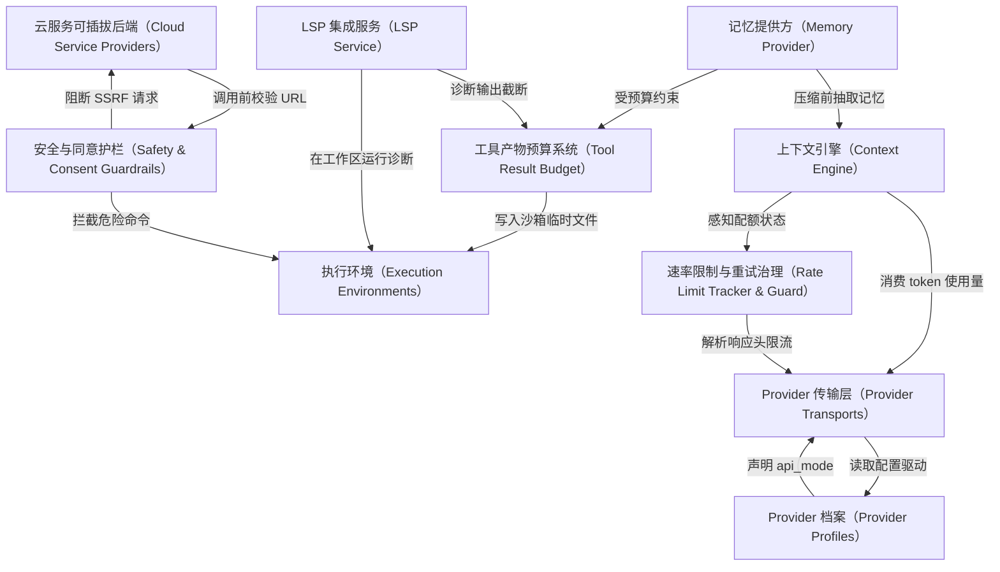

# Tutorial: hermes-agent

`hermes-agent` 是一个**多后端、可插拔的 AI 编码 Agent 框架**。它把和大模型对话的"传输层"、跑命令的"执行环境"、搜索/抓网页/生图等"云能力"全部抽象成统一接口，再用*声明式档案*和*插件注册表*把具体厂商（Anthropic、OpenAI、Bedrock、Brave、Browserbase 等）挂载进来。

围绕主循环还配套了一整套**护栏与治理机制**：*上下文引擎*管 token 预算和压缩、*记忆提供方*管跨会话长期记忆、*工具产物预算系统*防止超大输出撑爆窗口、*LSP 服务*实时反馈代码诊断、*速率限制治理*跨会话同步避让 429、*安全护栏*拦截危险写入和 SSRF。整体设计让用户**换厂商、换沙箱、换搜索引擎只改一行配置**，主代码不动。

**Source Repository:** [None](None)

## Chapters

1. [Provider 档案（Provider Profiles）
](01_provider_档案_provider_profiles__.md)
2. [Provider 传输层（Provider Transports）
](02_provider_传输层_provider_transports__.md)
3. [上下文引擎（Context Engine）
](03_上下文引擎_context_engine__.md)
4. [记忆提供方（Memory Provider）
](04_记忆提供方_memory_provider__.md)
5. [工具产物预算系统（Tool Result Budget）
](05_工具产物预算系统_tool_result_budget__.md)
6. [执行环境（Execution Environments）
](06_执行环境_execution_environments__.md)
7. [LSP 集成服务（LSP Service）
](07_lsp_集成服务_lsp_service__.md)
8. [云服务可插拔后端（Cloud Service Providers）
](08_云服务可插拔后端_cloud_service_providers__.md)
9. [安全与同意护栏（Safety & Consent Guardrails）
](09_安全与同意护栏_safety___consent_guardrails__.md)
10. [速率限制与重试治理（Rate Limit Tracker & Guard）
](10_速率限制与重试治理_rate_limit_tracker___guard__.md)

---

Generated by [AI Codebase Knowledge Builder](https://github.com/The-Pocket/Tutorial-Codebase-Knowledge)